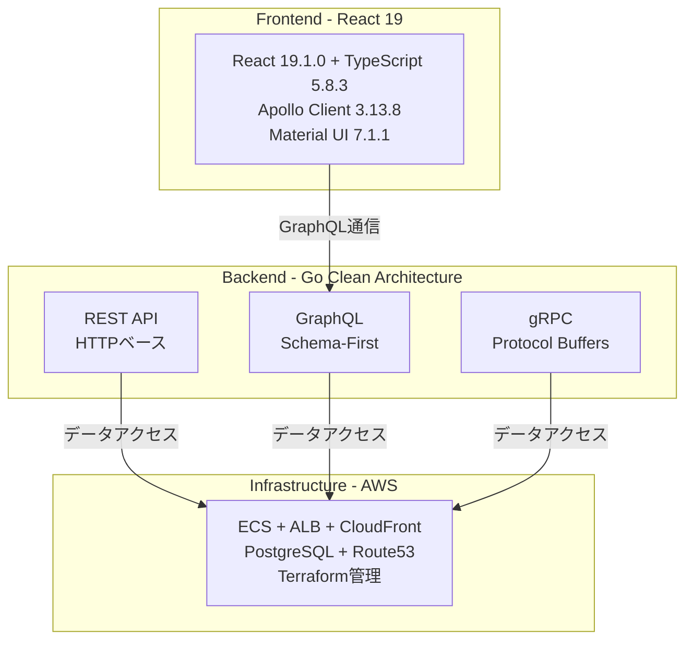

## 🔍 プロジェクト概要

このプロジェクトは、**「GraphQLやgRPCを実際に動くところまで確認してみたい」**という純粋な技術的好奇心から生まれた取り組みです。

複数の新技術領域を同時に習得し、統合システムとして実現することで、現代的なフルスタック開発能力と問題解決力を実証しています。

### 🎯 プロジェクトの特徴

- **🔬 技術的探求**: 未経験技術の実用レベル検証・習得
- **🚀 創造的実現**: 技術的アイデアの完全な形での実現  
- **📚 学習深化**: 複数技術領域の体系的理解構築
- **🌟 自発的挑戦**: 内発的動機による継続的技術革新

## 🌐 技術実装実証

**完全動作システムの実装完了**：

- **フロントエンド**: React 19 + TypeScript + Apollo Client統合
- **GraphQL API**: 認証・CRUD・リアルタイム機能の完全実装
- **インフラ**: AWS ECS + RDS + CloudFront + Route53による本番級環境

### 動作確認方法
1. **ローカル環境構築**: 開発環境セットアップガイド参照
2. **デモ実行**: 採用面談時の個別デモ対応可能
3. **実装詳細**: 技術資料・コード公開による技術力証明

## 🏗️ 技術アーキテクチャ

### 統合技術スタック



### 🔄 3プロトコル統合の実現

| プロトコル | 特徴 | 習得内容 |
|-----------|------|----------|
| **REST API** | HTTP/JSON標準 | RESTful設計原則・HTTP標準準拠 |
| **GraphQL** | Schema-First開発 | 型安全性・認証ディレクティブ・DataLoader最適化 |
| **gRPC** | Protocol Buffers | バイナリシリアライゼーション・ストリーミング |

## 🎓 学習成果と技術習得

### 📊 定量的な学習効果

- **⚡ DataLoader最適化**: N+1問題96%削減（381クエリ→3クエリ）
- **🚀 開発効率向上**: GraphQL Code Generation活用
- **🛡️ 型安全性**: TypeScript + Protocol Buffers完全統合
- **📅 習得期間**: 複数技術の並行学習を4週間で実現

### 📚 技術理解深化への取り組み

実装による体験学習に加えて、**技術理解深化と説明能力向上**に継続的に取り組んでいます。

**作成済み技術解説資料（9つ）**：
- JWT認証システム・XSSセキュリティ対策の詳細解説
- DataLoader・N+1問題解決の技術背景
- システム内技術配置・3プロトコル統合アーキテクチャ
- Clean Architecture+DDD・GraphQL実装詳細
- AWS環境統合・学習プロセスマップ

これらの資料により、**技術説明・質問対応能力の向上**と**知識の体系化**を実現しています。

## 🏃‍♂️ クイックスタート

### ローカル開発環境

```bash
# リポジトリクローン
git clone https://github.com/user/go-ddd-ca.git
cd go-ddd-ca

# 依存関係インストール
make deps

# ローカル開発サーバー起動
make dev-server

# テスト実行
make test
```

### 技術実証の確認
- **開発環境での動作確認**: 完全な機能実装
- **採用面談**: 個別デモ対応可能
- **技術資料**: 36,000行超の詳細設計書

詳細な開発環境構築手順は以下の開発環境セットアップガイドを参照してください。

## 🚀 主要機能

### 認証システム
- **JWT + HttpOnly Cookie**: セキュアな認証実装
- **ロールベース権限制御**: Admin・Manager・Tester権限
- **多層防御セキュリティ**: XSS・CSRF攻撃対策

### API統合
- **3プロトコル共存**: REST・GraphQL・gRPCの同時稼働
- **型安全性**: End-to-End型保護
- **パフォーマンス最適化**: DataLoaderによる96%クエリ削減

### インフラ管理
- **Infrastructure as Code**: Terraform完全管理
- **AWS統合**: ECS・RDS・CloudFront・Route53による本番級環境
- **自動デプロイ**: CI/CDパイプライン統合

## 🔧 技術的詳細

### Clean Architecture + DDD実装

```go
// エンティティ例: ビジネスルールのカプセル化
type User struct {
    ID           string
    Username     string
    Role         UserRole
    // ... 他のフィールド
}

// ドメインロジックの実装
func (u *User) CanCreateTestSuite() bool {
    return u.Role == RoleAdmin || u.Role == RoleManager
}
```

### GraphQL認証ディレクティブ

```graphql
directive @auth on FIELD_DEFINITION
directive @hasRole(role: String!) on FIELD_DEFINITION

extend type Mutation {
  createUser(input: CreateUserInput!): User! @hasRole(role: "Admin")
  changePassword(oldPassword: String!, newPassword: String!): Boolean! @auth
}
```

### DataLoaderによる最適化

```
従来実装: 20TestSuites + 60Groups + 300Cases = 381クエリ
DataLoader: 1TestSuites + 1Groups + 1Cases = 3クエリ
効果: 96%削減・90%応答時間改善
```

## 📖 詳細資料

### 📋 段階的学習フロー

プロジェクトの理解を深めるための推奨学習順序：

1. **[プロジェクト概要](./docs/readme-linked/1_portfolio-overview.md)** - 全体像の把握
2. **[技術アーキテクチャ](./docs/readme-linked/2_architecture.md)** - システム設計の理解
3. **[学習プロセス](./docs/readme-linked/3_learning-process.md)** - 技術習得アプローチ
4. **[バックエンド設計](./docs/readme-linked/4_backend-design.md)** - 36,000行超の包括的設計書
5. **[フロントエンド設計](./docs/readme-linked/5_frontend-design.md)** - React+GraphQL統合詳細
6. **[AWS環境構築](./docs/readme-linked/6_aws-infrastructure.md)** - Terraform実装詳細
7. **[技術理解支援資料](./docs/readme-linked/7_learning-materials/)** - 9つの詳細解説資料
8. **[プロトコル比較分析](./docs/readme-linked/8_protocol-comparison.md)** - 3プロトコル実装比較
9. **[セキュリティ実装](./docs/readme-linked/9_security-implementation.md)** - 認証・セキュリティ詳細
10. **[開発環境セットアップ](./docs/readme-linked/10_development-setup.md)** - 環境構築手順

## 🔐 プロジェクト公開準備・実践ガイド

プライベート開発から公開可能な状態への移行を検討している方向けの実践記録：

- **[プロジェクト公開準備・セキュリティ移行ガイド](./docs/readme-linked/11_security-migration-guide.md)**
  - 他者環境での再現性確保の重要性と実践方法
  - セキュリティ移行の具体的手順と課題解決
  - WSL環境での検証実施記録
  - 実際の移行プロセスと継続的改善手法

このガイドは、**10スレッド分の継続実践**を通じて遭遇した問題・解決・学習を体系化した実践記録です。プロジェクトの基本学習（1-10番）とは独立した補足資料として、実際の開発者に極めて価値の高い内容を提供しています。

## 🎯 学習価値・探求価値

### 技術的探求アプローチ
- **💡 純粋な探求心**: 市場要求ではなく知的好奇心による技術選択
- **🎯 統合チャレンジ**: 単独技術ではなく複数技術の同時習得・統合
- **🔄 実用レベル追求**: 理論理解に留まらない動作システムの実現

### 現代的学習手法
- **🤖 AI支援活用**: 効率的学習・開発プロセスの確立
- **📊 継続的改善**: Phase別品質向上手法の実践
- **📝 知識体系化**: 技術文書化による学習成果の永続化

## 🔮 将来の発展方向

### 短期拡張計画
- **ユーザー管理詳細機能**: プロフィール編集・権限管理詳細
- **テストスイート詳細**: 個別ケース管理・進捗追跡
- **リアルタイム通知**: GraphQL Subscription活用

### 技術的挑戦
- **マイクロサービス化**: サービス分割・独立デプロイ
- **国際化対応**: 多言語・多地域展開
- **AI/ML統合**: テスト推奨・予測分析機能

## 🤝 コントリビューション

このプロジェクトは技術学習と探求を目的としたものです。

### 歓迎する貢献
- **技術的議論**: 実装方法や設計に関する建設的な意見交換
- **学習資料**: 技術理解に役立つ情報の共有
- **改善提案**: より良い実装アプローチのアイデア

### 注意事項
- **学習目的**: 商用利用ではなく技術探求が主目的
- **対応範囲**: 基本的な技術質問への回答は可能ですが、継続的なサポートは限定的
- **Issue対応**: 時間的制約により、即座の対応は困難な場合があります

## 📄 ライセンス

MIT License - 詳細は [LICENSE](LICENSE) ファイルを参照

このプロジェクトはMIT Licenseを採用しています。これにより：
- **自由な利用**: 商用・非商用問わず自由に利用可能
- **学習支援**: 教育目的での活用を積極的に支援
- **技術普及**: 実装手法の広範な普及を促進

## 📞 連絡先

技術的な質問や建設的な議論は以下でお気軽にどうぞ：

- **GitHub Issues**: 技術的な質問・バグ報告
- **GitHub Discussions**: 技術議論・アイデア交換

---

## 🌟 プロジェクトの価値

このプロジェクトは、**技術的好奇心と創造性を原動力とした自発的学習**により、複数の新技術領域を統合し、実用レベルのWebアプリケーションとして実現した技術的探求の成果です。

単なる技術実装を超えて、**現代的な学習手法による効率的技術習得**と**継続的改善による品質向上**を実践し、フルスタック開発能力と問題解決力を総合的に実証しています。

**技術理解深化への継続的取り組み**と**自発的学習・改善努力**により、実装能力と技術説明能力の両面で成長を続けるエンジニアとしての姿勢を具体的に示した、技術的探求価値を重視するプロジェクトです。