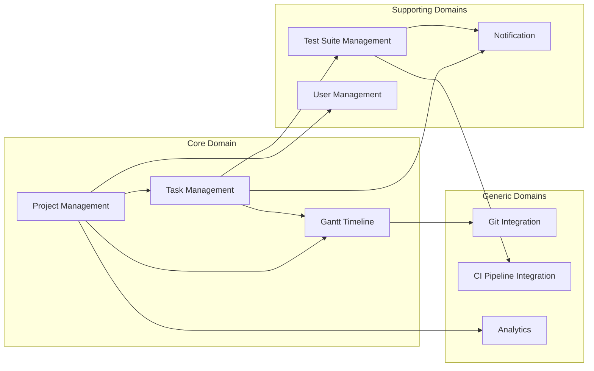

# プロジェクト概要サマリー (2024-11-10)

## 1. プロジェクトの目的と主要機能

### 1.1 目的
- AWS上で動作するプロジェクトの作成
- DDDとクリーンアーキテクチャの実践
- ポートフォリオとして活用可能な成果物の作成
- AWS資格（CLF→SAA）取得に向けた実践的な学習

### 1.2 主要機能
1. テストケース管理
   - テストスイート（大項目）の管理
   - テストケースの作成・管理
   - テスト実行結果の記録

2. ガントチャート連携
   - テストスイートとガントチャートの紐付け
   - 依存関係の管理
   - 進捗管理

### 1.3 採用技術
- 言語: Go
- アーキテクチャ: DDD + クリーンアーキテクチャ
- デプロイ環境: AWS（コンテナベース）
- データベース: PostgreSQL 14.13

## 2. ドメインモデル

### 2.1 戦略的設計（コンテキストマップ）


## 3. ユビキタス言語

### 3.1 ユーザーロール
- **テストマネージャー**：テスト全体の計画と管理を行う責任者
- **テストリーダー**：テストグループの責任者
- **テスター**：テストケースの実行者
- **レビュワー**：テスト結果の確認者
- **開発者**：修正対応者

### 3.2 進捗管理用語
- **計画工数**：テストケース実行に必要と見積もられた作業時間（0.5日単位）
- **実績工数**：実際に費やした作業時間の記録（0.25日単位）
- **追加工数**：当初計画外で発生した作業時間
- **進捗率**：テストケースの完了度を表すパーセンテージ

### 3.3 テスト環境
- **開発環境**：単体テスト、結合テスト初期用
- **検証環境**：結合テスト、システムテスト用
- **本番環境**：受入テスト用

## 4. プロジェクト構成

```
project-root/
├── docs/
│   ├── domain/
│   │   ├── strategic/
│   │   │   └── context-map.md
│   │   └── tactical/
│   │       ├── domain-model.md
│   │       └── domain-model-refinement.md
│   ├── architecture/
│   │   └── clean-architecture.md
│   ├── database/
│   │   ├── design/
│   │   ├── migrations/
│   │   └── verification/
│   └── _meta/
│       └── progress-summary.md
├── src/
│   ├── domain/
│   ├── usecase/
│   ├── interface/
│   └── infrastructure/
└── tests/
```

## 5. 実装方針

### 5.1 クリーンアーキテクチャ層構造
1. ドメイン層（domain）
   - エンティティ
   - 値オブジェクト
   - ドメインサービス
   - リポジトリインターフェース

2. ユースケース層（usecase）
   - アプリケーションサービス
   - DTOオブジェクト
   - イベントハンドラー

3. インターフェース層（interface）
   - コントローラー
   - プレゼンター
   - バリデーター

4. インフラストラクチャ層（infrastructure）
   - リポジトリ実装
   - 外部APIクライアント
   - データベースアクセス

### 5.2 DDDパターン適用方針
- 集約の境界を明確に定義
- ドメインイベントによる疎結合な設計
- CQRS原則の適用検討
- 明示的な値オブジェクトの利用

## 6. AWS実装計画

### 6.1 使用予定のサービス
- コンテナ実行基盤: ECS/Fargate
- データベース: RDS (PostgreSQL)
- CI/CD: GitHub Actions + CodeDeploy
- 監視: CloudWatch
- ネットワーク: VPC + ALB

### 6.2 インフラストラクチャ設計方針
- コンテナベースのマイクロサービス構成
- 自動スケーリングの実装
- バックアップと災害対策の考慮
- セキュリティベストプラクティスの適用

## 7. プロジェクトマイルストーン

### 第1フェーズ（現在）
- [x] ドメインモデルの設計
- [x] データベース設計
- [ ] マイグレーションスクリプト作成

### 第2フェーズ
- [ ] リポジトリ層の実装
- [ ] ユースケース層の実装
- [ ] API設計と実装

### 第3フェーズ
- [ ] AWSインフラ構築
- [ ] CI/CD パイプライン構築
- [ ] 監視・アラート設定

### 第4フェーズ
- [ ] 結合テスト
- [ ] パフォーマンステスト
- [ ] セキュリティテスト
