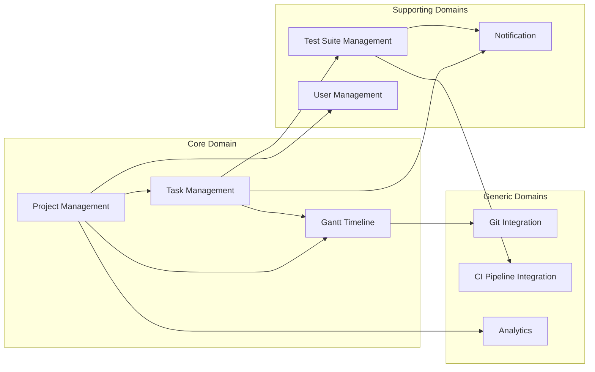
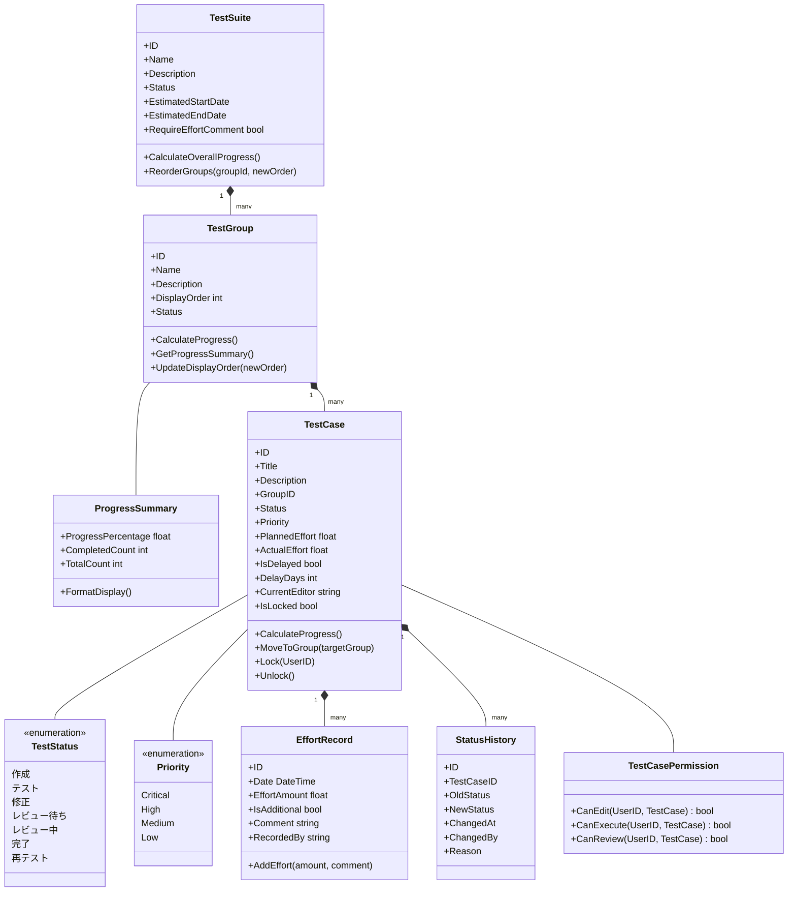

# テストケース管理システム 設計進捗サマリー

## 1. プロジェクト概要

### 1.1 目的
- AWS上で動作するプロジェクトの作成
- DDDとクリーンアーキテクチャの実践
- ポートフォリオとして活用可能な成果物の作成
- AWS資格（CLF→SAA）取得に向けた実践的な学習

### 1.2 主要機能
1. テストケース管理
   - テストスイート（大項目）の管理
   - テストケースの作成・管理
   - テスト実行結果の記録

2. ガントチャート連携
   - テストスイートとガントチャートの紐付け
   - 依存関係の管理
   - 進捗管理

### 1.3 採用技術
- 言語: Go
- アーキテクチャ: DDD + クリーンアーキテクチャ
- デプロイ環境: AWS（コンテナベース）
- DB設計ツール: DBeaver

## 2. 現在のドメイン設計状況

### 2.1 戦略的設計（コンテキストマップ）


### 2.2 戦術的設計（ドメインモデル）


## 3. 詳細設計の決定事項

### 3.1 状態管理
1. 状態遷移フロー
   - 作成(0%) → テスト(25%) → 修正(25%) → レビュー待ち(50%) → レビュー中(75%) → 完了(100%)
   - 再テスト時は50%に戻る
   - 遅延状態の表示: 「再テスト中（○日遅延）」形式

2. 権限管理
   - テスト中は実行者のみ編集可能
   - レビュー中はレビュワーがコメント・軽微な修正が可能
   - レビュー中のテスト実行は不可

### 3.2 工数管理
- 日単位での記録
- 追加工数は都度更新
- コメントは任意（スイート単位で必須/任意を切り替え可能）
- 履歴は直近10回分を保持

### 3.3 グループ管理
- 単一階層のシンプルな構造
- グループ間のテストケース移動が可能
- 表示順序は数値で管理（任意に変更可能）
- グループ単位の進捗は所属テストケースの単純平均

### 3.4 進捗計算
1. テストケースレベル
   - 状態による進捗率 × 重要度の重み
   - 重要度: Critical(4.0), High(3.0), Medium(2.0), Low(1.0)

2. グループレベル
   - 所属テストケースの単純平均
   - 進捗率と完了件数/全件数を併記

## 4. 次のステップ候補
1. ガントチャートとの連携部分の詳細設計
2. 権限管理の実装方式の具体化
3. レポート機能の設計

## 5. 未決定事項
- アーカイブデータの保持期間
- 詳細な権限設定の範囲
- レポート出力の形式
- ドメインモデルの過不足の最終確認

## 6. ドキュメント配置
```
docs/
├── domain/
│   ├── strategic/
│   │   └── context-map.md
│   └── tactical/
│       ├── domain-model.md
│       └── domain-model-refinement.md
├── design/
│   └── data/     # DB設計を配置予定
└── _meta/
    └── progress-summary.md
```

## 7. 更新履歴
- 2024-11-02: 初期バージョン作成、プロジェクト基本構造の確立
- 2024-11-06: ドメインモデルの詳細化、状態管理・進捗計算ロジックの設計