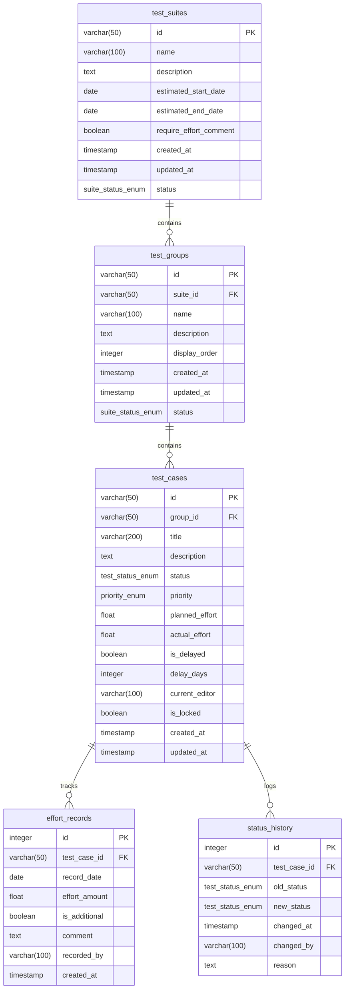
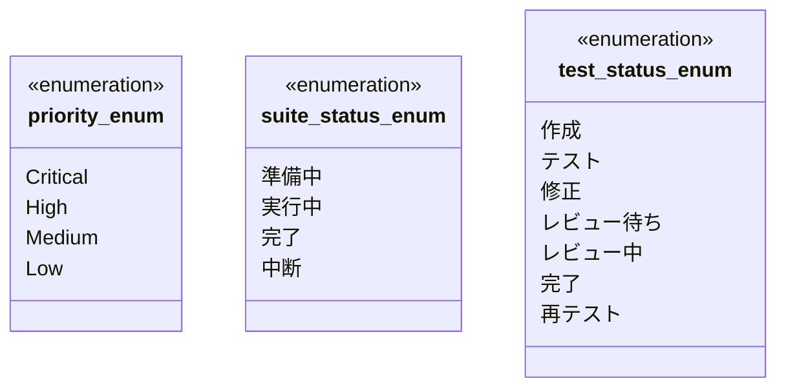
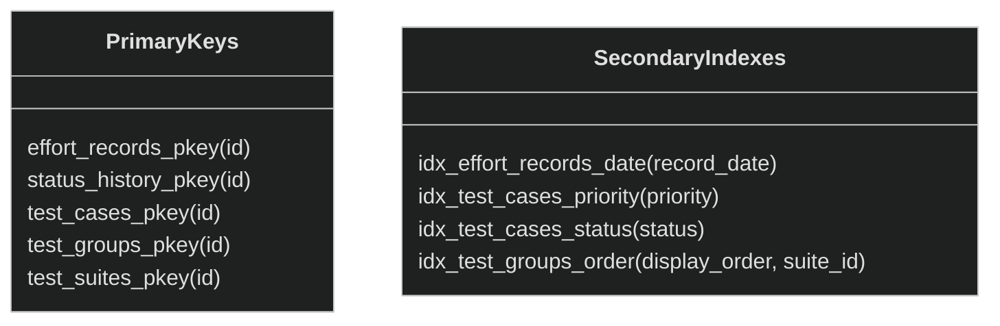

# データベース設計完了図 (2024-11-10)

## 1. ER図

## 2. ENUM定義

## 3. インデックス定義

## 4. 制約一覧

### 4.1 CHECK制約
- effort_records: `check_positive_effort (effort_amount > 0)`

### 4.2 トリガー
1. update_test_cases_updated_at
   - テーブル: test_cases
   - イベント: UPDATE
   - タイミング: BEFORE

2. update_test_groups_updated_at
   - テーブル: test_groups
   - イベント: UPDATE
   - タイミング: BEFORE

3. update_test_suites_updated_at
   - テーブル: test_suites
   - イベント: UPDATE
   - タイミング: BEFORE

### 4.3 外部キー制約
1. test_groups.suite_id → test_suites.id
2. test_cases.group_id → test_groups.id
3. effort_records.test_case_id → test_cases.id
4. status_history.test_case_id → test_cases.id

## 5. シーケンス
1. effort_records_id_seq
   - 開始値: 1
   - 最小値: 1
   - 最大値: 2147483647
   - 増分: 1

2. status_history_id_seq
   - 開始値: 1
   - 最小値: 1
   - 最大値: 2147483647
   - 増分: 1

## 6. 残作業項目

### 6.1 確認が必要な項目
- [ ] パーティショニング戦略の必要性検討
- [ ] バックアップ・リストア手順の確認
- [ ] パフォーマンスチューニングの必要性評価
- [ ] 監視・メンテナンス計画の策定
- [ ] データアーカイブ戦略の決定

### 6.2 推奨アクション
1. 短期的なアクション
   - [ ] 各テーブルのサンプルデータ作成
   - [ ] 主要クエリのパフォーマンステスト
   - [ ] バックアップ・リストア手順の文書化

2. 中長期的な検討項目
   - [ ] データアーカイブ戦略の策定
   - [ ] パーティショニング戦略の検討
   - [ ] 監視・アラート体制の構築
