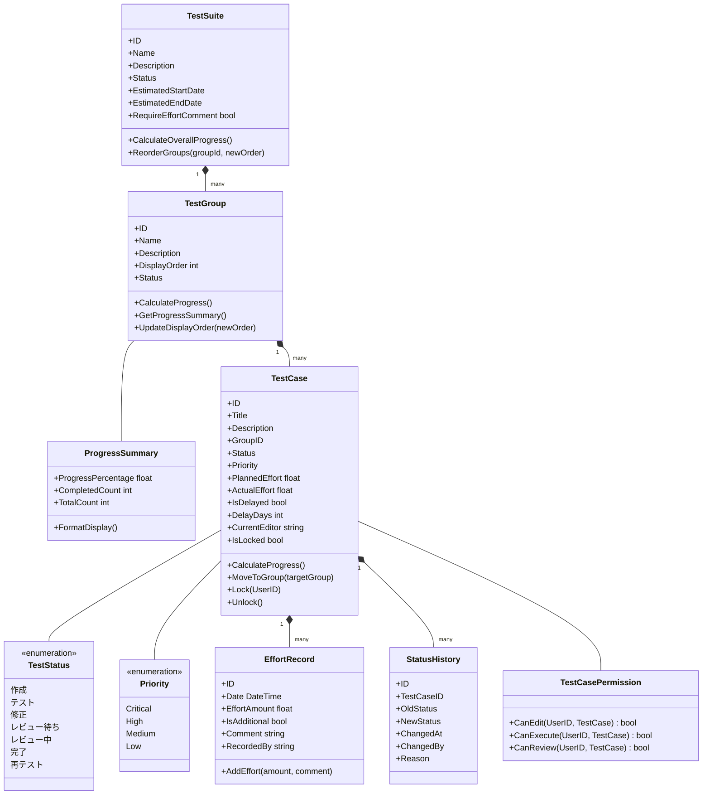

```mermaid
classDiagram
    class TestSuite {
        +ID
        +Name
        +Description
        +Status
        +EstimatedStartDate
        +EstimatedEndDate
        +RequireEffortComment bool
        +CalculateOverallProgress()
        +ReorderGroups(groupId, newOrder)
    }
    
    class TestGroup {
        +ID
        +Name
        +Description
        +DisplayOrder int
        +Status
        +CalculateProgress()
        +GetProgressSummary()
        +UpdateDisplayOrder(newOrder)
    }
    
    class ProgressSummary {
        +ProgressPercentage float
        +CompletedCount int
        +TotalCount int
        +FormatDisplay()
    }
    
    class TestCase {
        +ID
        +Title
        +Description
        +GroupID
        +Status
        +Priority
        +PlannedEffort float
        +ActualEffort float
        +IsDelayed bool
        +DelayDays int
        +CurrentEditor string
        +IsLocked bool
        +CalculateProgress()
        +MoveToGroup(targetGroup)
        +Lock(UserID)
        +Unlock()
    }
    
    class TestStatus {
        <<enumeration>>
        作成
        テスト
        修正
        レビュー待ち
        レビュー中
        完了
        再テスト
    }
    
    class Priority {
        <<enumeration>>
        Critical
        High
        Medium
        Low
    }
    
    class EffortRecord {
        +ID
        +Date DateTime
        +EffortAmount float
        +IsAdditional bool
        +Comment string
        +RecordedBy string
        +AddEffort(amount, comment)
    }
    
    class StatusHistory {
        +ID
        +TestCaseID
        +OldStatus
        +NewStatus
        +ChangedAt
        +ChangedBy
        +Reason
    }
    
    class TestCasePermission {
        +CanEdit(UserID, TestCase) bool
        +CanExecute(UserID, TestCase) bool
        +CanReview(UserID, TestCase) bool
    }

    TestSuite "1" *-- "many" TestGroup
    TestGroup "1" *-- "many" TestCase
    TestGroup -- ProgressSummary
    TestCase -- TestStatus
    TestCase -- Priority
    TestCase "1" *-- "many" EffortRecord
    TestCase "1" *-- "many" StatusHistory
    TestCase -- TestCasePermission
```