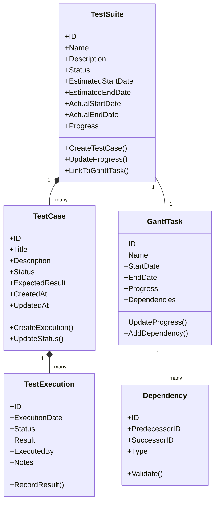

# domain-model.md
# ドメインモデル

## テストケース管理システム
テストケース管理とガントチャートを統合したシステムのドメインモデルです。

## クラス図

```mermaid
classDiagram
    class TestSuite {
        +ID
        +Name
        +Description
        +Status
        +EstimatedStartDate
        +EstimatedEndDate
        +ActualStartDate
        +ActualEndDate
        +Progress
        +CreateTestCase()
        +UpdateProgress()
        +LinkToGanttTask()
    }
    
    class TestCase {
        +ID
        +Title
        +Description
        +Status
        +ExpectedResult
        +CreatedAt
        +UpdatedAt
        +CreateExecution()
        +UpdateStatus()
    }
    
    class TestExecution {
        +ID
        +ExecutionDate
        +Status
        +Result
        +ExecutedBy
        +Notes
        +RecordResult()
    }
    
    class GanttTask {
        +ID
        +Name
        +StartDate
        +EndDate
        +Progress
        +Dependencies
        +UpdateProgress()
        +AddDependency()
    }
    
    class Dependency {
        +ID
        +PredecessorID
        +SuccessorID
        +Type
        +Validate()
    }

    TestSuite "1" *-- "many" TestCase
    TestCase "1" *-- "many" TestExecution
    TestSuite "1" -- "1" GanttTask
    GanttTask "1" -- "many" Dependency
```