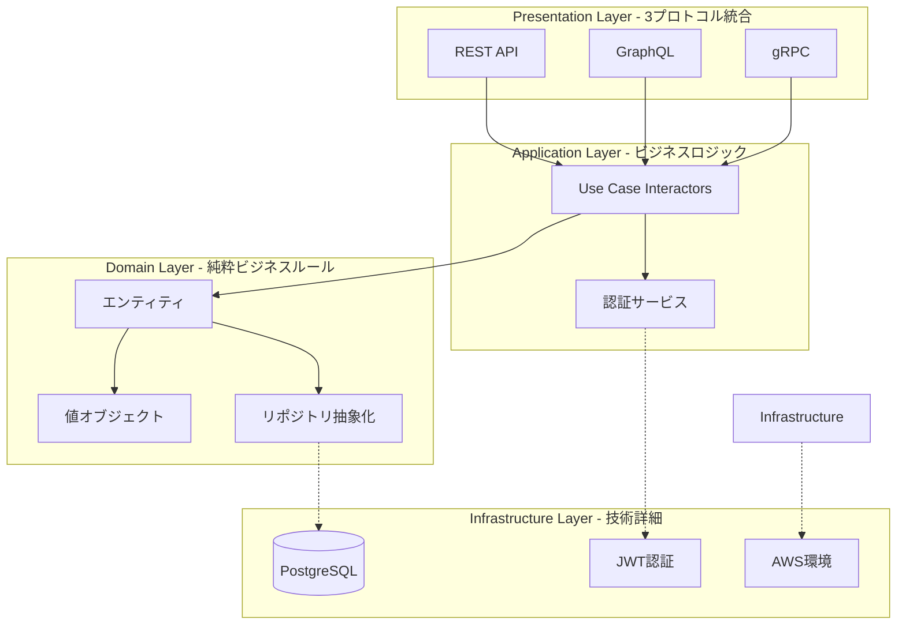
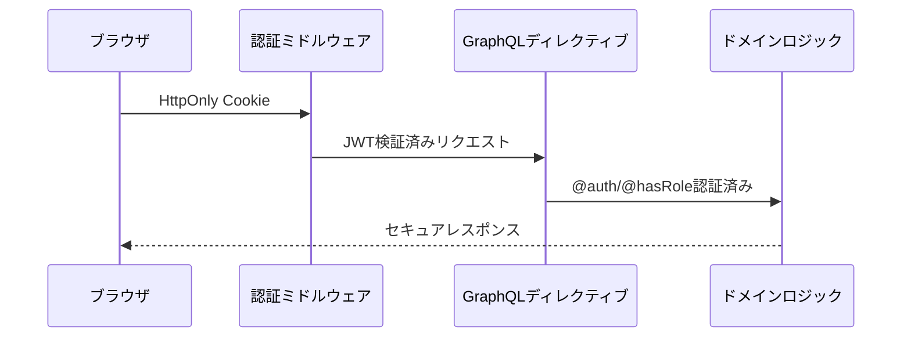

# Portfolio Overview - 技術的探求による統合Webアプリケーション

## プロジェクト概要

### 技術的探求心による挑戦的プロジェクト

このプロジェクトは、**純粋な技術的好奇心と探求心**から生まれた意欲的な取り組みです。「GraphQLやgRPCを実際に動くところまで確認してみたい」という知的探求心を原動力に、**複数の新技術領域を同時に習得し、統合システムとして実現する**という困難な挑戦に取り組みました。

**プロジェクトの本質**：
- 🔍 **技術的探求**: 未経験技術の実用レベルでの検証・習得
- 🚀 **創造的実現**: 技術的アイデアの完全な形での実現
- 📚 **学習深化**: 複数技術領域の体系的理解構築
- 🌟 **自発的挑戦**: 内発的動機による継続的技術革新

### 意欲的な技術統合チャレンジ

**同時習得した技術領域**：
- **GraphQL**: Apollo Client統合・認証ディレクティブ実装
- **gRPC**: Protocol Buffers・デュアルプロトコル対応
- **Terraform**: Infrastructure as Code・AWS本番環境構築
- **React 19**: 最新フロントエンド技術・TypeScript統合

これらの技術を**単独ではなく統合システムとして実現**することで、より実践的で深い理解を追求しました。

## 学習プロセスと技術習得への取り組み

### 継続的学習・理解深化への努力

**技術詳細理解の継続的取り組み**：

プロジェクト実装と並行して、**技術理解の深化と説明能力向上**に継続的に取り組んでいます。実装による体験学習に加えて、概念理解による知識体系化を重視し、以下の学習支援資料を自主作成しました：

**作成済み技術理解支援資料（9つ）**：

1. **JWT認証システム解説資料**
   - JWTトークン構造・署名検証メカニズムの詳細
   - HttpOnly Cookieとの組み合わせセキュリティ効果

2. **XSS対策・セキュリティ実装解説資料**
   - XSS攻撃の仕組みと防御メカニズム
   - 多層防御設計の実装詳細

3. **DataLoader・N+1問題解説資料**
   - N+1問題の発生メカニズム・96%削減効果の技術背景
   - バッチング・キャッシング原理の詳細

4. **技術配置図・システム内役割マップ**
   - フロントエンド・バックエンド・インフラの統合図解
   - 各技術の責務・役割の明示

5. **3プロトコル統合アーキテクチャ図**
   - REST・GraphQL・gRPCの協調動作詳細
   - ALBルーティング・デュアルプロトコル対応

6. **学習・習得プロセスマップ**
   - AI支援学習手法・体験学習アプローチ
   - 継続改善による品質向上サイクル

7. **Clean Architecture + DDD実践解説**
   - 4層アーキテクチャ・依存関係逆転の実装
   - DDD戦術パターンの実践詳細

8. **GraphQL実装詳細解説**
   - Schema-First開発・認証ディレクティブ統合
   - Code Generation・開発効率向上手法

9. **AWS環境統合解説**
   - Infrastructure as Code・Terraform実践
   - ECS+ALB+CloudFront統合・本番運用実現

### 学習価値と技術理解への姿勢

**体験学習と概念理解の統合アプローチ**：

- ✅ **実装による体験学習**: 動作システム構築による実践的技術理解
- ✅ **概念理解による知識体系化**: 技術原理・メカニズムの詳細学習
- ✅ **文書化による学習定着**: 技術解説資料作成による理解深化
- ✅ **継続的改善**: 学習内容の定期的見直し・品質向上

**技術説明・質問対応能力向上への取り組み**：

技術実装能力に加えて、**技術内容を分かりやすく説明する能力**の向上にも取り組んでいます。上記の技術解説資料は、第三者への技術説明やプレゼンテーション時のバックアップ資料としても活用しています。

**学習課題への正直な取り組み**：

技術詳細理解については継続的な学習が必要な状況であることを認識し、以下の取り組みを継続しています：

- 🎯 **JWT認証・XSS対策・DataLoader**: 動作原理・内部実装の詳細理解深化
- 📚 **技術配置・役割理解**: 各技術がシステムのどこで使用されているかの把握強化
- 🎓 **説明・質問対応**: 技術詳細質問への即座回答能力向上

これらの課題に対して、**実装経験を基盤とした概念学習**と**継続的な自己学習**により、着実な技術理解向上を目指しています。

## 技術アーキテクチャの探求成果

### Clean Architecture + DDD実践による学習深化



**アーキテクチャ実践による学習成果**：
- 🏗️ **依存関係逆転**: インターフェース駆動設計の実践的理解
- 🎯 **関心の分離**: 各層の責務明確化による保守性確保
- 🔄 **拡張性設計**: 新プロトコル追加時の影響最小化

### 3プロトコル統合による技術比較学習

| プロトコル | 技術的特徴 | 実装による学習内容 |
|------------|------------|-------------------|
| **REST API** | HTTP/JSON標準 | RESTful設計原則・HTTP標準準拠 |
| **GraphQL** | Schema-First開発 | 型安全性・認証ディレクティブ・DataLoader最適化 |
| **gRPC** | Protocol Buffers | バイナリシリアライゼーション・ストリーミング |

**統合実装による価値**：
- 📊 **適材適所理解**: 各プロトコルの最適用途の実践的把握
- 🔧 **技術選択力**: 要求に応じた適切な技術判断能力
- 🎯 **統合設計**: 複数技術の協調動作実現

## GraphQL実装による技術的探求

### 認証統合とディレクティブ実装

**宣言的セキュリティの実現**：
```graphql
directive @auth on FIELD_DEFINITION
directive @hasRole(role: String!) on FIELD_DEFINITION

extend type Mutation {
  createUser(input: CreateUserInput!): User! @hasRole(role: "Admin")
  changePassword(oldPassword: String!, newPassword: String!): Boolean! @auth
}
```

**技術探求による成果**：
- 🔒 **セキュリティ統合**: GraphQLスキーマレベルでの認証制御
- 📋 **宣言的設計**: 権限要求の明示的表現
- 🛡️ **一貫性確保**: 全操作での統一認証フロー

### DataLoaderによるパフォーマンス最適化

**N+1問題の解決実証**：
```
最適化前: 20TestSuites + 60Groups + 300Cases = 381クエリ
最適化後: 1TestSuites + 1Groups + 1Cases = 3クエリ
効果: 96%クエリ削減・大幅な応答時間改善
```

**技術学習による価値**：
- ⚡ **パフォーマンス理解**: データフェッチング最適化の実践
- 🧠 **バッチング**: 効率的なデータ取得パターンの習得
- 📈 **測定可能な改善**: 定量的効果による技術価値実証

## フロントエンド技術統合による現代的開発手法

### React 19 + TypeScript + Apollo Client統合

**最新技術スタックによる学習**：
- ⚛️ **React 19.1.0**: 最新コンポーネントフレームワーク
- 📝 **TypeScript 5.8.3**: 厳密な型安全性による品質確保
- 🔗 **Apollo Client 3.13.8**: GraphQL状態管理・キャッシュ戦略
- 🎨 **Material UI 7.1.1**: モダンUIコンポーネント統合

### Page-based アーキテクチャによる設計品質向上

**継続的改善による学習プロセス**：
- 🎯 **設計原則適用**: 1機能1ファイル原則の100%実装
- 🔄 **品質向上サイクル**: LoginForm統合による設計一貫性確立
- 📊 **完成度達成**: 予想70-80% → 実際100%完成

## AWS環境統合による本番運用経験

### Infrastructure as Code実践

**Terraform未経験からの本番環境構築**：
- 🏗️ **モジュール化設計**: 複雑システムの体系的管理
- 🔄 **3サービス共存**: 技術的困難の解決による運用実現
- 🌐 **クラウドネイティブ**: ECS + ALB + CloudFrontによる統合

**実際の稼働システム**：
- 🌐 **フロントエンド**: https://example-frontend.cloudfront.net/
- 🔗 **GraphQL API**: https://example-graphql-api.com/
- ✅ **継続稼働**: 実用レベルでの安定動作

## 認証・セキュリティ実装による専門性習得

### JWT + HttpOnly Cookie統合

**多層防御セキュリティの実装**：


**セキュリティ学習成果**：
- 🔐 **トークン管理**: JWTの安全な生成・検証実装
- 🛡️ **XSS対策**: HttpOnly Cookieによる攻撃防止
- 👑 **権限制御**: ロールベース認証システム

## 学習プロセスと開発手法

### AI支援による効率的技術習得

**現代的学習手法の実践**：
- 🤖 **AI活用**: 新技術理解の効率化・実装支援
- 📚 **体系的文書化**: 45,000行技術文書による知識永続化
- 🔄 **継続的改善**: Phase別品質向上による学習深化

**学習効果の定量化**：
- 📅 **習得期間**: 複数技術の並行学習を4週間で実現
- 📊 **理解深度**: 理論から実用レベルまでの完全習得
- 🎯 **実践適用**: 学習内容の即座実システム適用

### 段階的品質向上による継続学習

**Phase別学習アプローチ**：
- 🏗️ **Phase 1-2**: アーキテクチャ基盤・データ層設計
- 🔒 **Phase 3**: 認証・セキュリティ実装
- 📊 **Phase 4**: GraphQL統合・最適化
- 🌐 **Phase 5**: API統合・本番環境
- ✨ **Phase 6**: 最終統合・品質確立

### 学習支援資料作成による知識体系化

**自主的学習・改善努力の具体的実証**：

技術実装と並行して、**技術理解深化への継続的取り組み**として9つの詳細解説資料を作成しました。これらの資料は：

- 🎓 **質問対応能力向上**: 技術詳細質問への回答支援
- 📚 **知識体系化**: 技術情報の整理・永続化
- 🔍 **理解深化**: 文書化プロセスによる学習促進
- 💡 **自発的学習**: 内発的動機による継続的技術探求

の価値を持ち、**技術理解への真摯な取り組み姿勢**を具体的に示しています。

## 技術価値の実証

### 定量的成果による学習効果

**実測による技術価値**：
- ⚡ **DataLoader効果**: N+1問題96%削減の実証
- 🚀 **開発効率**: GraphQL Code Generationによる開発プロセス最適化
- 🛡️ **品質向上**: TypeScript型安全性による堅牢性確保
- 📈 **完成度**: 予想を大幅に上回る100%完成達成

### 実用システムとしての動作実績

**本番環境での継続稼働**：
- 🌐 **Webアプリケーション**: 実際のユーザー操作対応
- 🔐 **認証システム**: セキュアなユーザー管理
- 📊 **データ管理**: テストスイートCRUD操作の完全実装
- ⚡ **パフォーマンス**: 最適化された応答性能

## プロジェクト価値の総括

### 技術的探求プロジェクトとしての意義

**学習・挑戦価値**：
- 🔍 **知的探求**: 未経験技術の実用レベル検証達成
- 🚀 **創造実現**: 技術的アイデアの完全な形での実現
- 📚 **体系的理解**: 複数技術領域の統合的習得
- 🌟 **自発的成長**: 内発的動機による継続的技術革新

**実装能力の実証**：
- 🏗️ **アーキテクチャ設計**: Clean Architecture + DDDの実践適用
- 🔗 **技術統合**: 3プロトコル + フロントエンド + インフラの統合
- 🛡️ **セキュリティ**: 本番レベル認証システムの実装
- 🌐 **運用実績**: AWS環境での実際のサービス稼働

**現代的開発手法の習得**：
- 🤖 **AI支援活用**: 効率的学習・開発プロセスの確立
- 📊 **継続的改善**: 段階的品質向上手法の実践
- 📝 **知識体系化**: 技術文書化による学習成果の永続化

**学習・成長への継続的取り組み**：
- 📚 **技術理解深化**: 9つの学習支援資料による自主学習実証
- 🎓 **説明能力向上**: 技術解説・質問対応能力向上への努力
- 🔄 **継続的学習**: 技術詳細理解の継続的改善姿勢

### プロジェクトの独自性

**技術的探求アプローチの価値**：
- 💡 **純粋な探求心**: 市場要求ではなく知的好奇心による技術選択
- 🎯 **統合チャレンジ**: 単独技術ではなく複数技術の同時習得・統合
- 🔄 **実用レベル追求**: 理論理解に留まらない動作システムの実現
- 📈 **継続的深化**: 学習プロセス自体の最適化・体系化

このプロジェクトは、**技術的好奇心と創造性を原動力とした自発的学習**により、複数の新技術領域を統合し、実用レベルのWebアプリケーションとして実現した技術的探求の成果です。

単なる技術実装を超えて、**現代的な学習手法による効率的技術習得**と**継続的改善による品質向上**を実践し、フルスタック開発能力と問題解決力を総合的に実証しています。

**技術理解深化への継続的取り組み**と**自発的学習・改善努力**により、実装能力と技術説明能力の両面で成長を続けるエンジニアとしての姿勢を具体的に示した、技術的探求価値を重視するプロジェクトです。