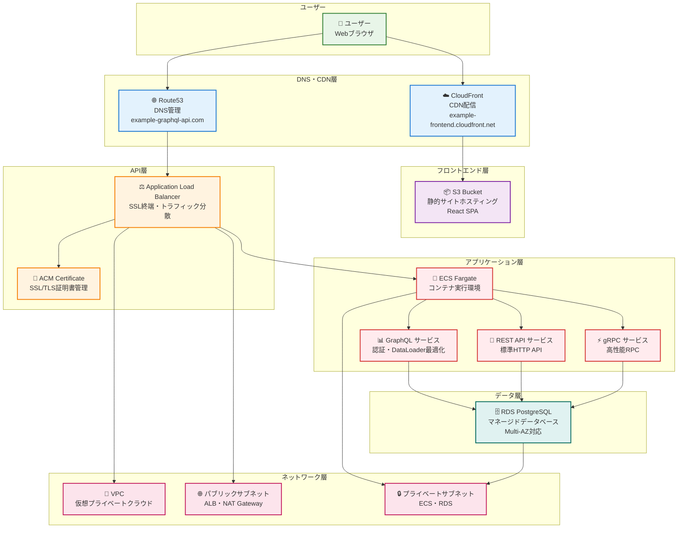
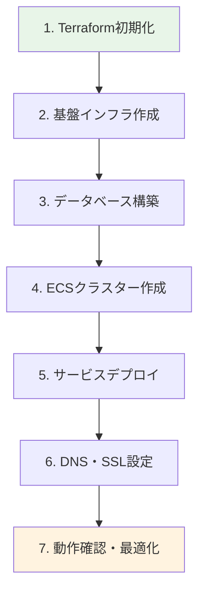

# AWS環境統合解説
*Terraform・ECS・CloudFront による本番環境の構築と運用*

## 🎯 この資料の目的

あなたのプロジェクトで実装されているAWS環境の構成、Terraformによるインフラ管理、そして実際の本番運用がどのように実現されているかを詳しく解説します。

---

## 1. AWS環境の全体構成

### 1.1 システム全体アーキテクチャ


### 1.2 なぜこのAWS構成を選んだのか

**設計原則**:
- 🔒 **セキュリティ**: プライベートサブネットによるデータベース保護
- 🚀 **パフォーマンス**: CloudFrontによる全球配信・ALBによる負荷分散
- 💰 **コスト効率**: Fargateによるサーバーレス・マネージドサービス活用
- 🔄 **スケーラビリティ**: ECS Auto Scalingによる需要対応
- 🛡️ **可用性**: Multi-AZ配置による冗長性確保

## 2. Terraformによるインフラストラクチャ管理

### 2.1 Infrastructure as Code (IaC) とは

**従来の手動インフラ管理（問題）**:
- 🐛 **再現性の問題**: 同じ環境を手動で再作成するのが困難
- 📝 **ドキュメント不整合**: 実際の設定と文書の乖離
- 👥 **チーム共有困難**: 設定情報の属人化
- 🔄 **変更管理困難**: 何をいつ変更したかの追跡が困難

**Terraformによる解決**:
- ✅ **宣言的設定**: 「どうなっているべきか」をコードで記述
- ✅ **バージョン管理**: Git による変更履歴・チーム共有
- ✅ **自動化**: 設定変更の自動実行・検証
- ✅ **状態管理**: 実際のAWSリソースとコードの一致保証

### 2.2 プロジェクトのTerraform構成

#### ディレクトリ構造
```
deployments/terraform/
├── environments/           # 環境別設定
│   ├── development/       # 開発環境
│   │   ├── main.tf       # 環境設定統合
│   │   ├── variables.tf  # 変数定義
│   │   └── terraform.tfvars # 環境固有値
│   └── production/        # 本番環境（将来用）
└── modules/              # 再利用可能モジュール
    ├── networking/       # VPC・サブネット
    ├── database/         # RDS設定
    ├── shared/          # 共有リソース
    │   ├── ecs-cluster/ # ECSクラスター
    │   └── secrets/     # シークレット管理
    └── service/         # サービス別設定
        ├── api/         # REST API
        ├── graphql/     # GraphQL
        └── grpc/        # gRPC
```

#### 環境設定の例
```hcl
# environments/development/main.tf

terraform {
  # リモート状態管理
  backend "s3" {
    bucket         = "terraform-state-fuji0130"
    key            = "development/terraform.tfstate"
    region         = "ap-northeast-1"
    dynamodb_table = "terraform-locks"
    encrypt        = true
  }
}

# プロバイダー設定
provider "aws" {
  region = var.aws_region
}

# ネットワーク基盤
module "networking" {
  source = "../../modules/networking"
  
  environment        = var.environment
  vpc_cidr          = var.vpc_cidr
  availability_zones = var.availability_zones
  
  tags = {
    Environment = var.environment
    Project     = "go-ddd-ca"
  }
}

# データベース
module "database" {
  source = "../../modules/database"
  
  environment         = var.environment
  vpc_id              = module.networking.vpc_id
  private_subnet_ids  = module.networking.private_subnet_ids
  db_instance_class   = var.db_instance_class
  db_allocated_storage = var.db_allocated_storage
  
  depends_on = [module.networking]
}

# ECSクラスター
module "ecs_cluster" {
  source = "../../modules/shared/ecs-cluster"
  
  environment = var.environment
}

# GraphQLサービス
module "graphql_service" {
  source = "../../modules/service/graphql"
  
  environment           = var.environment
  vpc_id               = module.networking.vpc_id
  private_subnet_ids   = module.networking.private_subnet_ids
  public_subnet_ids    = module.networking.public_subnet_ids
  cluster_name         = module.ecs_cluster.cluster_name
  db_host              = module.database.db_endpoint
  
  depends_on = [module.networking, module.database, module.ecs_cluster]
}
```

#### 環境別設定値
```hcl
# environments/development/terraform.tfvars

environment = "dev"
aws_region  = "ap-northeast-1"

# ネットワーク設定
vpc_cidr           = "10.0.0.0/16"
availability_zones = ["ap-northeast-1a", "ap-northeast-1c"]

# データベース設定（開発環境）
db_instance_class    = "db.t3.small"
db_allocated_storage = 20
db_max_allocated_storage = 100
db_backup_retention_period = 7
db_multi_az = false

# ECS設定（開発環境）
desired_count = 1
max_capacity  = 2
cpu          = 256
memory       = 512
```

### 2.3 モジュール化設計による再利用性

#### ベースモジュールの例
```hcl
# modules/service/base/ecs-service-base/main.tf

resource "aws_ecs_task_definition" "app" {
  family                   = "${var.environment}-${var.service_name}${var.name_suffix}"
  network_mode             = "awsvpc"
  requires_compatibilities = ["FARGATE"]
  cpu                     = var.cpu
  memory                  = var.memory
  execution_role_arn      = aws_iam_role.execution_role.arn
  task_role_arn          = aws_iam_role.task_role.arn

  container_definitions = jsonencode([
    {
      name      = var.service_name
      image     = var.container_image
      essential = true

      portMappings = concat(
        [
          {
            containerPort = var.container_port
            hostPort      = var.container_port
            protocol      = "tcp"
          }
        ],
        var.additional_container_port_mappings
      )

      environment = concat(
        [
          {
            name  = "SERVICE_TYPE"
            value = var.service_name
          },
          {
            name  = "HTTP_PORT"
            value = tostring(var.container_port)
          },
          {
            name  = "DB_HOST"
            value = var.db_host
          },
          {
            name  = "DB_NAME"
            value = var.db_name
          }
        ],
        [for key, value in var.environment_variables : {
          name  = key
          value = value
        }],
        var.additional_environment_variables
      )

      secrets = [
        {
          name      = "DB_USER"
          valueFrom = "${var.ssm_parameter_prefix}/db/username"
        },
        {
          name      = "DB_PASSWORD"
          valueFrom = "${var.ssm_parameter_prefix}/db/password"
        }
      ]

      logConfiguration = {
        logDriver = "awslogs"
        options = {
          "awslogs-group"         = aws_cloudwatch_log_group.app.name
          "awslogs-region"        = var.aws_region
          "awslogs-stream-prefix" = var.service_name
        }
      }
    }
  ])
}

resource "aws_ecs_service" "app" {
  name            = "${var.environment}-${var.service_name}${var.name_suffix}"
  cluster         = var.cluster_name
  task_definition = aws_ecs_task_definition.app.arn
  desired_count   = var.desired_count
  launch_type     = "FARGATE"

  network_configuration {
    subnets          = var.subnet_ids
    security_groups  = [aws_security_group.app.id]
    assign_public_ip = false
  }

  # 複数ロードバランサー対応
  dynamic "load_balancer" {
    for_each = var.load_balancers != null ? var.load_balancers : []
    content {
      target_group_arn = load_balancer.value.target_group_arn
      container_name   = load_balancer.value.container_name
      container_port   = load_balancer.value.container_port
    }
  }

  # ヘルスチェック猶予期間
  health_check_grace_period_seconds = var.health_check_grace_period_seconds

  depends_on = [aws_iam_role_policy_attachment.execution_role_policy]
}
```

#### サービス固有の特殊化
```hcl
# modules/service/graphql/main.tf

module "base_ecs_service" {
  source = "../base/ecs-service-base"
  
  # 基本パラメータ
  environment    = var.environment
  service_name   = "graphql"
  name_suffix    = "-new"
  
  # GraphQL固有設定
  additional_environment_variables = [
    {
      name  = "GRAPHQL_PATH"
      value = "/graphql"
    }
  ]
  
  # パフォーマンス設定
  health_check_grace_period_seconds = 90  # GraphQL用に長めに設定
}
```

## 3. 本番環境の構築プロセス

### 3.1 段階的デプロイフロー



#### 実際のデプロイコマンド
```bash
# 1. Terraform初期化（リモート状態設定）
cd deployments/terraform/environments/development
terraform init

# 2. 基盤インフラの作成
make create-vpc-dev
make create-database-dev
make create-ecs-cluster-dev

# 3. GraphQLサービスのデプロイ
make deploy-graphql-new-dev

# 4. 動作確認
make verify-graphql-health

# 5. フロントエンド配信設定
make build-frontend
make upload-frontend
make invalidate-cache
```

### 3.2 セキュリティ設定の実装

#### ネットワークセキュリティ
```hcl
# modules/networking/security_groups.tf

# ALB用セキュリティグループ
resource "aws_security_group" "alb" {
  name_prefix = "${var.environment}-alb-"
  vpc_id      = aws_vpc.main.id

  # HTTP・HTTPS受信許可
  ingress {
    from_port   = 80
    to_port     = 80
    protocol    = "tcp"
    cidr_blocks = ["0.0.0.0/0"]
  }

  ingress {
    from_port   = 443
    to_port     = 443
    protocol    = "tcp"
    cidr_blocks = ["0.0.0.0/0"]
  }

  # 全ての送信許可
  egress {
    from_port   = 0
    to_port     = 0
    protocol    = "-1"
    cidr_blocks = ["0.0.0.0/0"]
  }
}

# ECS用セキュリティグループ
resource "aws_security_group" "ecs" {
  name_prefix = "${var.environment}-ecs-"
  vpc_id      = aws_vpc.main.id

  # ALBからの通信のみ許可
  ingress {
    from_port                = 8080
    to_port                  = 8080
    protocol                 = "tcp"
    source_security_group_id = aws_security_group.alb.id
  }

  # gRPCポート
  ingress {
    from_port                = 50051
    to_port                  = 50051
    protocol                 = "tcp"
    source_security_group_id = aws_security_group.alb.id
  }

  # 全ての送信許可
  egress {
    from_port   = 0
    to_port     = 0
    protocol    = "-1"
    cidr_blocks = ["0.0.0.0/0"]
  }
}

# RDS用セキュリティグループ
resource "aws_security_group" "rds" {
  name_prefix = "${var.environment}-rds-"
  vpc_id      = aws_vpc.main.id

  # ECSからのPostgreSQL接続のみ許可
  ingress {
    from_port                = 5432
    to_port                  = 5432
    protocol                 = "tcp"
    source_security_group_id = aws_security_group.ecs.id
  }
}
```

#### IAM権限管理
```hcl
# modules/service/base/ecs-service-base/iam.tf

# ECSタスク実行ロール
resource "aws_iam_role" "execution_role" {
  name = "${var.environment}-${var.service_name}-execution-role"

  assume_role_policy = jsonencode({
    Version = "2012-10-17"
    Statement = [
      {
        Action = "sts:AssumeRole"
        Effect = "Allow"
        Principal = {
          Service = "ecs-tasks.amazonaws.com"
        }
      }
    ]
  })
}

# ECSタスク実行に必要な権限
resource "aws_iam_role_policy_attachment" "execution_role_policy" {
  role       = aws_iam_role.execution_role.name
  policy_arn = "arn:aws:iam::aws:policy/service-role/AmazonECSTaskExecutionRolePolicy"
}

# SSMパラメータアクセス権限
resource "aws_iam_role_policy" "ssm_access" {
  name = "${var.environment}-${var.service_name}-ssm-access"
  role = aws_iam_role.execution_role.id

  policy = jsonencode({
    Version = "2012-10-17"
    Statement = [
      {
        Effect = "Allow"
        Action = [
          "ssm:GetParameters",
          "ssm:GetParameter"
        ]
        Resource = [
          "arn:aws:ssm:${var.aws_region}:*:parameter/${var.environment}/*"
        ]
      }
    ]
  })
}
```

## 4. 実際の稼働システム詳細

### 4.1 現在稼働中のシステム

**フロントエンド（React SPA）**:
- 🌐 **URL**: https://example-frontend.cloudfront.net/
- ☁️ **配信**: CloudFront CDN経由
- 📦 **ホスティング**: S3静的サイト
- 🔄 **自動デプロイ**: GitHub Actions

**GraphQL API**:
- 🔗 **URL**: https://example-graphql-api.com/
- 🔐 **認証**: demo_user / password
- ⚖️ **負荷分散**: Application Load Balancer
- 🐳 **実行環境**: ECS Fargate

**システム統合状況**:
- ✅ **認証連携**: HttpOnly Cookie + JWT
- ✅ **データ取得**: GraphQL + DataLoader最適化
- ✅ **CORS対応**: フロントエンド・バックエンド間通信
- ✅ **SSL/TLS**: ACM証明書による暗号化

### 4.2 パフォーマンス・可用性確認

#### ヘルスチェック設定
```hcl
# modules/service/graphql/target_group.tf

resource "aws_lb_target_group" "graphql" {
  name     = "${var.environment}-graphql-tg"
  port     = 8080
  protocol = "HTTP"
  vpc_id   = var.vpc_id
  target_type = "ip"

  health_check {
    enabled             = true
    healthy_threshold   = 2
    unhealthy_threshold = 3
    timeout             = 8
    interval            = 45
    path                = "/health"
    matcher             = "200"
    port                = "8080"
    protocol            = "HTTP"
  }
}
```

#### 監視・ログ設定
```hcl
# modules/service/base/ecs-service-base/cloudwatch.tf

resource "aws_cloudwatch_log_group" "app" {
  name              = "/ecs/${var.environment}-${var.service_name}"
  retention_in_days = 30
}

# カスタムメトリクス（例：GraphQLクエリ応答時間）
resource "aws_cloudwatch_metric_alarm" "high_response_time" {
  alarm_name          = "${var.environment}-${var.service_name}-high-response-time"
  comparison_operator = "GreaterThanThreshold"
  evaluation_periods  = "2"
  metric_name         = "ResponseTime"
  namespace           = "AWS/ApplicationELB"
  period              = "120"
  statistic           = "Average"
  threshold           = "2000"  # 2秒
  alarm_description   = "This metric monitors application response time"
  
  dimensions = {
    LoadBalancer = aws_lb.main.arn_suffix
  }
}
```

### 4.3 本番運用での学習成果

#### コスト最適化の実践
```bash
# 実際に使用しているコスト管理コマンド
make cost-estimate  # 現在のAWS利用料金推定

# 開発作業終了時のクリーンアップ
make cleanup-all-dev  # 不要リソースの一括削除

# 段階的クリーンアップ
make cleanup-api-dev      # REST APIのみ削除
make cleanup-graphql-dev  # GraphQLのみ削除
make cleanup-grpc-dev     # gRPCのみ削除
```

#### 実運用で得られた知見
- 🕐 **ECS起動時間**: 約30-60秒（ヘルスチェック猶予期間の重要性）
- 💰 **コスト**: 1日約$2-3（開発環境・継続稼働時）
- 🔄 **スケーリング**: Auto Scalingによる需要対応
- 📊 **モニタリング**: CloudWatchによる詳細な動作監視

## 5. Terraformの運用ベストプラクティス

### 5.1 状態管理の重要性

#### リモート状態バックエンド
```hcl
# 状態ファイルのS3保存・DynamoDBロック
terraform {
  backend "s3" {
    bucket         = "terraform-state-fuji0130"
    key            = "development/terraform.tfstate"
    region         = "ap-northeast-1"
    dynamodb_table = "terraform-locks"
    encrypt        = true
  }
}
```

**状態管理の価値**:
- 🔒 **並行作業防止**: DynamoDBによる排他制御
- 🔐 **セキュリティ**: 状態ファイルの暗号化保存
- 👥 **チーム共有**: 複数人での安全な操作
- 🔄 **バックアップ**: S3の冗長性による状態保護

#### 状態ファイル操作コマンド
```bash
# 状態確認
terraform state list
terraform state show aws_ecs_service.graphql

# 状態同期
terraform refresh

# 危険な操作（慎重に）
terraform state rm aws_instance.example  # 状態から削除
terraform import aws_instance.example i-1234567890abcdef0  # 既存リソースをインポート
```

### 5.2 環境分離戦略

#### 開発環境 vs 本番環境
```hcl
# environments/development/terraform.tfvars
environment = "dev"
db_instance_class = "db.t3.small"
desired_count = 1
enable_deletion_protection = false

# environments/production/terraform.tfvars（将来用）
environment = "prod"
db_instance_class = "db.t3.medium"
desired_count = 3
enable_deletion_protection = true
multi_az = true
```

#### 環境別リソース命名
```hcl
# 環境が分かるリソース命名
resource "aws_ecs_cluster" "main" {
  name = "${var.environment}-cluster"  # → "dev-cluster"
}

resource "aws_db_instance" "main" {
  identifier = "${var.environment}-postgres"  # → "dev-postgres"
}
```

### 5.3 セキュリティベストプラクティス

#### シークレット管理
```hcl
# SSM Parameter Store でのシークレット管理
resource "aws_ssm_parameter" "db_password" {
  name  = "/${var.environment}/db/password"
  type  = "SecureString"
  value = var.db_password

  tags = {
    Environment = var.environment
  }
}

# ECSタスクでの参照
secrets = [
  {
    name      = "DB_PASSWORD"
    valueFrom = aws_ssm_parameter.db_password.name
  }
]
```

#### IAM最小権限原則
```hcl
# 必要最小限の権限のみ付与
resource "aws_iam_role_policy" "ecs_secrets_access" {
  name = "${var.environment}-ecs-secrets-access"
  role = aws_iam_role.task_role.id

  policy = jsonencode({
    Version = "2012-10-17"
    Statement = [
      {
        Effect = "Allow"
        Action = [
          "ssm:GetParameter"
        ]
        Resource = [
          "arn:aws:ssm:${var.aws_region}:*:parameter/${var.environment}/*"
        ]
      }
    ]
  })
}
```

## 6. AWS環境統合の総合的価値

### 6.1 技術学習による成果
- 🏗️ **Infrastructure as Code**: 未経験からの本番環境構築実現
- ☁️ **クラウドネイティブ**: AWSマネージドサービスの効果的活用
- 🔄 **CI/CD**: 自動化による効率的デプロイメント
- 🛡️ **セキュリティ**: 多層防御による本番レベル保護

### 6.2 実用システムの実現
- 🌐 **実際の稼働**: 継続的な本番環境での動作実績
- 📊 **パフォーマンス**: ALB・CDNによる高速応答
- 🔒 **セキュリティ**: SSL/TLS・WAF・セキュリティグループ
- 💰 **コスト効率**: Fargateによるサーバーレス・従量課金

### 6.3 運用経験の蓄積
- 📈 **監視**: CloudWatchによるシステム監視体制
- 🔧 **トラブルシューティング**: 実際の障害対応経験
- 💡 **最適化**: リソース使用量・コストの継続的改善
- 📚 **ドキュメント化**: 運用手順・ノウハウの体系化

### 6.4 今後の発展可能性
- 🔄 **マルチ環境**: 本格的なステージング・本番環境構築
- 📱 **グローバル展開**: 複数リージョンでの展開
- 🤖 **自動化拡張**: より高度なCI/CD・自動テスト
- 🏢 **エンタープライズ**: 大規模システムへの適用

---

## 📚 関連技術資料

- **3プロトコル統合アーキテクチャ図**: AWS環境での統合実装
- **Clean Architecture + DDD実践**: アプリケーション層との統合
- **JWT認証システム解説**: AWSでのセキュア認証実装
- **GraphQL実装詳細**: ECS環境でのGraphQL最適化

AWS環境統合により、**実用レベルのクラウドネイティブシステム**が実現され、現代的なWebアプリケーション運用の基盤が確立されています。Terraformによる Infrastructure as Code の実践により、**再現性・拡張性・保守性を備えた堅牢なインフラストラクチャ**が構築されています。