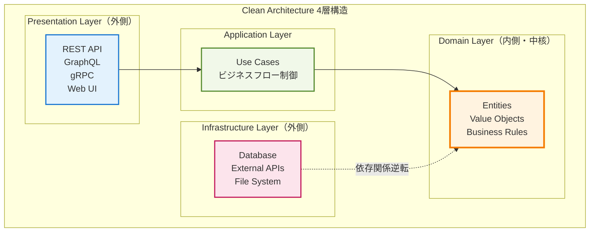
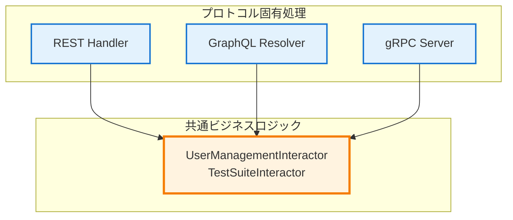

# Clean Architecture + DDD実践解説
*クリーンアーキテクチャとドメイン駆動設計の実装と価値*

## 🎯 この資料の目的

あなたのプロジェクトで実装されているClean Architecture（クリーンアーキテクチャ）とDDD（ドメイン駆動設計）がどのような考え方で、実際にどう実装されているかを分かりやすく解説します。

---

## 1. Clean Architecture（クリーンアーキテクチャ）とは

### 1.1 基本的な考え方
Clean Architectureは、ソフトウェアを4つの層に分けて、**内側の層が外側の層に依存しない**ようにする設計思想です。



### 1.2 なぜClean Architectureを使うのか

**問題**: 通常の開発では、ビジネスロジックがデータベースやWebフレームワークに依存してしまいます
```go
// 問題のあるコード例
func CreateUser(db *sql.DB, name string) error {
    // ビジネスルールがSQL文の中に埋まっている
    _, err := db.Exec("INSERT INTO users (name) VALUES (?)", name)
    return err
}
```

**解決**: Clean Architectureでは、ビジネスロジックを中央に置き、技術詳細から独立させます
```go
// Clean Architectureでの解決
type User struct {
    ID   string
    Name string
}

// ドメイン層：純粋なビジネスルール
func (u *User) Validate() error {
    if len(u.Name) == 0 {
        return errors.New("名前は必須です")
    }
    return nil
}

// アプリケーション層：ビジネスフロー
func (uc *UserUseCase) CreateUser(name string) (*User, error) {
    user := &User{Name: name}
    if err := user.Validate(); err != nil {
        return nil, err
    }
    return uc.repo.Save(user) // インターフェース経由
}
```

## 2. プロジェクトでのClean Architecture実装

### 2.1 実際のディレクトリ構造
```
internal/
├── domain/              # ドメイン層
│   ├── entity/         # エンティティ
│   │   ├── user.go
│   │   └── test_suite.go
│   ├── valueobject/    # 値オブジェクト
│   │   ├── id.go
│   │   └── status.go
│   └── repository/     # リポジトリインターフェース
│       └── user_repository.go
├── usecase/            # アプリケーション層
│   └── interactor/
│       ├── user_management_interactor.go
│       └── test_suite_interactor.go
├── interface/          # プレゼンテーション層
│   ├── api/           # REST API
│   ├── graphql/       # GraphQL
│   └── grpc/          # gRPC
└── infrastructure/     # インフラストラクチャ層
    ├── persistence/   # データベース実装
    └── auth/         # 認証実装
```

### 2.2 層間の関係性の実例

#### ドメイン層（中核）
```go
// internal/domain/entity/user.go
type User struct {
    ID           string
    Username     string
    PasswordHash string
    Role         UserRole
    CreatedAt    time.Time
}

// ビジネスルールをエンティティ内に実装
func (u *User) CanCreateTestSuite() bool {
    return u.Role == RoleAdmin || u.Role == RoleManager
}

func (u *User) ChangePassword(newPassword string) error {
    if len(newPassword) < 8 {
        return errors.New("パスワードは8文字以上必要です")
    }
    // パスワードハッシュ化はインフラ層に委譲
    return nil
}
```

#### アプリケーション層（ユースケース）
```go
// internal/usecase/interactor/user_management_interactor.go
type UserManagementInteractor struct {
    userRepo    domain.UserRepository    // インターフェース
    passwordSvc auth.PasswordService     // インターフェース
    jwtSvc      auth.JWTService          // インターフェース
}

func (i *UserManagementInteractor) CreateUser(input CreateUserInput) (*User, error) {
    // 1. ドメインエンティティ作成
    user := &domain.User{
        Username: input.Username,
        Role:     input.Role,
    }
    
    // 2. ビジネスルール検証（ドメイン層）
    if err := user.Validate(); err != nil {
        return nil, err
    }
    
    // 3. パスワードハッシュ化（インフラ層サービス）
    hashedPassword, err := i.passwordSvc.HashPassword(input.Password)
    if err != nil {
        return nil, err
    }
    user.PasswordHash = hashedPassword
    
    // 4. 永続化（インフラ層リポジトリ）
    return i.userRepo.Save(user)
}
```

#### プレゼンテーション層（API）
```go
// internal/interface/graphql/resolver/user_resolver.go
func (r *mutationResolver) CreateUser(ctx context.Context, input model.CreateUserInput) (*model.User, error) {
    // 1. プレゼンテーション形式 → アプリケーション形式変換
    usecaseInput := interactor.CreateUserInput{
        Username: input.Username,
        Password: input.Password,
        Role:     input.Role,
    }
    
    // 2. ユースケース実行
    user, err := r.userInteractor.CreateUser(usecaseInput)
    if err != nil {
        return nil, err
    }
    
    // 3. ドメイン形式 → プレゼンテーション形式変換
    return &model.User{
        ID:       user.ID,
        Username: user.Username,
        Role:     user.Role,
    }, nil
}
```

## 3. DDD（ドメイン駆動設計）の実践

### 3.1 DDDの核となる概念

#### エンティティ（Entity）
**同一性を持つオブジェクト**：IDで識別される
```go
// TestSuiteは同一性を持つエンティティ
type TestSuite struct {
    ID          string    // 同一性の識別子
    Name        string
    Description string
    Status      SuiteStatus
    CreatedAt   time.Time
}

// ビジネスルールをエンティティ内に実装
func (ts *TestSuite) CanStart() error {
    if ts.Status != SuiteStatusPreparation {
        return errors.New("準備中のスイートのみ開始できます")
    }
    return nil
}

func (ts *TestSuite) Start() error {
    if err := ts.CanStart(); err != nil {
        return err
    }
    ts.Status = SuiteStatusInProgress
    return nil
}
```

#### 値オブジェクト（Value Object）
**同一性を持たない、値そのものが重要なオブジェクト**
```go
// SuiteStatusは値オブジェクト
type SuiteStatus string

const (
    SuiteStatusPreparation SuiteStatus = "準備中"
    SuiteStatusInProgress  SuiteStatus = "実行中"
    SuiteStatusCompleted   SuiteStatus = "完了"
    SuiteStatusSuspended   SuiteStatus = "中断"
)

// 値オブジェクトは自己検証能力を持つ
func (s SuiteStatus) IsValid() bool {
    switch s {
    case SuiteStatusPreparation, SuiteStatusInProgress, 
         SuiteStatusCompleted, SuiteStatusSuspended:
        return true
    }
    return false
}

// 不変性を保証（変更ではなく新しい値を返す）
func (s SuiteStatus) Next() (SuiteStatus, error) {
    switch s {
    case SuiteStatusPreparation:
        return SuiteStatusInProgress, nil
    case SuiteStatusInProgress:
        return SuiteStatusCompleted, nil
    default:
        return s, errors.New("次の状態に進めません")
    }
}
```

#### リポジトリ（Repository）
**エンティティの永続化を抽象化**
```go
// domain/repository/user_repository.go（インターフェース）
type UserRepository interface {
    Save(user *User) (*User, error)
    FindByID(id string) (*User, error)
    FindByUsername(username string) (*User, error)
    Delete(id string) error
}

// infrastructure/persistence/postgres/user_repository.go（実装）
type PostgreSQLUserRepository struct {
    db SQLExecutor
}

func (r *PostgreSQLUserRepository) Save(user *domain.User) (*domain.User, error) {
    query := `INSERT INTO users (id, username, password_hash, role, created_at) 
              VALUES ($1, $2, $3, $4, $5)`
    
    _, err := r.db.ExecContext(ctx, query, 
        user.ID, user.Username, user.PasswordHash, user.Role, user.CreatedAt)
    
    return user, err
}
```

### 3.2 依存関係逆転の実現

**通常の依存関係（問題）**:
```
ビジネスロジック → データベース
```

**依存関係逆転後（解決）**:
```
ビジネスロジック → インターフェース ← データベース実装
```

```go
// ドメイン層がインターフェースを定義
type UserRepository interface {
    Save(user *User) (*User, error)
}

// インフラ層がインターフェースを実装
type PostgreSQLUserRepository struct{}
func (r *PostgreSQLUserRepository) Save(user *User) (*User, error) { /* 実装 */ }

// アプリケーション層はインターフェースに依存
type UserUseCase struct {
    repo UserRepository // 具象型ではなくインターフェース
}
```

## 4. 実装による具体的メリット

### 4.1 テストの容易性
```go
// モックリポジトリでテスト
type MockUserRepository struct {
    users map[string]*domain.User
}

func (m *MockUserRepository) Save(user *domain.User) (*domain.User, error) {
    m.users[user.ID] = user
    return user, nil
}

// ユースケースのテスト
func TestCreateUser(t *testing.T) {
    // モックを使用してテスト
    mockRepo := &MockUserRepository{users: make(map[string]*domain.User)}
    usecase := &UserUseCase{repo: mockRepo}
    
    user, err := usecase.CreateUser(CreateUserInput{
        Username: "test_user",
        Password: "password123",
    })
    
    assert.NoError(t, err)
    assert.Equal(t, "test_user", user.Username)
}
```

### 4.2 新機能追加の容易性
新しいAPIプロトコル（例：WebSocket）を追加する場合：

```go
// 既存のユースケースをそのまま再利用
type WebSocketHandler struct {
    userUseCase *interactor.UserManagementInteractor // 変更不要
}

func (h *WebSocketHandler) HandleCreateUser(conn *websocket.Conn, data []byte) {
    // WebSocket固有の処理のみ実装
    var input CreateUserInput
    json.Unmarshal(data, &input)
    
    // 既存のビジネスロジックを再利用
    user, err := h.userUseCase.CreateUser(input)
    
    // WebSocket固有のレスポンス処理
    response := map[string]interface{}{
        "user": user,
        "error": err,
    }
    conn.WriteJSON(response)
}
```

### 4.3 データベース変更の容易性
PostgreSQLからMongoDBに変更する場合：

```go
// 新しいリポジトリ実装を追加するだけ
type MongoUserRepository struct {
    collection *mongo.Collection
}

func (r *MongoUserRepository) Save(user *domain.User) (*domain.User, error) {
    // MongoDB固有の実装
    _, err := r.collection.InsertOne(ctx, user)
    return user, err
}

// ユースケースは変更不要
// インターフェースが同じなので依存注入で切り替え可能
```

## 5. プロジェクトでの実践効果

### 5.1 3つのAPIプロトコル統合


**実現できたこと**:
- 🔄 **コード再利用**: 同じビジネスロジックを3つのプロトコルで共有
- 🛡️ **一貫性**: 統一されたビジネスルールによる動作保証
- 🚀 **開発効率**: 新プロトコル追加時の実装コスト最小化

### 5.2 認証システムの統合
```go
// 認証ミドルウェア（プレゼンテーション層）
func AuthMiddleware(next http.Handler) http.Handler {
    return http.HandlerFunc(func(w http.ResponseWriter, r *http.Request) {
        // JWT検証の技術詳細
        token := extractToken(r)
        user, err := jwtService.ValidateToken(token)
        if err != nil {
            http.Error(w, "Unauthorized", 401)
            return
        }
        
        // ユーザー情報をコンテキストに保存
        ctx := context.WithValue(r.Context(), "user", user)
        next.ServeHTTP(w, r.WithContext(ctx))
    })
}

// ビジネスロジック（ドメイン層）
func (ts *TestSuite) CanBeModifiedBy(user *User) bool {
    // 純粋なビジネスルール
    return user.Role == RoleAdmin || 
           (user.Role == RoleManager && ts.CreatedBy == user.ID)
}
```

### 5.3 エラーハンドリングの統一
```go
// ドメイン層：ビジネスエラー定義
type DomainError struct {
    Code    string
    Message string
    Details map[string]interface{}
}

// アプリケーション層：エラー変換
func (uc *UserUseCase) CreateUser(input CreateUserInput) (*User, error) {
    if err := validateInput(input); err != nil {
        return nil, &DomainError{
            Code:    "VALIDATION_ERROR",
            Message: "入力データが不正です",
            Details: map[string]interface{}{"field": err.Field},
        }
    }
    // ...
}

// プレゼンテーション層：プロトコル固有変換
func ConvertToHTTPError(err error) (int, interface{}) {
    if domainErr, ok := err.(*DomainError); ok {
        switch domainErr.Code {
        case "VALIDATION_ERROR":
            return 400, map[string]string{"error": domainErr.Message}
        case "NOT_FOUND":
            return 404, map[string]string{"error": domainErr.Message}
        }
    }
    return 500, map[string]string{"error": "Internal Server Error"}
}
```

## 6. Clean Architecture + DDDのメリット総括

### 6.1 開発・保守面のメリット
- 🧪 **テストしやすさ**: モックを使った単体テストが容易
- 🔄 **変更容易性**: 技術詳細変更時のビジネスロジックへの影響最小化
- 👥 **チーム開発**: 層別の役割分担による並行開発可能
- 📚 **理解しやすさ**: 責務の明確化による可読性向上

### 6.2 技術面のメリット
- 🎯 **再利用性**: 同一ビジネスロジックの複数プロトコルでの活用
- 🛡️ **堅牢性**: 依存関係逆転による結合度の低減
- 🚀 **拡張性**: 新機能・新技術導入時の影響範囲限定
- 📈 **スケーラビリティ**: マイクロサービス化への対応容易性

### 6.3 学習・成長面のメリット
- 💡 **設計思考**: アーキテクチャレベルでの思考力向上
- 🎯 **問題解決**: 複雑なシステムの構造化能力習得
- 📚 **知識体系**: エンタープライズレベル設計パターンの理解
- 🔄 **継続改善**: 設計品質の継続的向上手法の習得

---

## 📚 関連技術資料

- **3プロトコル統合アーキテクチャ図**: 統合実装の詳細
- **JWT認証システム解説**: セキュリティ実装の詳細
- **技術配置図**: システム全体での技術役割

Clean Architecture + DDDの実践により、**保守性・拡張性・テスト容易性を備えたエンタープライズレベルのシステム設計**が実現され、複雑な要求に対応できる堅牢な基盤が構築されています。