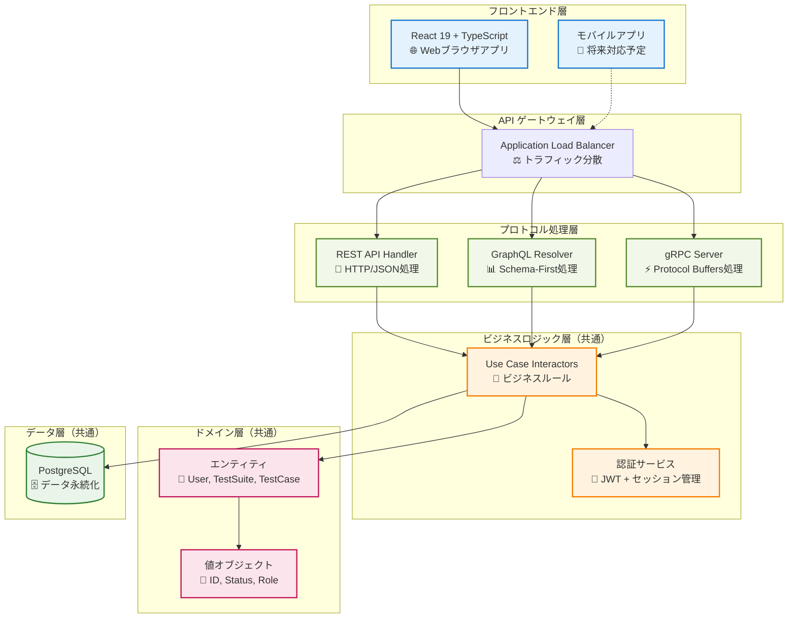
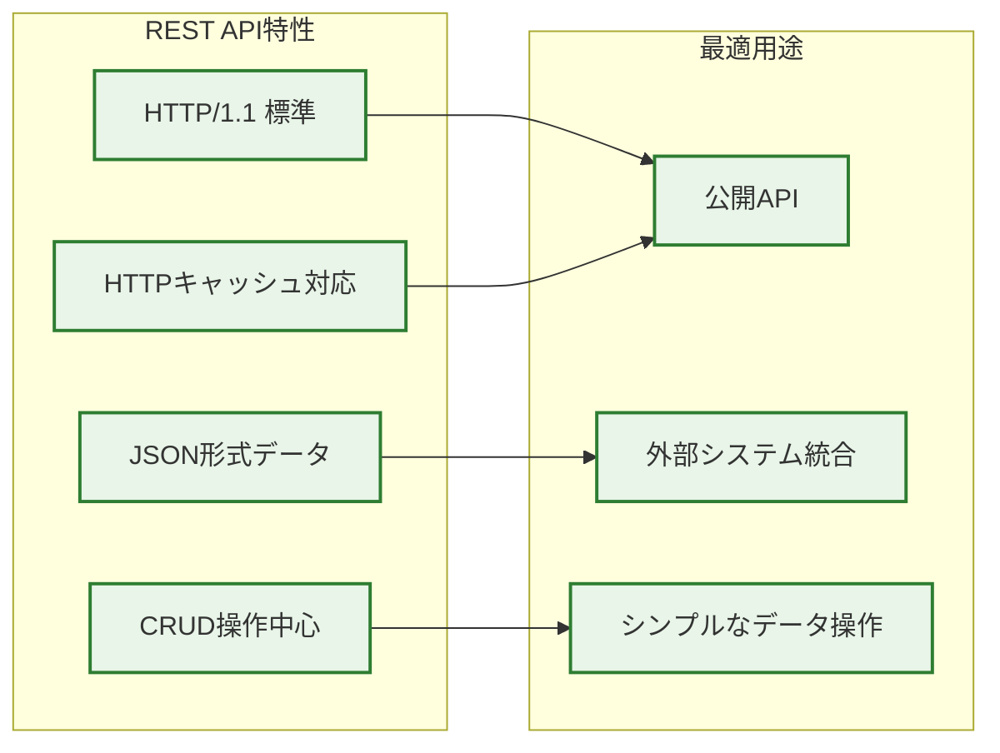
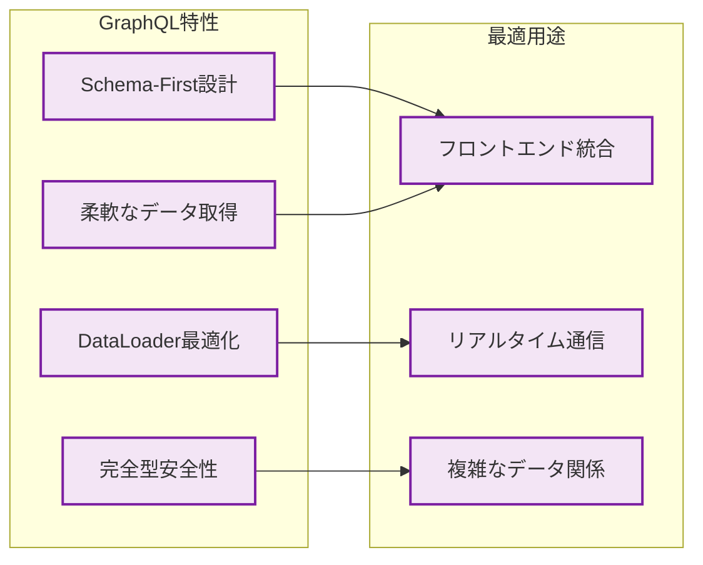
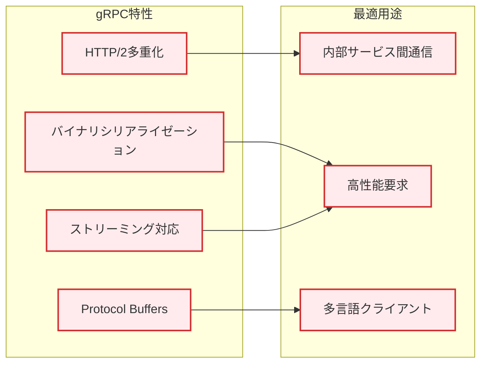
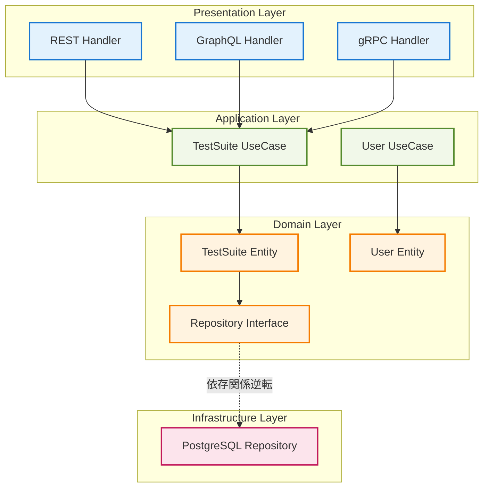
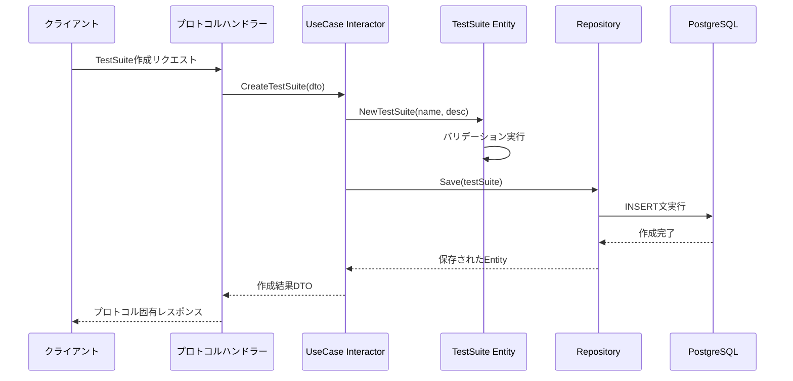

# 3プロトコル統合アーキテクチャ図
*REST API・GraphQL・gRPCの統合設計と使い分け戦略*

## 🎯 この資料の目的

あなたのプロジェクトで実装されている3つのAPIプロトコル（REST API・GraphQL・gRPC）がどのように統合されており、それぞれどのような特徴と用途があるかを視覚的に理解できるようにします。

---

## 1. 3プロトコル統合システム全体図



## 2. プロトコル別特性と使い分け

### 2.1 REST API - 標準HTTP通信


**プロジェクトでの実装**:
- **エンドポイント例**: `GET /test-suites`, `POST /test-suites`
- **実装ファイル**: `internal/interface/api/handler/test_suite_handler.go`
- **特徴**: RESTful設計原則に準拠、標準的なHTTPステータスコード使用

### 2.2 GraphQL - フロントエンド最適化


**プロジェクトでの実装**:
- **スキーマ定義**: `schema/schema.graphql`
- **リゾルバー**: `internal/interface/graphql/resolver/`
- **認証ディレクティブ**: `@auth`, `@hasRole`
- **最適化**: DataLoaderによる96%クエリ削減実現

### 2.3 gRPC - 高性能内部通信


**プロジェクトでの実装**:
- **プロトコル定義**: `proto/testsuite.proto`
- **サーバー実装**: `internal/interface/grpc/handler/test_suite_server.go`
- **デュアルポート**: HTTP互換(8080) + gRPCネイティブ(50051)
- **ストリーミング**: `WatchTestSuite`によるリアルタイム監視

## 3. Clean Architectureでの統合設計

### 3.1 依存関係逆転による統合


**統合の価値**:
- 🔄 **コード再利用**: 同一ビジネスロジックを3プロトコルで共有
- 🛡️ **一貫性保証**: 統一されたビジネスルールによる動作保証
- 🚀 **開発効率**: 新機能追加時の実装コスト最小化
- 🧪 **テスタビリティ**: 各層の独立したテスト可能性

## 4. 実際のデータフロー例

### 4.1 TestSuite作成時のプロトコル別フロー

**REST API経由**:
```
POST /test-suites
Content-Type: application/json

{
  "name": "ログイン機能テスト",
  "description": "ユーザーログイン機能の包括的テスト"
}
```

**GraphQL経由**:
```graphql
mutation CreateTestSuite($input: CreateTestSuiteInput!) {
  createTestSuite(input: $input) {
    id
    name
    status
    createdAt
  }
}
```

**gRPC経由**:
```protobuf
service TestSuiteService {
  rpc CreateTestSuite(CreateTestSuiteRequest) returns (TestSuite);
}
```

### 4.2 共通のビジネスロジック処理


## 5. 性能特性比較

| 特性 | REST API | GraphQL | gRPC |
|------|----------|---------|------|
| **レスポンス時間** | 標準 | 最適化後高速 | 最高速 |
| **データ転送量** | 中程度 | 最小化 | 最小 |
| **学習コスト** | 低 | 中 | 高 |
| **デバッグ容易性** | 高 | 中 | 低 |
| **ツール豊富度** | 最高 | 高 | 中 |

**実測データ（プロジェクト実績）**:
- **GraphQL + DataLoader**: 96%クエリ削減、90%応答時間改善
- **gRPC**: JSONに比べ約30%の転送量削減
- **REST**: 標準ブラウザツールでの簡単デバッグ

## 6. 開発・運用における使い分け指針

### 6.1 開発フェーズでの選択指針
- **プロトタイピング**: REST API（実装・テストが簡単）
- **フロントエンド統合**: GraphQL（型安全性・最適化）
- **内部サービス**: gRPC（性能・型安全性）

### 6.2 運用・保守での考慮事項
- **ログ・監視**: GraphQLは複雑、REST/gRPCは標準的
- **キャッシュ戦略**: RESTが最も簡単、GraphQLは工夫が必要
- **エラーハンドリング**: プロトコル固有の変換層で統一

### 6.3 将来拡張での活用
- **外部API公開**: REST APIベース
- **モバイルアプリ**: GraphQL活用
- **マイクロサービス間**: gRPC中心

---

## 📚 関連技術資料

- **JWT認証システム解説**: 3プロトコル共通の認証実装
- **XSS対策・セキュリティ**: セキュリティ統合実装
- **DataLoader最適化**: GraphQL性能向上の詳細
- **技術配置図**: システム全体での技術役割

この3プロトコル統合により、**適材適所の技術活用**と**統一されたビジネスロジック**を両立し、柔軟で高性能なAPIアーキテクチャを実現しています。