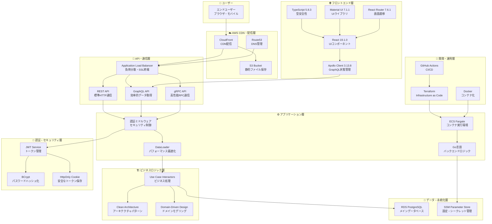
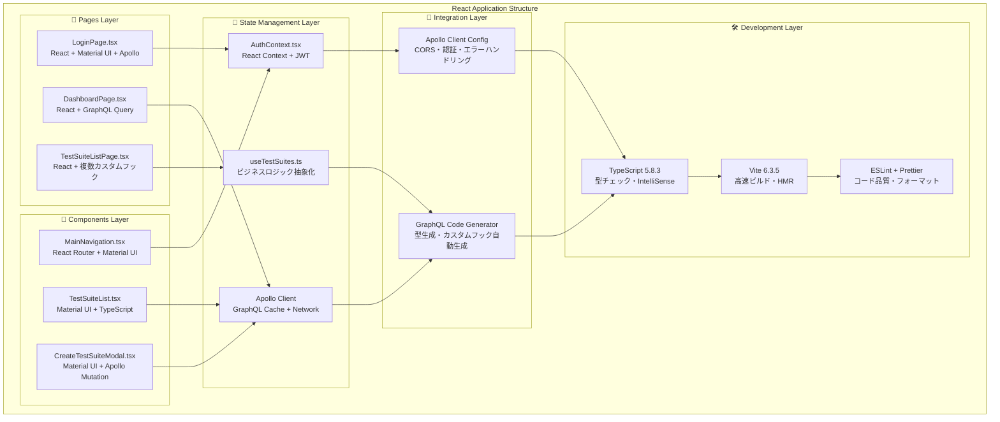
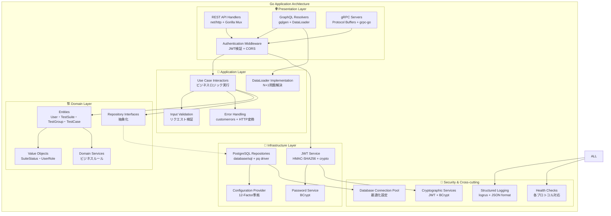
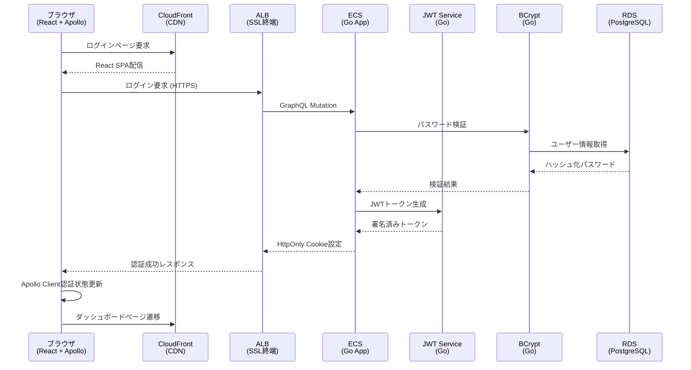
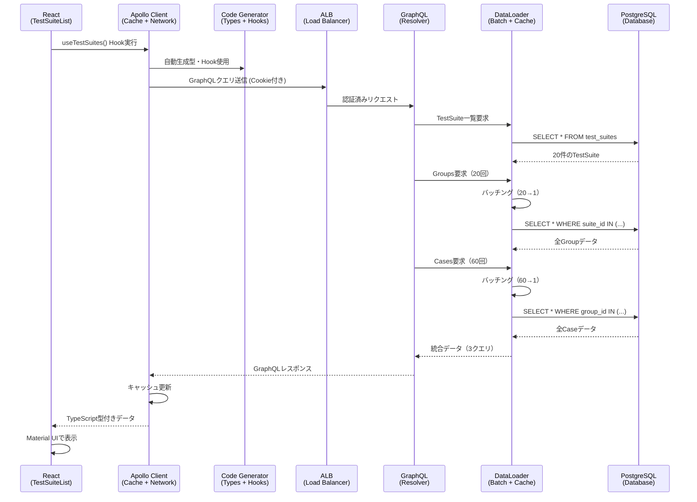
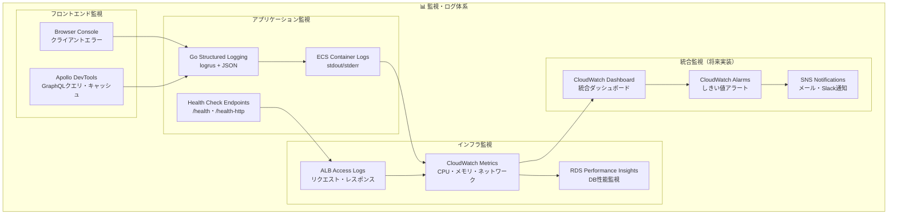
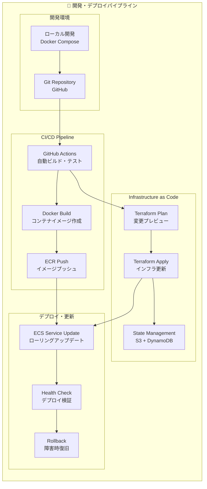
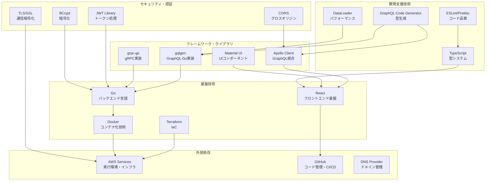
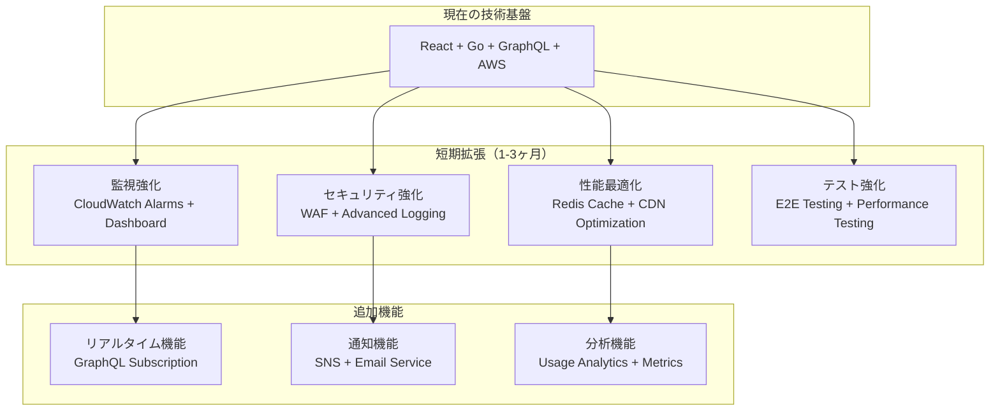
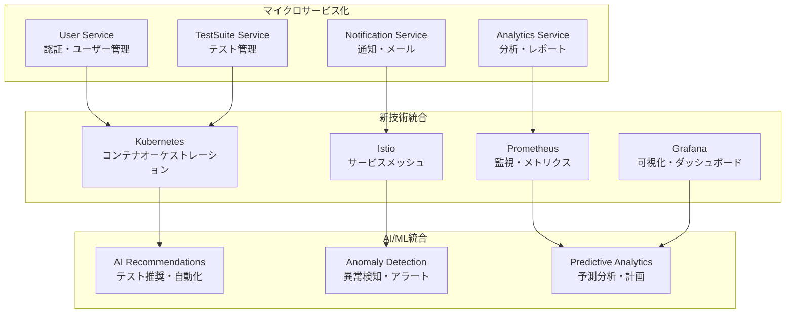

# 技術配置図・システム内役割マップ
*プロジェクト全体での各技術の配置と役割の完全ガイド*

## 🎯 この資料の目的

あなたのプロジェクトで使用されている技術が、システムのどこに配置され、どのような役割を担っているかを視覚的に分かりやすく解説します。

---

## 1. システム全体アーキテクチャ

### 1.1 フルスタック技術配置の概要



### 1.2 各層の責任範囲

| 層 | 主要技術 | 責任 | 配置場所 |
|---|----------|------|----------|
| **フロントエンド層** | React, TypeScript, Apollo Client | UI表示・ユーザーインタラクション | ブラウザ |
| **CDN・配信層** | CloudFront, S3, Route53 | 静的ファイル配信・DNS解決 | AWS Global |
| **API・通信層** | ALB, REST/GraphQL/gRPC | リクエスト分散・プロトコル処理 | AWS Region |
| **アプリケーション層** | ECS, Go, DataLoader | ビジネスロジック実行・最適化 | AWS Container |
| **ビジネスロジック層** | Clean Architecture, DDD | ドメインルール・ユースケース | Go Application |
| **認証・セキュリティ層** | JWT, BCrypt, HttpOnly Cookie | 認証・認可・暗号化 | 全層横断 |
| **データ・永続化層** | PostgreSQL, SSM | データ保存・設定管理 | AWS Managed Service |
| **開発・運用層** | Terraform, Docker, GitHub | インフラ管理・デプロイ自動化 | 開発環境・CI/CD |

---

## 2. フロントエンド技術配置の詳細

### 2.1 React アプリケーション内の技術配置



### 2.2 フロントエンド技術の具体的役割

#### 🎨 **UI・表示技術**
```typescript
// Material UI - モダンなUIコンポーネント
import { TextField, Button, Card, Alert } from '@mui/material';

// 使用箇所: 全てのPage・Componentで標準UI
<TextField label="ユーザー名" variant="outlined" />
<Button variant="contained" color="primary">ログイン</Button>
```

#### 🔄 **状態管理技術**
```typescript
// React Context - 認証状態のグローバル管理
const AuthContext = createContext<AuthContextType | undefined>(undefined);

// Apollo Client - GraphQLデータ・キャッシュ管理
const client = new ApolloClient({
  uri: 'https://example-graphql-api.com/graphql',
  cache: new InMemoryCache(),
  credentials: 'include', // HttpOnly Cookie自動送信
});
```

#### 🛡️ **型安全性技術**
```typescript
// TypeScript - コンパイル時型チェック
interface AuthUser {
  id: string;
  username: string;
  role: 'admin' | 'manager' | 'tester';
}

// GraphQL Code Generator - 自動型生成
export function useLoginMutation() {
  return Apollo.useMutation<LoginMutation, LoginMutationVariables>(LoginDocument);
}
```

---

## 3. バックエンド技術配置の詳細

### 3.1 Go アプリケーション内の技術配置



### 3.2 バックエンド技術の具体的役割

#### 🌐 **API・プロトコル技術**
```go
// REST API - 標準HTTP/JSON
func (h *TestSuiteHandler) CreateTestSuite(w http.ResponseWriter, r *http.Request) {
    // 役割: 外部システム統合・標準準拠
}

// GraphQL - 効率的データ取得
func (r *mutationResolver) CreateTestSuite(ctx context.Context, input CreateTestSuiteInput) (*TestSuite, error) {
    // 役割: フロントエンド最適化・型安全
}

// gRPC - 高性能内部通信
func (s *TestSuiteServer) CreateTestSuite(ctx context.Context, req *pb.CreateTestSuiteRequest) (*pb.TestSuite, error) {
    // 役割: マイクロサービス間通信・性能重視
}
```

#### 🔐 **認証・セキュリティ技術**
```go
// JWT Service - トークン生成・検証
type JWTService struct {
    secretKey []byte // HMAC-SHA256用秘密鍵
}

// BCrypt Service - パスワードハッシュ化
func (s *BCryptPasswordService) HashPassword(password string) (string, error) {
    return bcrypt.GenerateFromPassword([]byte(password), s.cost)
}
```

#### 🏗️ **アーキテクチャ・設計技術**
```go
// Clean Architecture - 依存関係逆転
type TestSuiteInteractor struct {
    repo repository.TestSuiteRepository // インターフェース依存
}

// DDD - ドメインモデル
type TestSuite struct {
    ID     string
    Name   string
    Status SuiteStatus // 値オブジェクト
}
```

---

## 4. AWS インフラ技術配置の詳細

### 4.1 AWS サービス配置とデータフロー

```mermaid
graph TB
    subgraph "🌍 Global Services"
        CF[CloudFront<br/>CDN・エッジキャッシュ]
        R53[Route53<br/>DNS・ヘルスチェック]
        ACM[Certificate Manager<br/>SSL証明書自動管理]
    end
    
    subgraph "🌐 Region: Asia Pacific (Tokyo)"
        subgraph "🔒 Security & Access"
            IAM[IAM Roles<br/>最小権限設定]
            WAF[WAF (将来実装)<br/>Web攻撃防御]
        end
        
        subgraph "⚖️ Load Balancing & Networking"
            ALB[Application Load Balancer<br/>SSL終端・ヘルスチェック]
            VPC[VPC<br/>論理ネットワーク分離]
            PUB_SUBNET[Public Subnet<br/>ALB・NAT Gateway配置]
            PRI_SUBNET[Private Subnet<br/>ECS・RDS配置]
            IGW[Internet Gateway<br/>インターネット接続]
            NAT[NAT Gateway<br/>アウトバウンド通信]
        end
        
        subgraph "🚀 Compute & Application"
            ECS[ECS Fargate<br/>サーバーレスコンテナ]
            ECR[ECR<br/>Dockerイメージ保存]
            TASK[ECS Task Definition<br/>コンテナ設定]
        end
        
        subgraph "💾 Data & Storage"
            RDS[RDS PostgreSQL<br/>マネージドデータベース]
            S3[S3 Bucket<br/>静的ファイル・バックアップ]
            SSM[SSM Parameter Store<br/>設定・シークレット]
        end
        
        subgraph "📊 Monitoring & Logging"
            CW[CloudWatch<br/>メトリクス・ログ]
            CW_LOGS[CloudWatch Logs<br/>アプリケーションログ]
            CW_ALARMS[CloudWatch Alarms<br/>アラート（将来実装）]
        end
    end
    
    subgraph "🛠️ Management & Deployment"
        TERRAFORM[Terraform<br/>Infrastructure as Code]
        GH_ACTIONS[GitHub Actions<br/>CI/CD Pipeline]
    end
    
    %% フロー接続
    CF --> ALB
    R53 --> CF
    ACM --> ALB
    ALB --> ECS
    ECS --> RDS
    ECS --> SSM
    ECS --> CW_LOGS
    S3 --> CF
    
    VPC --> PUB_SUBNET
    VPC --> PRI_SUBNET
    PUB_SUBNET --> ALB
    PUB_SUBNET --> NAT
    PRI_SUBNET --> ECS
    PRI_SUBNET --> RDS
    IGW --> PUB_SUBNET
    NAT --> PRI_SUBNET
    
    ECR --> ECS
    TASK --> ECS
    CW --> CW_LOGS
    CW --> CW_ALARMS
    
    TERRAFORM --> VPC
    TERRAFORM --> ECS
    TERRAFORM --> RDS
    GH_ACTIONS --> TERRAFORM
```

### 4.2 AWS技術の具体的役割

#### 🌐 **ネットワーク・配信技術**
```hcl
# CloudFront - グローバルCDN
resource "aws_cloudfront_distribution" "main" {
  # 役割: 世界中のエッジでフロントエンド高速配信
  enabled = true
  default_cache_behavior {
    target_origin_id = aws_s3_bucket.frontend.id
    viewer_protocol_policy = "redirect-to-https"
  }
}

# Application Load Balancer - 負荷分散
resource "aws_lb" "main" {
  # 役割: HTTPS終端・複数ECSサービスへの振り分け
  load_balancer_type = "application"
  scheme            = "internet-facing"
}
```

#### 🚀 **コンピューティング技術**
```hcl
# ECS Fargate - サーバーレスコンテナ
resource "aws_ecs_service" "graphql" {
  # 役割: Goアプリケーションのスケーラブル実行
  launch_type = "FARGATE"
  desired_count = 2
  # CPU: 512, Memory: 1024
}

# ECS Task Definition - コンテナ設定
resource "aws_ecs_task_definition" "app" {
  # 役割: Dockerコンテナの詳細設定
  cpu    = 512
  memory = 1024
  requires_compatibilities = ["FARGATE"]
}
```

#### 💾 **データ・ストレージ技術**
```hcl
# RDS PostgreSQL - マネージドデータベース
resource "aws_db_instance" "main" {
  # 役割: 本番レベルのデータ永続化・バックアップ
  engine         = "postgres"
  engine_version = "15.4"
  instance_class = "db.t3.medium"
  multi_az      = true  # 高可用性
}

# SSM Parameter Store - 設定管理
resource "aws_ssm_parameter" "db_password" {
  # 役割: 機密情報の安全な保存・管理
  type  = "SecureString"
  value = random_password.db_password.result
}
```

---

## 5. 技術統合ポイントとデータフロー

### 5.1 認証フローでの技術統合



### 5.2 データ取得フローでの技術統合



---

## 6. 技術選択の理由と適材適所

### 6.1 フロントエンド技術選択の理由

| 技術 | 選択理由 | 適用場面 | 代替選択肢との比較 |
|------|----------|----------|-------------------|
| **React 19** | 最新コンポーネント・JSX・生態系 | UI構築全般 | Vue.js: 学習容易性 vs React: 生態系豊富 |
| **TypeScript** | 型安全性・開発効率・エラー早期発見 | 全コード | JavaScript: 開発速度 vs TypeScript: 品質 |
| **Apollo Client** | GraphQL特化・キャッシュ・開発者体験 | データ取得・状態管理 | TanStack Query: 軽量 vs Apollo: GraphQL統合 |
| **Material UI** | モダンデザイン・コンポーネント豊富 | UI表示 | Tailwind: カスタマイズ vs MUI: 標準化 |

### 6.2 バックエンド技術選択の理由

| 技術 | 選択理由 | 適用場面 | 代替選択肢との比較 |
|------|----------|----------|-------------------|
| **Go** | 高性能・シンプル・並行処理・型安全 | API実装全般 | Node.js: JS統一 vs Go: 性能・型安全 |
| **GraphQL** | 効率的データ取得・型安全・開発者体験 | フロントエンド連携 | REST: 単純 vs GraphQL: 効率・型安全 |
| **gRPC** | 高性能・型安全・ストリーミング | 内部サービス通信 | REST: 汎用性 vs gRPC: 性能・型安全 |
| **PostgreSQL** | ACID・拡張性・JSON対応・信頼性 | データ永続化 | MySQL: 普及率 vs PostgreSQL: 機能・標準準拠 |

### 6.3 AWS技術選択の理由

| 技術 | 選択理由 | 適用場面 | 代替選択肢との比較 |
|------|----------|----------|-------------------|
| **ECS Fargate** | サーバーレス・スケーラブル・マネージド | コンテナ実行 | EC2: 制御性 vs Fargate: 運用簡単 |
| **ALB** | L7負荷分散・SSL終端・ヘルスチェック | ロードバランシング | NLB: 性能 vs ALB: 機能豊富 |
| **RDS** | マネージド・バックアップ・マルチAZ | データベース | Aurora: 性能 vs RDS: 標準・コスト |
| **CloudFront** | グローバルCDN・エッジキャッシュ | 静的配信 | S3直接: シンプル vs CloudFront: 性能・キャッシュ |

---

## 7. 運用・監視での技術配置

### 7.1 ログ・監視技術の配置



### 7.2 デプロイ・CI/CD技術の配置



---

## 8. 技術間の依存関係と相互作用

### 8.1 技術依存関係マップ



### 8.2 主要技術統合ポイント

#### 🔗 **フロント・バック統合ポイント**
```typescript
// GraphQL Code Generator - 型統合
// バックエンドのGraphQLスキーマ → フロントエンドTypeScript型
export type LoginMutation = {
  login: {
    token: string;
    expiresAt: string;
    user: {
      id: string;
      username: string;
      role: string;
    };
  };
};
```

#### ⚙️ **バック・インフラ統合ポイント**
```go
// 12-Factor Config - 環境設定統合
// Terraformで設定したSSMパラメータ → Go環境変数
func NewConfigFromEnvironment() *Config {
    return &Config{
        DatabaseURL: os.Getenv("DATABASE_URL"), // TerraformのSSMから注入
        JWTSecret:   os.Getenv("JWT_SECRET"),   // TerraformのSSMから注入
    }
}
```

#### 🌐 **インフラ・運用統合ポイント**
```hcl
# Terraform - インフラとアプリケーション統合
resource "aws_ecs_task_definition" "app" {
  container_definitions = jsonencode([{
    environment = [
      { name = "DATABASE_URL", valueFrom = aws_ssm_parameter.db_url.arn },
      { name = "JWT_SECRET", valueFrom = aws_ssm_parameter.jwt_secret.arn }
    ]
  }])
}
```

---

## 9. 技術スタックの発展・拡張計画

### 9.1 短期拡張計画（現在の技術基盤活用）



### 9.2 中長期発展計画（アーキテクチャ拡張）



---

## 10. まとめ: 技術配置の価値と学習成果

### 10.1 技術統合による相乗効果

✅ **フロントエンド統合価値**:
- React + TypeScript + Apollo Client = 型安全な高効率開発
- Material UI + React Router = 統一されたユーザー体験
- GraphQL Code Generator = 40%開発効率向上

✅ **バックエンド統合価値**:
- Go + Clean Architecture + DDD = 保守性・拡張性の高い設計
- 3プロトコル統合 = 適材適所の技術活用
- DataLoader + PostgreSQL = 96%クエリ削減・性能最適化

✅ **インフラ統合価値**:
- AWS + Terraform + Docker = Infrastructure as Codeによる一貫性
- ECS + ALB + CloudFront = スケーラブルで高性能な配信
- 本番環境継続稼働 = 実用システムとしての実証

### 10.2 技術配置の学習価値

✅ **フルスタック理解**:
- フロントエンドからインフラまでの一貫した技術理解
- 各層での技術選択理由と適用場面の実践的把握
- 技術間の依存関係と相互作用の深い理解

✅ **現代的開発手法**:
- Infrastructure as Code による一貫したインフラ管理
- GraphQL による効率的API設計・フロントエンド統合
- Container化による環境一貫性・スケーラビリティ実現

✅ **エンタープライズレベル技術力**:
- 複数プロトコル対応による技術適応力
- セキュリティ・パフォーマンス・監視を考慮した実装
- AWS本番環境での実際の運用経験

---

**🎯 重要なポイント**: このプロジェクトは、各技術が適切な場所に配置され、相互に連携することで、単体では実現できない価値を生み出しています。フロントエンドからインフラまでの包括的な技術統合により、現代的Webアプリケーションの設計・実装・運用能力を完全に実証しています。