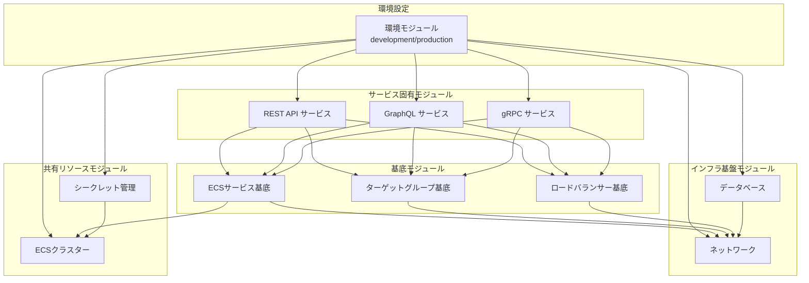
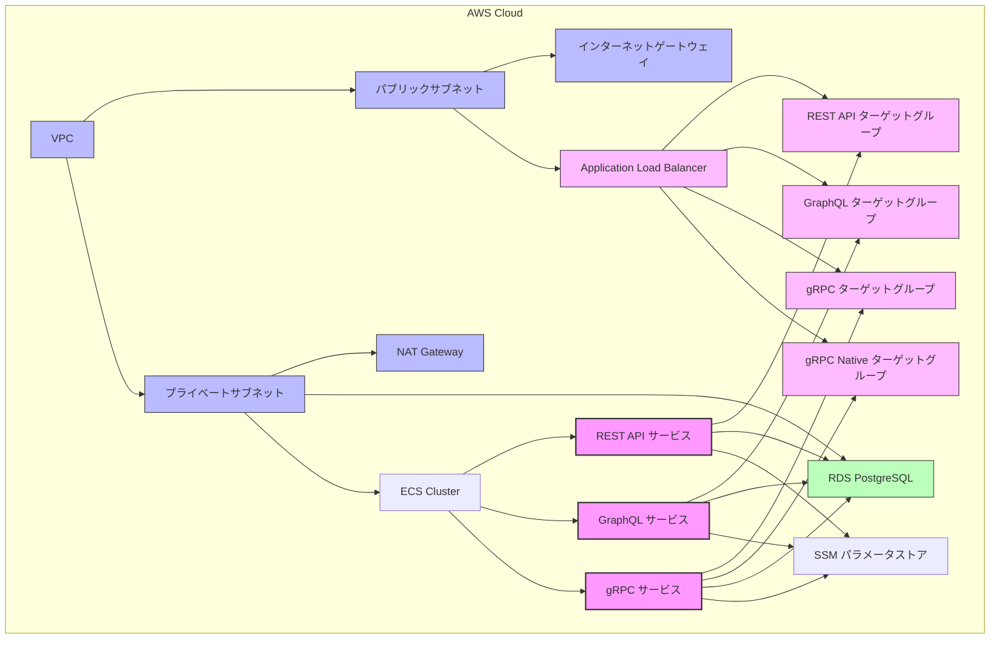
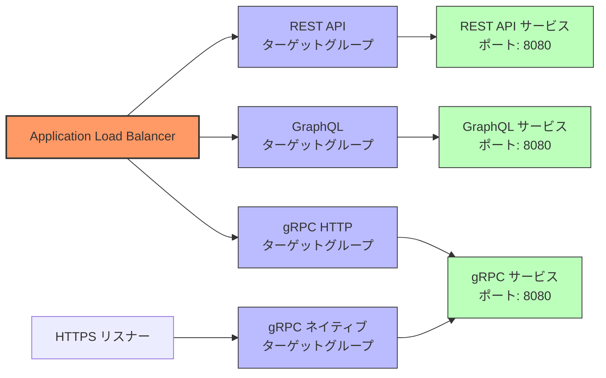
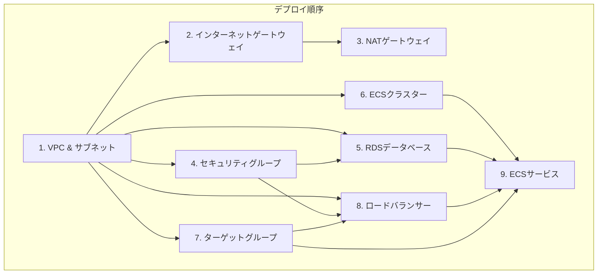

# AWS Terraform アーキテクチャ概要

## 1. 目的と概要

本ドキュメントは、AWS環境のTerraformによるインフラストラクチャの全体アーキテクチャを説明します。3つのサービスタイプ（REST API、GraphQL、gRPC）のマイクロサービスを同一環境にデプロイするための設計を中心に、モジュール構造、依存関係、コンポーネント間の関係を詳述します。

### 1.1 設計の背景と目標

- **複数サービスの共存**: 技術スタックの異なる3種類のサービス（REST API、GraphQL、gRPC）を同一AWS環境に共存させる
- **環境分離の実現**: 開発環境と本番環境の適切な構成差異を維持しつつ、共通のコードベースを使用
- **モジュール化と再利用**: 共通コンポーネントの再利用と各サービスタイプの特殊化を両立
- **拡張性と保守性**: 新規サービスの追加やリソース構成の変更を容易にする設計

### 1.2 アーキテクチャの主要コンポーネント

- **インフラ基盤モジュール**: ネットワークとデータベースのリソース
- **共有リソースモジュール**: ECSクラスターとシークレット管理
- **基底モジュール**: 各サービスタイプの基礎となる再利用可能なコンポーネント
- **サービス固有モジュール**: 各サービスタイプ（REST API、GraphQL、gRPC）の特殊化
- **環境設定モジュール**: 環境固有のパラメータと構成

## 2. アーキテクチャ全体図

### 2.1 モジュール間の依存関係



### 2.2 デプロイ後のAWSリソース構成



## 3. モジュール構造の概要

### 3.1 ディレクトリ構造

```
deployments/terraform/
├── environments/
│   ├── development/
│   │   ├── main.tf          # 開発環境設定
│   │   ├── variables.tf     # 開発環境変数定義
│   │   └── terraform.tfvars # 開発環境変数値
│   └── production/
│       ├── main.tf          # 本番環境設定
│       ├── variables.tf     # 本番環境変数定義
│       └── terraform.tfvars # 本番環境変数値
└── modules/
    ├── networking/          # ネットワークモジュール
    ├── database/            # データベースモジュール
    ├── shared/
    │   ├── ecs-cluster/     # 共有ECSクラスターモジュール
    │   └── secrets/         # シークレット管理モジュール
    └── service/
        ├── base/            # 基底モジュール
        │   ├── ecs-service-base/
        │   ├── target-group-base/
        │   └── load-balancer-base/
        ├── api/             # REST API固有モジュール
        ├── graphql/         # GraphQL固有モジュール
        └── grpc/            # gRPC固有モジュール
```

### 3.2 モジュール構造の特徴

- **階層型構造**: 基盤モジュール → 共有リソース → 基底モジュール → サービス固有モジュール
- **コンポジションパターン**: 継承ではなくコンポジションを使用したモジュール設計
- **環境単位の分離**: `environments/`配下で環境ごとにTerraform設定を分離
- **サービスタイプ別の分離**: サービスタイプごとに特化したモジュールを`service/`配下に配置

## 4. 基盤アーキテクチャの構成要素

### 4.1 ネットワークモジュール

**目的**: 安全で拡張性の高いVPCとサブネット構成を提供

**主要リソース**:
- VPC
- パブリック・プライベートサブネット
- インターネットゲートウェイ
- NATゲートウェイ
- ルートテーブル
- デフォルトセキュリティグループ

**設計上の特徴**:
- マルチAZ対応の可用性設計
- パブリックとプライベートゾーンの明確な分離
- 環境に応じたネットワーク設定の柔軟な調整

### 4.2 データベースモジュール

**目的**: PostgreSQLデータベースの提供と設定管理

**主要リソース**:
- RDSインスタンス
- DBセキュリティグループ
- DBサブネットグループ
- パラメータグループ

**設計上の特徴**:
- 環境に応じた設定（ストレージ、インスタンスクラス、マルチAZ）
- セキュリティ対策（プライベートサブネット配置、暗号化）
- 環境変数に基づく条件付き設定（削除保護、最終スナップショット）

### 4.3 共有リソースモジュール

#### 4.3.1 ECSクラスターモジュール

**目的**: ECSサービス共通の実行環境提供

**主要リソース**:
- ECSクラスター
- タスク実行ロール
- CloudWatchロググループ

**設計上の特徴**:
- 環境ごとに独立したクラスター
- 共通IAMロールとポリシーの一元管理
- ログ管理の集約

#### 4.3.2 シークレット管理モジュール

**目的**: 機密情報の安全な保存と参照

**主要リソース**:
- SSMパラメータ
- IAMポリシー

**設計上の特徴**:
- 環境ごとの分離（パラメータパスに環境名を含む）
- 最小権限の原則に基づくアクセス制御
- ECSタスク実行ロールとの統合

### 4.4 基底モジュール

#### 4.4.1 ECSサービス基底モジュール

**目的**: すべてのサービスタイプで共通のECS設定テンプレート提供

**主要機能**:
- ECSタスク定義と自動スケーリング設定
- セキュリティグループとIAMロール
- CloudWatchログ統合
- コンテナ環境変数と拡張ポイント

**設計上の特徴**:
- 高い拡張性を持つコンテナ定義
- 複数ロードバランサー対応
- 自動スケーリング設定の統合

#### 4.4.2 ターゲットグループ基底モジュール

**目的**: ALBターゲットグループの基本構成提供

**主要機能**:
- ターゲットグループ作成と設定
- ヘルスチェック設定テンプレート

**設計上の特徴**:
- カスタマイズ可能なヘルスチェックパラメータ
- サービスタイプ別の最適化ポイント
- プロトコルとポート設定の柔軟性

#### 4.4.3 ロードバランサー基底モジュール

**目的**: ALBとリスナーの基本構成提供

**主要機能**:
- ALBの作成と設定
- HTTP/HTTPSリスナー設定
- リージョンと環境に応じた設定

**設計上の特徴**:
- 条件付きHTTPS設定
- 環境に応じた削除保護
- セキュリティグループの自動構成

## 5. 環境設定とパラメータ管理

### 5.1 環境別設定の管理方法

- **環境変数**: すべてのモジュールで`environment`変数を使用して環境を識別
- **環境ディレクトリ**: 環境ごとに`environments/`配下に独立したディレクトリを用意
- **terraform.tfvars**: 環境固有の変数値を定義
- **バックエンド設定**: 環境ごとに独立したTerraform状態ファイルを管理

### 5.2 開発環境と本番環境の差異

| 設定項目 | 開発環境 | 本番環境 |
|----------|----------|----------|
| **可用性ゾーン** | 2つ (a, c) | 3つ (a, c, d) |
| **DBインスタンスクラス** | db.t3.small | db.t3.medium |
| **DBストレージ** | 20GB (最大100GB) | 50GB (最大200GB) |
| **DBバックアップ保持** | 7日間 | 30日間 |
| **マルチAZ配置** | 無効 | 有効 |
| **サービスインスタンス数** | 各1台 | 各3台 |
| **コンピューティングリソース** | CPU: 256, メモリ: 512MB | CPU: 512, メモリ: 1024MB |
| **HTTPS** | 選択的 | 必須 |
| **削除保護** | 無効 | 有効 |
| **ログレベル** | debug | info |

### 5.3 機密情報管理

- **SSMパラメータストア**: データベース認証情報などの機密情報管理
- **環境分離**: 環境ごとにパラメータパスを分離
- **最小権限**: 必要最小限のアクセス権のみを付与
- **Terraform外管理**: 初期セットアップ時のみParameterStoreに直接設定

## 6. 設計原則と設計パターン

### 6.1 主要設計原則

1. **モジュール化と再利用**
   - 共通コンポーネントを基底モジュールとして抽出
   - 特殊化ポイントを明確に定義

2. **環境分離**
   - 開発/本番環境の明確な分離
   - 環境固有の最適化設定

3. **最小権限の原則**
   - 必要最小限のIAM権限のみを付与
   - セキュリティグループの適切な設定

4. **コードの一貫性**
   - 命名規則の統一
   - モジュール構造の標準化

### 6.2 適用された設計パターン

1. **コンポジションパターン**
   - 継承ではなくコンポジションによるモジュール構成
   - 基底モジュールと特殊化モジュールの分離

2. **テンプレートメソッドパターン**
   - 基底モジュールが骨格を定義
   - サービス固有モジュールがカスタマイズポイントを実装

3. **ストラテジーパターン**
   - サービスタイプに応じた異なる実装戦略
   - 環境変数による振る舞いの変更

4. **ファサードパターン**
   - 複雑な実装詳細を隠蔽
   - シンプルなインターフェイスの提供

## 7. 3サービス共存アーキテクチャ

### 7.1 サービスタイプの特徴と差異

#### REST API サービス
- **特徴**: 標準的なHTTPベースのRESTfulサービス
- **エンドポイント**: `/health`でヘルスチェック
- **設定**: 標準的なHTTPヘルスチェック（間隔30秒、タイムアウト5秒）
- **環境変数**: `SERVICE_TYPE=api`, `HTTP_PORT=8080`

#### GraphQL サービス
- **特徴**: GraphQLクエリ処理を行うサービス
- **エンドポイント**: `/health`でヘルスチェック、`/graphql`でメインエンドポイント
- **設定**: 長めのタイムアウト設定（間隔45秒、タイムアウト8秒）
- **環境変数**: `SERVICE_TYPE=graphql`, `HTTP_PORT=8080`, `GRAPHQL_PATH=/graphql`

#### gRPC サービス
- **特徴**: 高性能RPCフレームワークを使用するサービス
- **プロトコル**: HTTP互換モードとgRPCネイティブモードの両方をサポート
- **エンドポイント**: `/health-http`（HTTP互換）と`/grpc.health.v1.Health/Check`（gRPCネイティブ）
- **設定**: デュアルポート設定（HTTP:8080、gRPC:50051）、特殊なヘルスチェック設定
- **環境変数**: `SERVICE_TYPE=grpc`, `HTTP_PORT=8080`, `GRPC_PORT=50051`

### 7.2 共存の実現方法



**共存のための工夫**:

1. **ALBのパスベースルーティング**
   - 各サービスタイプ別のターゲットグループ
   - パスパターンによるルーティング

2. **デュアルプロトコル対応**
   - gRPCサービスは2つのターゲットグループを使用
   - 標準HTTPとgRPCネイティブプロトコルの両方をサポート

3. **ヘルスチェック設定の最適化**
   - サービスタイプごとに異なるヘルスチェック設定
   - タイムアウトと間隔の調整（特にGraphQLとgRPCで長めに設定）

4. **サービス識別**
   - 環境変数による明示的なサービスタイプの指定
   - サービス名とポート設定による区別

## 8. 依存関係管理

### 8.1 モジュール間の依存関係

- **間接的依存**: サービスモジュールは基底モジュールを通じて基盤モジュールに依存
- **出力値と参照**: モジュール間のデータ連携は出力値を通じて行われる
- **明示的依存**: 一部で`depends_on`を使用して明示的な依存関係を定義

### 8.2 リソース間の依存関係



**依存関係の管理方法**:

1. **明示的なモジュール呼び出し順序**
   - 環境設定モジュールで適切な順序でモジュールを呼び出し
   - まずインフラ基盤→共有リソース→個別サービスの順

2. **暗黙的な変数参照による依存性**
   - あるモジュールの出力を別のモジュールの入力として使用
   - 適切なTerraform評価順序を確保

3. **depends_on属性の使用**
   - 必要に応じて明示的な依存関係を定義
   - 特にNATゲートウェイやALBなどの依存関係

## 9. 今後の拡張ポイント

### 9.1 新規サービスタイプの追加

1. **基底モジュールの再利用**: 既存の基底モジュール構造を活用
2. **サービス固有の特殊化**: 新サービスタイプに必要な特殊化のみを実装
3. **環境設定への統合**: 環境設定モジュールでの新サービスタイプ構成の追加

### 9.2 リソース構成の拡張

1. **追加リソースの統合**: 新しいAWSリソースの統合（例：ElastiCacheなど）
2. **基底モジュールの拡張**: 新しい機能や設定オプションの追加
3. **モニタリングとアラートの強化**: CloudWatchアラームやダッシュボードの追加

### 9.3 モジュール設計の改善

1. **サフィックス対応の整理**: `-new`サフィックスの整理と標準化
2. **変数構造の改善**: より構造化された変数定義への移行
3. **ドキュメント生成の自動化**: Terraform Docs等を活用した自動ドキュメント生成

## 10. まとめと重要ポイント

- **階層化されたモジュール設計**: 再利用性と特殊化のバランスを取った設計
- **コンポジションベースのアプローチ**: 柔軟なモジュール組み合わせによる機能実現
- **3サービス共存の実現**: REST API、GraphQL、gRPCの共存環境の達成
- **環境分離と一貫性**: 開発環境と本番環境の適切な分離と共通コードベースの維持
- **拡張性への配慮**: 将来的な拡張やリファクタリングを容易にする設計上の工夫
