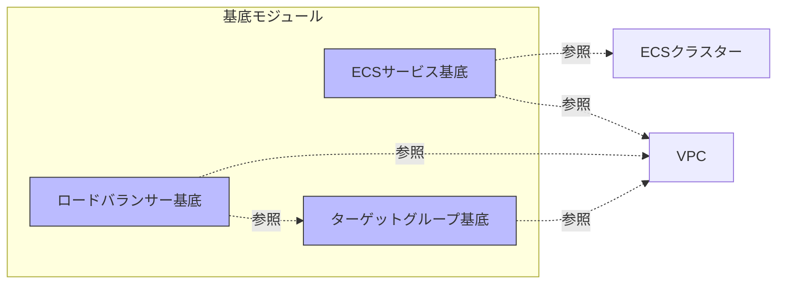
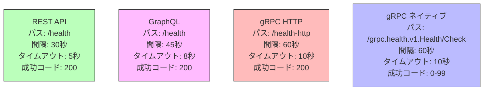
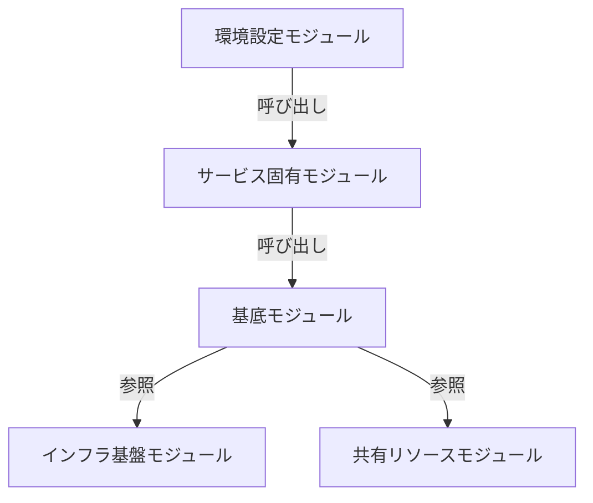
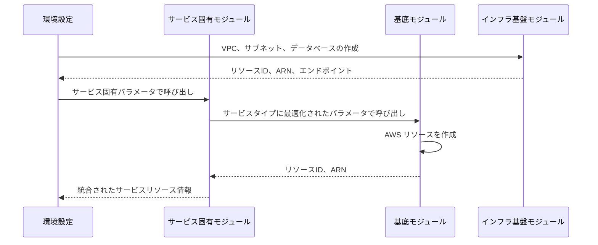

# AWS Terraform コンポーネント設計詳細

## 1. 導入

本ドキュメントでは、AWS環境のインフラストラクチャで使用されている主要コンポーネントの詳細設計と実装について解説します。基底モジュールと各サービスタイプ（REST API、GraphQL、gRPC）の特殊化モジュールを中心に、設計パターン、実装上の工夫、各サービス間の比較分析を提供します。

### 1.1 目的と範囲

- **基底モジュールの詳細設計**: 再利用可能なコンポーネントの構造と機能
- **サービス固有モジュールの実装詳細**: 3種類のサービスタイプ別の特殊化ポイント
- **コンポーネント間の相互作用**: モジュール間のデータフローと依存関係
- **設計上の意思決定**: 特定の設計を採用した背景と理由

### 1.2 対象読者

- AWSインフラストラクチャを管理する開発者・運用者
- Terraformモジュール設計に携わるエンジニア
- マイクロサービスアーキテクチャの設計者・実装者

## 2. 基底モジュールの設計

### 2.1 概要と役割

基底モジュールは、サービス固有の実装に依存しない共通コンポーネントを提供し、各サービスタイプの基盤となるテンプレート構造を定義します。



### 2.2 ECSサービス基底モジュール

#### 2.2.1 提供機能

- ECSタスク定義とサービスの作成
- セキュリティグループとIAMロールの設定
- CloudWatchロギングの構成
- 環境変数とシークレット管理の統合
- 自動スケーリング設定

#### 2.2.2 主要設計要素

**拡張可能なコンテナ定義**:
```terraform
container_definitions = jsonencode([
  {
    # ... 基本設定 ...
    portMappings = concat(
      # 基本ポートマッピング
      [{ containerPort = var.container_port, ... }],
      # 追加ポートマッピング（拡張ポイント）
      var.additional_container_port_mappings
    )
    environment = concat(
      # 基本環境変数
      [for key, value in var.environment_variables : {...}],
      # データベース接続変数
      [{ name = "DB_HOST", value = var.db_host }, ...],
      # 追加環境変数（拡張ポイント）
      var.additional_environment_variables
    )
  }
])
```

**複数ロードバランサー対応**:
```terraform
# 動的ブロックを使用して複数のロードバランサー設定を可能に
dynamic "load_balancer" {
  for_each = var.load_balancers != null ? var.load_balancers : []
  content {
    target_group_arn = load_balancer.value.target_group_arn
    container_name   = load_balancer.value.container_name
    container_port   = load_balancer.value.container_port
  }
}

# 下位互換性のための単一ロードバランサーサポート
dynamic "load_balancer" {
  for_each = var.target_group_arn != "" && var.load_balancers == null ? [1] : []
  content {
    target_group_arn = var.target_group_arn
    container_name   = var.service_name
    container_port   = var.container_port
  }
}
```

**自動スケーリング設定**:
```terraform
resource "aws_appautoscaling_target" "app" {
  service_namespace  = "ecs"
  resource_id        = "service/${var.cluster_name}/${aws_ecs_service.app.name}"
  scalable_dimension = "ecs:service:DesiredCount"
  min_capacity       = var.desired_count
  max_capacity       = var.max_capacity
}

resource "aws_appautoscaling_policy" "cpu" {
  name               = "${var.environment}-${var.service_name}-cpu-scaling"
  policy_type        = "TargetTrackingScaling"
  resource_id        = aws_appautoscaling_target.app.resource_id
  scalable_dimension = aws_appautoscaling_target.app.scalable_dimension
  service_namespace  = aws_appautoscaling_target.app.service_namespace

  target_tracking_scaling_policy_configuration {
    target_value       = var.cpu_scaling_target_value
    scale_in_cooldown  = var.scale_in_cooldown
    scale_out_cooldown = var.scale_out_cooldown
    predefined_metric_specification {
      predefined_metric_type = "ECSServiceAverageCPUUtilization"
    }
  }
}
```

### 2.3 ターゲットグループ基底モジュール

#### 2.3.1 提供機能

- ALBターゲットグループの作成
- ヘルスチェック設定の構成
- プロトコルとポートの設定

#### 2.3.2 主要設計要素

**高度にカスタマイズ可能なヘルスチェック設定**:
```terraform
resource "aws_lb_target_group" "this" {
  name        = "${var.environment}-${var.service_name}${var.name_suffix}-tg"
  port        = var.container_port
  protocol    = var.protocol
  vpc_id      = var.vpc_id
  target_type = "ip"

  health_check {
    enabled             = true
    interval            = var.health_check_interval
    path                = var.health_check_path
    port                = var.health_check_port
    protocol            = var.health_check_protocol
    timeout             = var.health_check_timeout
    healthy_threshold   = var.health_check_healthy_threshold
    unhealthy_threshold = var.health_check_unhealthy_threshold
    matcher             = var.health_check_matcher
  }

  tags = {
    Name        = "${var.environment}-${var.service_name}${var.name_suffix}-tg"
    Environment = var.environment
    Service     = var.service_name
  }
}
```

### 2.4 ロードバランサー基底モジュール

#### 2.4.1 提供機能

- ALBとセキュリティグループの作成
- HTTPリスナーの設定
- オプションのHTTPSリスナー設定

#### 2.4.2 主要設計要素

**条件付きHTTPS設定**:
```terraform
# HTTP Listener
resource "aws_lb_listener" "http" {
  load_balancer_arn = aws_lb.main.arn
  port              = 80
  protocol          = "HTTP"

  default_action {
    type = var.enable_https ? "redirect" : "forward"

    dynamic "redirect" {
      for_each = var.enable_https ? [1] : []
      content {
        port        = "443"
        protocol    = "HTTPS"
        status_code = "HTTP_301"
      }
    }

    dynamic "forward" {
      for_each = var.enable_https ? [] : [1]
      content {
        target_group {
          arn = var.target_group_arn
        }
      }
    }
  }
}

# HTTPS Listener（オプション）
resource "aws_lb_listener" "https" {
  count             = var.enable_https ? 1 : 0
  load_balancer_arn = aws_lb.main.arn
  port              = 443
  protocol          = "HTTPS"
  ssl_policy        = "ELBSecurityPolicy-2016-08"
  certificate_arn   = var.certificate_arn

  default_action {
    type             = "forward"
    target_group_arn = var.target_group_arn
  }
}
```

## 3. サービス固有モジュールの設計

### 3.1 コンポジションベースのアプローチ

サービス固有モジュールは、基底モジュールをコンポジション（委譲）パターンで使用し、特定のサービスタイプに必要な特殊化のみを実装します。

```mermaid
flowchart TD
    classDef base fill:#bbf,stroke:#333,stroke-width:1px
    classDef api fill:#bfb,stroke:#333,stroke-width:1px
    classDef graphql fill:#fbf,stroke:#333,stroke-width:1px
    classDef grpc fill:#fbb,stroke:#333,stroke-width:1px
    
    subgraph "基底モジュール"
        BASE_ECS[ECSサービス基底]:::base
        BASE_TG[ターゲットグループ基底]:::base
        BASE_LB[ロードバランサー基底]:::base
    end
    
    subgraph "REST API モジュール"
        API_ECS[REST API ECSサービス]:::api
        API_TG[REST API ターゲットグループ]:::api
        API_LB[REST API ロードバランサー]:::api
    end
    
    subgraph "GraphQL モジュール"
        GQL_ECS[GraphQL ECSサービス]:::graphql
        GQL_TG[GraphQL ターゲットグループ]:::graphql
        GQL_LB[GraphQL ロードバランサー]:::graphql
    end
    
    subgraph "gRPC モジュール"
        GRPC_ECS[gRPC ECSサービス]:::grpc
        GRPC_TG[gRPC HTTP ターゲットグループ]:::grpc
        GRPC_TG_NATIVE[gRPC ネイティブ ターゲットグループ]:::grpc
        GRPC_LB[gRPC ロードバランサー]:::grpc
    end
    
    API_ECS -->|使用| BASE_ECS
    API_TG -->|使用| BASE_TG
    API_LB -->|使用| BASE_LB
    
    GQL_ECS -->|使用| BASE_ECS
    GQL_TG -->|使用| BASE_TG
    GQL_LB -->|使用| BASE_LB
    
    GRPC_ECS -->|使用| BASE_ECS
    GRPC_TG -->|使用| BASE_TG
    GRPC_LB -->|使用| BASE_LB
    GRPC_TG_NATIVE -.->|直接定義| BASE_TG
```



### 3.2 REST APIサービスモジュール

REST APIサービスモジュールは、最もシンプルな構成を持ち、基底モジュールにほぼそのまま依存しています。主な特殊化ポイントは環境変数とヘルスチェック設定です。

#### 3.2.1 ECSサービスモジュール

```terraform
module "base_ecs_service" {
  source = "../../base/ecs-service-base"
  
  # 基本パラメータ（略）
  
  # REST API固有の設定
  name_suffix = "-new" # サフィックス追加
  
  additional_environment_variables = [
    {
      name  = "HTTP_PORT"
      value = "8080"
    },
    {
      name  = "SERVICE_TYPE"
      value = "api"
    }
  ]

  # 追加のポートマッピングは必要ない（コンテナポートが既に8080）
  additional_port_mappings           = []
  additional_container_port_mappings = []

  # オートスケーリング設定
  max_capacity                      = var.max_capacity
  cpu_scaling_target_value          = 70
  memory_scaling_target_value       = 70
  scale_in_cooldown                 = 300
  scale_out_cooldown                = 60
  health_check_grace_period_seconds = 60
}
```

#### 3.2.2 ターゲットグループモジュール

```terraform
module "base_target_group" {
  source = "../../base/target-group-base"

  # 基本パラメータ（略）
  name_suffix = "-new" # サフィックス追加
  
  # REST API固有のデフォルト値
  health_check_path                = "/health"
  health_check_port                = "traffic-port"
  health_check_protocol            = "HTTP"
  health_check_interval            = 30
  health_check_timeout             = 5
  health_check_healthy_threshold   = 3
  health_check_unhealthy_threshold = 3
  health_check_matcher             = "200"
}
```

### 3.3 GraphQLサービスモジュール

GraphQLサービスモジュールは、REST APIモジュールと類似していますが、GraphQLクエリ処理のための最適化が施されています。

#### 3.3.1 ECSサービスモジュール

```terraform
module "base_ecs_service" {
  source = "../../base/ecs-service-base"
  
  # 基本パラメータ（略）
  
  # GraphQL固有の環境変数
  additional_environment_variables = [
    {
      name  = "HTTP_PORT"
      value = "8080"
    },
    {
      name  = "SERVICE_TYPE"
      value = "graphql"
    },
    {
      name  = "GRAPHQL_PATH"
      value = "/graphql"
    }
  ]

  # GraphQLにはポート追加は不要
  additional_port_mappings           = []
  additional_container_port_mappings = []

  # オートスケーリング設定
  max_capacity                = var.max_capacity
  cpu_scaling_target_value    = 70
  memory_scaling_target_value = 70
  scale_in_cooldown           = 300
  scale_out_cooldown          = 60
  # GraphQLはウォームアップに時間がかかる場合があるため、長めに設定
  health_check_grace_period_seconds = 90
}
```

#### 3.3.2 ターゲットグループモジュール

```terraform
module "base_target_group" {
  source = "../../base/target-group-base"
  
  # 基本パラメータ（略）
  
  # GraphQL固有のデフォルト値
  health_check_path                = "/health"
  health_check_port                = "traffic-port"
  health_check_protocol            = "HTTP"
  health_check_interval            = 45 # GraphQL用に最適化（長いクエリに対応）
  health_check_timeout             = 8  # GraphQL用に最適化
  health_check_healthy_threshold   = 2  # より寛容な設定
  health_check_unhealthy_threshold = 3
  health_check_matcher             = "200"
}
```

### 3.4 gRPCサービスモジュール

gRPCサービスモジュールは、最も複雑な構成を持ち、HTTP互換モードとgRPCネイティブモードの両方をサポートするためのデュアルポート設定と特殊なターゲットグループ設定を備えています。

#### 3.4.1 ECSサービスモジュール

```terraform
module "base_ecs_service" {
  # 基本パラメータ（略）
  
  # コンテナのメインポート設定
  container_port = 50051 # 主要ポートをgRPCに
  
  # デュアルポート対応
  additional_port_mappings = [
    {
      port        = 8080
      description = "HTTP health check port"
    }
  ]
  additional_container_port_mappings = [
    {
      containerPort = 8080
      hostPort      = 8080
      protocol      = "tcp"
    }
  ]

  # gRPC固有の環境変数
  additional_environment_variables = [
    {
      name  = "HTTP_PORT"
      value = "8080"
    },
    {
      name  = "GRPC_PORT"
      value = "50051"
    },
    {
      name  = "SERVICE_TYPE"
      value = "grpc"
    }
  ]
  
  # 複数ロードバランサー対応
  load_balancers = var.load_balancers
  # その他の設定（略）
}
```

#### 3.4.2 HTTP互換ターゲットグループモジュール

```terraform
module "base_target_group" {
  source = "../../base/target-group-base"
  
  # 基本パラメータ（略）
  container_port = 8080   # HTTP用固定
  protocol       = "HTTP" # 明示的に指定

  # gRPC HTTP用ヘルスチェック設定
  health_check_path                = "/health-http"
  health_check_port                = "8080"
  health_check_interval            = 60
  health_check_timeout             = 10
  health_check_healthy_threshold   = 2
  health_check_unhealthy_threshold = 3
  health_check_matcher             = "200"
}
```

#### 3.4.3 gRPCネイティブターゲットグループモジュール

```terraform
# 基底モジュールを使用せず直接リソース定義
resource "aws_lb_target_group" "this" {
  name             = "${var.environment}-${var.service_name}-native-new-tg"
  port             = var.container_port # 50051
  protocol         = "HTTP" # gRPCでもベースはHTTPを指定
  protocol_version = "GRPC" # プロトコルバージョンでgRPCを指定
  vpc_id           = var.vpc_id
  target_type      = "ip"

  health_check {
    enabled             = true
    interval            = var.health_check_interval # 60
    path                = var.health_check_path # "/grpc.health.v1.Health/Check"
    port                = var.health_check_port # "50051"
    protocol            = "HTTP"
    timeout             = var.health_check_timeout # 10
    healthy_threshold   = var.health_check_healthy_threshold # 2
    unhealthy_threshold = var.health_check_unhealthy_threshold # 3
    matcher             = var.health_check_matcher # "0-99" gRPC成功コード範囲
  }
  
  # タグ（略）
}
```

## 4. サービスタイプ別の設定比較

### 4.1 環境変数設定の比較

| 環境変数 | REST API | GraphQL | gRPC |
|----------|----------|---------|------|
| **SERVICE_TYPE** | `api` | `graphql` | `grpc` |
| **HTTP_PORT** | 8080 | 8080 | 8080 |
| **GRPC_PORT** | - | - | 50051 |
| **GRAPHQL_PATH** | - | `/graphql` | - |

### 4.2 ヘルスチェック設定の比較



| 設定 | REST API | GraphQL | gRPC (HTTP) | gRPC (ネイティブ) |
|------|----------|---------|------------|-----------------|
| **ヘルスチェックパス** | `/health` | `/health` | `/health-http` | `/grpc.health.v1.Health/Check` |
| **ヘルスチェック間隔** | 30秒 | 45秒 | 60秒 | 60秒 |
| **タイムアウト** | 5秒 | 8秒 | 10秒 | 10秒 |
| **健全しきい値** | 3回 | 2回 | 2回 | 2回 |
| **成功コード** | 200 | 200 | 200 | 0-99 |
| **健全性判定猶予期間** | 60秒 | 90秒 | 60秒 | 60秒 |

### 4.3 ポート設定の比較

| サービス | 主要ポート | プロトコル | 追加ポート | 目的 |
|---------|----------|----------|----------|------|
| **REST API** | 8080 | HTTP | なし | - |
| **GraphQL** | 8080 | HTTP | なし | - |
| **gRPC** | 50051 | gRPC | 8080 | HTTP互換ヘルスチェック |

## 5. サービス間の共通点と相違点

### 5.1 共通点

1. **基底モジュールの活用**
   - すべてのサービスが同じ基底モジュールを活用
   - コンポジションパターンによる基底機能の再利用
   - 命名規則と構造の一貫性

2. **オートスケーリング設定**
   - すべてのサービスが同様のオートスケーリング設定を採用
   - CPU/メモリ使用率ベースのスケーリング
   - スケールイン/アウト冷却期間の共通設定

3. **リソース命名規則**
   - `-new`サフィックスの一貫した使用
   - `${var.environment}-${var.service_name}`プレフィックスパターン
   - タグ付けの標準化

### 5.2 主要な相違点

1. **gRPCのデュアルプロトコル対応**
   - gRPCはHTTP互換モードとネイティブモードをサポート
   - 2つのポート（8080と50051）の使用
   - 2つのターゲットグループの設定

2. **GraphQLの最適化設定**
   - より長めのヘルスチェックタイムアウトと間隔
   - 延長された健全性判定猶予期間
   - GraphQL固有のエンドポイント環境変数

3. **ターゲットグループの実装方法**
   - REST APIとGraphQL: 基底モジュールを使用
   - gRPCネイティブ: 基底モジュールを使用せず直接リソース定義

## 6. モジュール間の相互作用パターン

### 6.1 階層的参照パターン



環境設定モジュールはサービス固有モジュールを呼び出し、サービス固有モジュールは基底モジュールを呼び出します。基底モジュールはインフラ基盤モジュールと共有リソースモジュールの出力を参照します。

### 6.2 モジュール間のデータフロー



### 6.3 依存関係の処理

1. **変数参照による暗黙的依存**
   - 上位モジュールが下位モジュールの出力値を参照
   - Terraformがリソース作成順序を自動的に決定

2. **`depends_on`属性による明示的依存**
   - 特定のリソース間に明示的な依存関係を設定
   - 例: NATゲートウェイとプライベートルートテーブル

3. **モジュール呼び出し順序による制御**
   - 環境設定モジュールでモジュール呼び出しの順序を制御
   - インフラ基盤→共有リソース→サービスの順序

## 7. 設計上の意思決定と背景

### 7.1 コンポジションパターンの採用

**決定**: 継承ではなくコンポジション（委譲）パターンを採用

**背景**:
- Terraformは真の継承をサポートしていない
- 委譲によるアプローチの方が柔軟性が高い
- モジュール間の疎結合を実現しやすい

**代替案と検討**:
- 基底モジュールからのコピー&ペースト（DRY原則に反する）
- 単一の大規模モジュールの使用（柔軟性が低下）
- 条件付きリソース作成（コードの複雑化）

### 7.2 gRPCネイティブターゲットグループの直接定義

**決定**: gRPCネイティブターゲットグループは基底モジュールを使用せず直接リソース定義

**背景**:
- `protocol_version = "GRPC"`はターゲットグループ基底モジュールでサポートされていない
- gRPC固有のマッチャー設定（`0-99`）が他のサービスと大きく異なる
- gRPCヘルスチェックパスの形式が特殊（`/grpc.health.v1.Health/Check`）

**代替案と検討**:
- 基底モジュールの拡張（他のサービスとの互換性低下）
- サービスごとの基底モジュール作成（コード重複）
- 条件付きリソース作成（コードの複雑化）

### 7.3 サービス固有の最適化設定

**決定**: サービスタイプごとにヘルスチェック設定や猶予期間を最適化

**背景**:
- GraphQLは複雑なクエリ処理に時間がかかる場合がある
- gRPCはネイティブとHTTP互換の両方のモードが必要
- REST APIは比較的シンプルで標準的な設定で十分

**実施した最適化**:
- GraphQL: 長めのタイムアウト（8秒）と猶予期間（90秒）
- gRPC: デュアルポート設定とより長いタイムアウト（10秒）
- すべてのサービス: サービスタイプ環境変数の明示的設定

## 8. ベストプラクティスと実装ガイドライン

### 8.1 新規サービスタイプの追加手順

1. **基底モジュールの機能確認**:
   - 既存の基底モジュールが要件を満たせるか確認
   - 必要な拡張ポイントの特定

2. **サービス固有モジュールの作成**:
   - 既存のサービスモジュールをテンプレートとして使用
   - 必要な特殊化のみを実装
   - 共通パターンと命名規則に準拠

3. **環境設定への統合**:
   - 環境設定モジュールでの新サービスタイプの呼び出し追加
   - 適切な変数値とリソース設定の提供

4. **検証と最適化**:
   - デプロイと検証手順の実施
   - パフォーマンスとリソース使用率の監視
   - 必要に応じたヘルスチェック設定の最適化

### 8.2 モジュール設計のガイドライン

1. **一貫した変数命名**:
   - サービス名、環境名などの主要変数の統一
   - 基底モジュールと同じ変数名を使用

2. **デフォルト値の適切な設定**:
   - 合理的なデフォルト値を提供
   - 必要に応じてオーバーライド可能に

3. **出力値の標準化**:
   - 必要な出力値を一貫して提供
   - サービス固有モジュールで基底モジュールの出力を透過的に引き継ぐ

4. **コメントと文書化**:
   - 非自明な設定や特殊ケースのコメント
   - サービス固有の設計意図の文書化

## 9. 改善案と将来の発展方向

### 9.1 モジュール構造の改善

1. **サフィックス管理の標準化**:
   ```terraform
   variable "resource_suffix" {
     description = "Suffix to append to all resources"
     type        = string
     default     = ""
   }
   ```

2. **構造化された変数定義**:
   ```terraform
   variable "health_check_config" {
     description = "Health check configuration"
     type = object({
       path      = string
       interval  = number
       timeout   = number
       protocol  = string
       matcher   = string
       threshold = object({
         healthy   = number
         unhealthy = number
       })
     })
     default = {
       path      = "/health"
       interval  = 30
       timeout   = 5
       protocol  = "HTTP"
       matcher   = "200"
       threshold = {
         healthy   = 3
         unhealthy = 3
       }
     }
   }
   ```

3. **サービスタイプ抽象化**:
   ```terraform
   locals {
     service_configs = {
       api = {
         health_check_path     = "/health"
         health_check_interval = 30
         health_check_timeout  = 5
         grace_period          = 60
       },
       graphql = {
         health_check_path     = "/health"
         health_check_interval = 45
         health_check_timeout  = 8
         grace_period          = 90
       },
       grpc = {
         health_check_path     = "/health-http"
         health_check_interval = 60
         health_check_timeout  = 10
         grace_period          = 60
       }
     }
     
     # 現在のサービスタイプの設定を選択
     current_config = lookup(local.service_configs, var.service_type, local.service_configs.api)
   }
   ```

### 9.2 gRPCネイティブサポートの強化

1. **基底モジュールの拡張**:
   ```terraform
   variable "protocol_version" {
     description = "Protocol version (e.g. GRPC for gRPC services)"
     type        = string
     default     = null
   }
   
   resource "aws_lb_target_group" "this" {
     # 基本設定（略）
     protocol_version = var.protocol_version
   }
   ```

2. **gRPCヘルスチェック抽象化**:
   ```terraform
   variable "grpc_health_check" {
     description = "Enable gRPC-specific health check settings"
     type        = bool
     default     = false
   }
   
   locals {
     health_check_path = var.grpc_health_check ? "/grpc.health.v1.Health/Check" : var.health_check_path
     matcher           = var.grpc_health_check ? "0-99" : var.health_check_matcher
   }
   ```

### 9.3 環境分離の強化

1. **環境タイプに基づく自動設定**:
   ```terraform
   locals {
     env_configs = {
       development = {
         desired_count              = 1
         max_capacity               = 2
         enable_deletion_protection = false
       },
       staging = {
         desired_count              = 1
         max_capacity               = 3
         enable_deletion_protection = false
       },
       production = {
         desired_count              = 2
         max_capacity               = 5
         enable_deletion_protection = true
       }
     }
     
     # 環境タイプに基づく設定（存在しない場合はdevelopmentを使用）
     env_config = lookup(local.env_configs, var.environment, local.env_configs.development)
   }
   ```

## 10. まとめ

本ドキュメントでは、AWS環境のTerraformインフラストラクチャにおける基底モジュールとサービス固有モジュールの詳細設計を解説しました。コンポジションパターンを基盤とした設計により、コードの再利用性と柔軟な特殊化を両立させています。

3つのサービスタイプ（REST API、GraphQL、gRPC）の実装の中で、特にgRPCサービスはデュアルプロトコル対応のための複雑な設計が特徴的です。GraphQLサービスは複雑なクエリ処理に最適化され、REST APIサービスは最もシンプルな構成を持ちます。

これらのモジュール設計と相互作用パターンにより、各サービスは共通の基盤を共有しつつも、それぞれの特性に合わせた最適化が実現されています。将来的には構造化された変数定義やサービスタイプの抽象化などを通じて、さらなる改善が期待されます。
