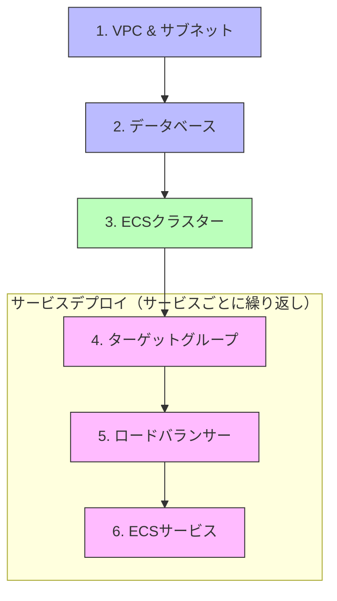
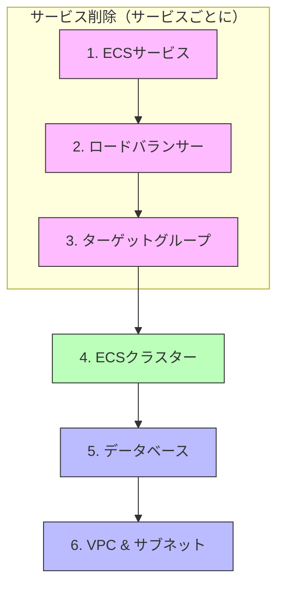
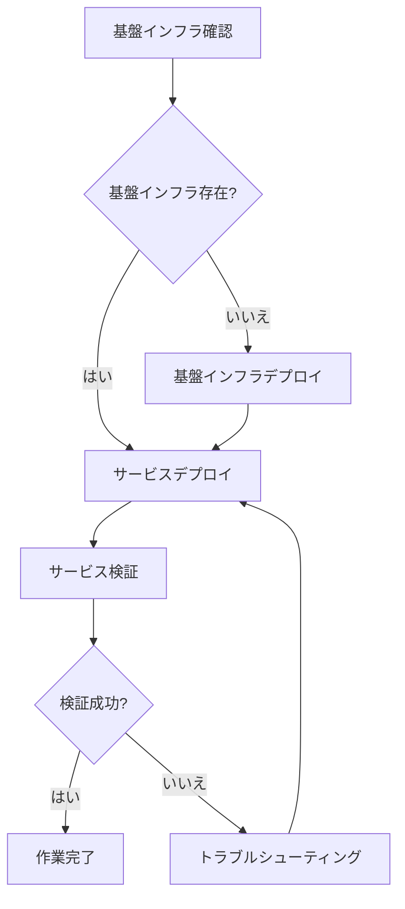
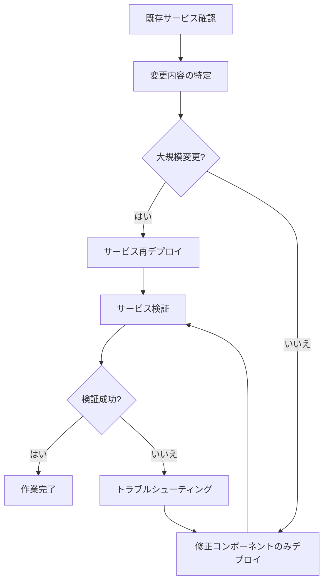
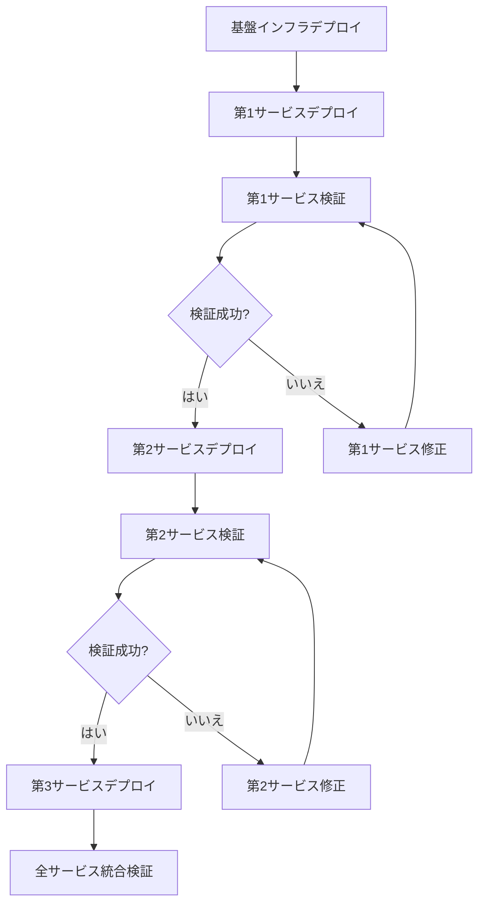
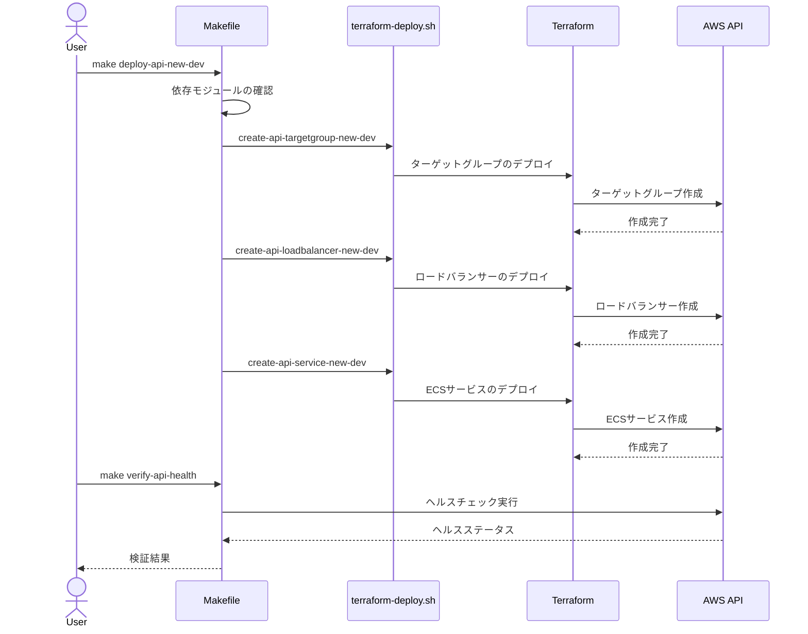
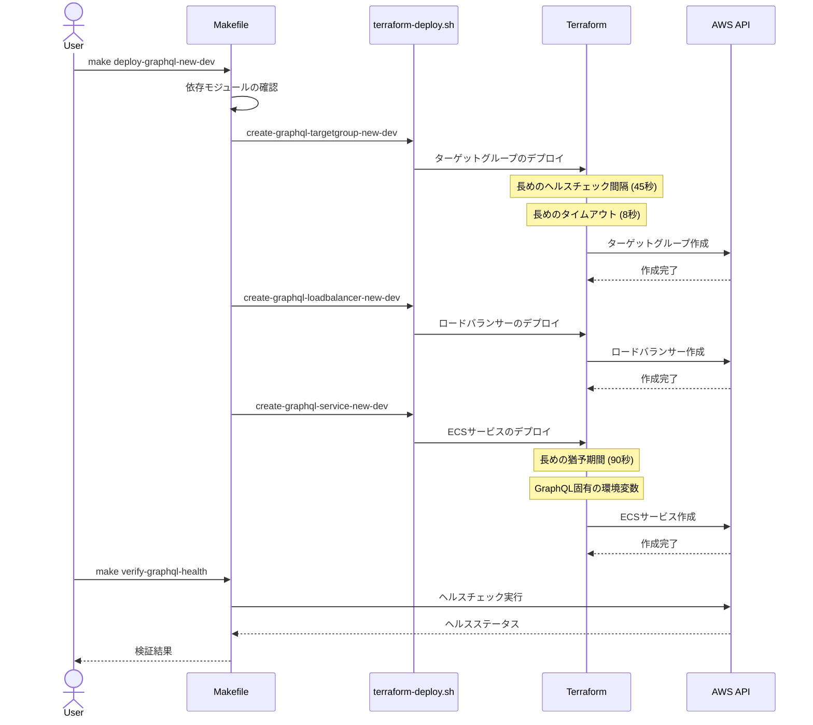
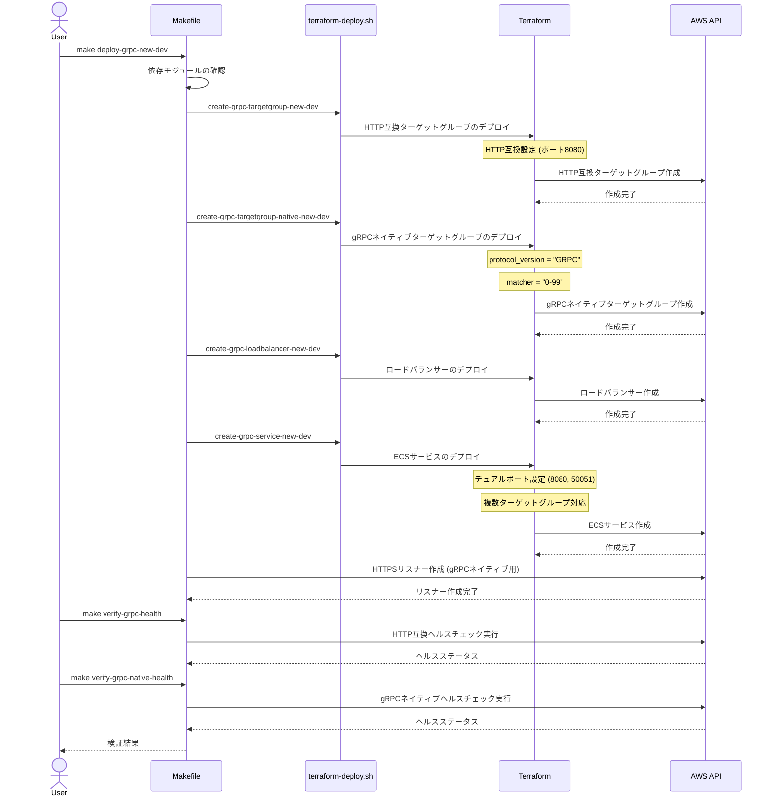

# AWS Terraform ワークフローガイド

## 1. 導入

本ドキュメントでは、AWS環境のTerraformインフラストラクチャを操作するための具体的なワークフローとプロセスを説明します。デプロイ、検証、クリーンアップの各フローの詳細と、それらを実行するためのMakefileコマンドやスクリプトの使用方法を提供します。

### 1.1 ワークフローの全体像

AWS環境での作業は、主に以下の3つのフェーズから構成されます：

1. **デプロイフェーズ**: インフラストラクチャリソースの作成と設定
2. **検証フェーズ**: デプロイされたリソースが正常に動作していることの確認
3. **クリーンアップフェーズ**: 不要になったリソースの削除とコスト管理

これらのフェーズは、Makefileコマンドとシェルスクリプトによって自動化されており、一貫した方法でインフラストラクチャを管理できます。

### 1.2 使用するツールとファイル

- **Makefileコマンド**: デプロイ、検証、クリーンアップの高レベルインターフェース
- **デプロイスクリプト**: `scripts/terraform/terraform-deploy.sh`
- **検証スクリプト**: `scripts/verification/verify-*-health.sh`
- **クリーンアップスクリプト**: `scripts/terraform/safe-cleanup-*.sh`
- **Terraform設定**: `deployments/terraform/`配下のモジュールと環境設定

### 1.3 前提条件

- AWS CLIがインストールされ、適切に設定されていること
- Terraformがインストールされていること（バージョン1.0以上推奨）
- 必要なIAM権限が設定されていること
- 初回使用時には、Terraformリモートステート環境が構築されていること

## 2. デプロイワークフロー

### 2.1 デプロイの流れ

デプロイは、依存関係に基づいて以下の順序で実行されます：



### 2.2 デプロイコマンド

**基盤インフラストラクチャのデプロイ**:
```bash
# 開発環境のVPCをデプロイ
make create-vpc-dev

# 開発環境のデータベースをデプロイ
make create-database-dev

# 開発環境のECSクラスターをデプロイ
make create-ecs-cluster-dev
```

**サービス固有のデプロイ**:
```bash
# REST APIサービスのデプロイ（すべてのコンポーネントを含む）
make deploy-api-new-dev

# GraphQLサービスのデプロイ
make deploy-graphql-new-dev

# gRPCサービスのデプロイ
make deploy-grpc-new-dev
```

**個別コンポーネントのデプロイ**:
```bash
# REST APIターゲットグループのみデプロイ
make create-api-targetgroup-new-dev

# GraphQLロードバランサーのみデプロイ
make create-graphql-loadbalancer-new-dev

# gRPC ECSサービスのみデプロイ
make create-grpc-service-new-dev
```

### 2.3 デプロイスクリプトの解説

デプロイは`terraform-deploy.sh`スクリプトによって実行されます：

```bash
# スクリプト使用例
scripts/terraform/terraform-deploy.sh -e dev -m vpc
scripts/terraform/terraform-deploy.sh -e dev -m ecs-api-service-new
```

**主なパラメータ**:
- `-e`: 環境名（dev, stagingなど）
- `-m`: モジュール名（vpc, database, ecs-api-service-newなど）
- `-v`: バージョン情報（オプション）

**スクリプトの処理フロー**:
1. パラメータを解析
2. モジュールタイプに基づいてTerraformディレクトリを決定
3. 環境変数の設定（AWS_PROFILE, TF_VARなど）
4. Terraformコマンド（init, plan, apply）の実行

```bash
# モジュールディレクトリの決定ロジック（スクリプト内）
if [[ $module == vpc || $module == database || $module == ecs-cluster ]]; then
    module_dir="${TERRAFORM_ROOT}/modules/${module}"
elif [[ $module == ecs-*-targetgroup* || $module == ecs-*-loadbalancer* || $module == ecs-*-service* ]]; then
    service_type=$(echo $module | sed -E 's/ecs-([^-]+)-.*/\1/')
    component=$(echo $module | sed -E 's/ecs-[^-]+-([^-]+).*/\1/')
    module_dir="${TERRAFORM_ROOT}/modules/service/${service_type}/${component}"
else
    echo "Unknown module: ${module}"
    exit 1
fi
```

## 3. 検証ワークフロー

### 3.1 検証のタイミングと目的

検証は以下のタイミングで実行されます：

1. **デプロイ直後**: リソースが正常に作成されたことを確認
2. **設定変更後**: 変更が正しく適用されたことを確認
3. **定期的な健全性チェック**: システムが継続的に機能していることを確認

検証の主な目的は、各サービスが正常に稼働していることを確認し、問題があれば早期に発見することです。

### 3.2 サービスタイプ別の検証方法

#### REST API サービスの検証

```bash
# ヘルスエンドポイントの検証
make verify-api-health
```

こちらは`/health`エンドポイントにHTTPリクエストを送信し、ステータスコード200と`{"status":"UP"}`のレスポンスを期待します。

#### GraphQL サービスの検証

```bash
# ヘルスエンドポイントの検証
make verify-graphql-health
```

GraphQLサービスも同様に`/health`エンドポイントを確認しますが、GraphQLクエリ処理の特性に合わせて長めのタイムアウト設定が使用されます。

#### gRPC サービスの検証

```bash
# HTTP互換ヘルスチェックの検証
make verify-grpc-health

# gRPCネイティブヘルスチェックの検証
make verify-grpc-native-health
```

gRPCサービスは2つの検証方法があります：
1. HTTP互換モード: `/health-http`エンドポイントを使用
2. gRPCネイティブモード: gRPC健全性チェックプロトコルを使用（`grpcurl`コマンドが必要）

### 3.3 検証スクリプトの解説

#### REST API 検証スクリプト (`verify-api-health.sh`)

```bash
# AWS CLIを使用してロードバランサーDNSを取得
lb_dns=$(aws elbv2 describe-load-balancers --names ${service_name}-${ENV} | jq -r '.LoadBalancers[0].DNSName')
target_group_arn=$(aws elbv2 describe-target-groups --names ${service_name}-${ENV} | jq -r '.TargetGroups[0].TargetGroupArn')

# ヘルスチェックリクエストの送信
response=$(curl -s -o response.txt -w "%{http_code}" http://${lb_dns}/health)

# レスポンスの評価
if [ "$response" == "200" ]; then
    status=$(cat response.txt | jq -r '.status')
    if [ "$status" == "UP" ]; then
        echo "Health check successful: $status"
        exit 0
    else
        echo "Health check failed: Expected status 'UP' but got '${status}'"
        exit 1
    fi
else
    echo "Health check failed with HTTP status: $response"
    exit 1
fi
```

#### gRPC ネイティブ検証スクリプト (`verify-grpc-native-health.sh`)

```bash
# gRPCurlが利用可能かチェック
if command -v grpcurl &> /dev/null; then
    grpcurl -plaintext ${lb_dns}:80 grpc.health.v1.Health/Check > response.txt
    
    if [ $? -eq 0 ]; then
        status=$(cat response.txt | jq -r '.status')
        if [ "$status" == "SERVING" ]; then
            echo "gRPC Health check successful: $status"
            exit 0
        else
            echo "gRPC Health check failed: Expected status 'SERVING' but got '${status}'"
            exit 1
        fi
    else
        echo "gRPC Health check failed: grpcurl command returned non-zero exit code"
        exit 1
    fi
else
    echo "grpcurl not found, using fallback check method..."
    # フォールバック処理
fi
```

## 4. クリーンアップワークフロー

### 4.1 クリーンアップの目的と重要性

クリーンアップは、以下の理由で重要です：

1. **コスト管理**: 不要なリソースを削除してAWS利用料金を最小化
2. **環境のクリーン化**: テスト環境を初期状態に戻す
3. **リソース競合の防止**: 名前の衝突やリソース上限の問題を回避

特に開発/テスト環境では、作業完了後に毎回クリーンアップを実施することが推奨されます。

### 4.2 クリーンアップコマンド

**全サービスのクリーンアップ**:
```bash
# すべてのサービスを一括でクリーンアップ
make cleanup-all-dev
```

**サービス別のクリーンアップ**:
```bash
# REST APIサービスのクリーンアップ
make cleanup-api-dev

# GraphQLサービスのクリーンアップ
make safe-cleanup-graphql-dev

# gRPCサービスのクリーンアップ
make safe-cleanup-grpc-dev
```

**段階的クリーンアップ（依存順）**:
```bash
# 1. サービスのクリーンアップ
make cleanup-all-dev

# 2. 共有リソースのクリーンアップ
make cleanup-ecs-cluster-dev

# 3. 基盤インフラのクリーンアップ
make cleanup-database-dev
make cleanup-vpc-dev
```

### 4.3 クリーンアップスクリプトの解説

#### gRPC クリーンアップスクリプト (`safe-cleanup-grpc.sh`)

```bash
# ECSサービスのクリーンアップ
ecs_service=$(aws-resource-finder "ecs" "describe-services --cluster $cluster_name --services $service_name" "services[0].serviceName")

if [ "$ecs_service" == "None" ] || [ -z "$ecs_service" ]; then
  echo "ECS Service not found. Skipping service cleanup."
else
  echo "Found ECS Service: $ecs_service"
  echo "Updating service to 0 desired count..."
  aws ecs update-service --cluster $cluster_name --service $service_name --desired-count 0
  
  # タスク終了を待機
  echo "Waiting for tasks to stop..."
  counter=0
  while [ $counter -lt $max_wait_cycles ]; do
    running_count=$(aws ecs describe-services --cluster $cluster_name --services $service_name --query "services[0].runningCount" --output text)
    if [ "$running_count" == "0" ]; then
      echo "All tasks stopped."
      break
    fi
    echo "Still waiting for tasks to stop. Running count: $running_count"
    sleep 5
    counter=$((counter + 1))
  done
  
  echo "Deleting ECS service..."
  aws ecs delete-service --cluster $cluster_name --service $service_name --force
  echo "ECS service deleted."
fi

# ロードバランサーのクリーンアップ
# ...（略）

# ターゲットグループのクリーンアップ
# ...（略）
```

### 4.4 リソース削除の依存関係

リソース削除は、作成時と逆の順序で行う必要があります：



**クリーンアップの重要ポイント**:
- ECSサービスは、タスクが完全に停止するまで待機する必要がある
- ロードバランサーを削除する前に、関連するリスナーが削除されていることを確認
- セキュリティグループの依存関係を考慮し、使用されていないものから順に削除

## 5. Makefileコマンドリファレンス

### 5.1 デプロイコマンド

| コマンド | 説明 | 使用スクリプト |
|---------|------|--------------|
| `create-vpc-dev` | 開発環境のVPCを作成 | terraform-deploy.sh |
| `create-database-dev` | 開発環境のRDSを作成 | terraform-deploy.sh |
| `create-ecs-cluster-dev` | 開発環境のECSクラスターを作成 | terraform-deploy.sh |
| `create-api-targetgroup-new-dev` | REST APIのターゲットグループを作成 | terraform-deploy.sh |
| `create-api-loadbalancer-new-dev` | REST APIのロードバランサーを作成 | terraform-deploy.sh |
| `create-api-service-new-dev` | REST APIのECSサービスを作成 | terraform-deploy.sh |
| `deploy-api-new-dev` | REST API環境を一括デプロイ | 複数スクリプトの組み合わせ |
| `deploy-graphql-new-dev` | GraphQL環境を一括デプロイ | 複数スクリプトの組み合わせ |
| `deploy-grpc-new-dev` | gRPC環境を一括デプロイ | 複数スクリプトの組み合わせ |

### 5.2 検証コマンド

| コマンド | 説明 | 使用スクリプト |
|---------|------|--------------|
| `verify-api-health` | REST APIのヘルスチェック | verify-api-health.sh |
| `verify-graphql-health` | GraphQLのヘルスチェック | verify-graphql-health.sh |
| `verify-grpc-health` | gRPC (HTTP互換)のヘルスチェック | verify-grpc-health.sh |
| `verify-grpc-native-health` | gRPC (ネイティブ)のヘルスチェック | verify-grpc-native-health.sh |
| `terraform-verify` | Terraformリソースの整合性確認 | verify-terraform (Go) |

### 5.3 クリーンアップコマンド

| コマンド | 説明 | 使用スクリプト |
|---------|------|--------------|
| `cleanup-api-dev` | REST APIリソースのクリーンアップ | aws-resource-cleaner.sh |
| `safe-cleanup-graphql-dev` | GraphQLリソースの安全なクリーンアップ | safe-cleanup-graphql.sh |
| `safe-cleanup-grpc-dev` | gRPCリソースの安全なクリーンアップ | safe-cleanup-grpc.sh |
| `cleanup-all-dev` | 全サービスのクリーンアップ | 複数スクリプトの組み合わせ |
| `cleanup-ecs-cluster-dev` | ECSクラスターのクリーンアップ | aws-resource-cleaner.sh |
| `cleanup-database-dev` | RDSのクリーンアップ | aws-resource-cleaner.sh |
| `cleanup-vpc-dev` | VPCのクリーンアップ | aws-resource-cleaner.sh |

### 5.4 ユーティリティコマンド

| コマンド | 説明 | 使用スクリプト |
|---------|------|--------------|
| `cost-estimate` | 現在のAWS利用コスト推定 | cost-estimate.sh |
| `terraform-init` | Terraformの初期化 | - |
| `terraform-plan` | Terraformプラン作成 | - |
| `terraform-apply` | Terraformプラン適用 | - |

## 6. 一般的なワークフローパターン

### 6.1 新規サービスのデプロイ



**実行例**:
```bash
# 1. 基盤インフラの確認と必要に応じたデプロイ
make create-vpc-dev
make create-database-dev
make create-ecs-cluster-dev

# 2. 新規サービスのデプロイ
make deploy-api-new-dev  # または deploy-graphql-new-dev, deploy-grpc-new-dev

# 3. サービスの検証
make verify-api-health  # または verify-graphql-health, verify-grpc-health

# 4. 作業完了後のクリーンアップ（開発環境）
make cleanup-all-dev
```

### 6.2 既存サービスの更新



**実行例**:
```bash
# 1. 特定コンポーネントの更新
make create-api-service-new-dev  # ECSサービス設定のみ更新

# 2. サービスの検証
make verify-api-health

# 3. 問題がある場合のロールバックまたは追加修正
# ...（必要に応じて）
```

### 6.3 複数サービスの共存デプロイ



**実行例**:
```bash
# 1. 基盤インフラのデプロイ
make create-vpc-dev
make create-database-dev
make create-ecs-cluster-dev

# 2. REST APIサービスのデプロイと検証
make deploy-api-new-dev
make verify-api-health

# 3. GraphQLサービスのデプロイと検証
make deploy-graphql-new-dev
make verify-graphql-health

# 4. gRPCサービスのデプロイと検証
make deploy-grpc-new-dev
make verify-grpc-health
make verify-grpc-native-health

# 5. すべてのサービスが正常に動作していることを確認
# （必要に応じて統合テストを実行）
```

## 7. デバッグとトラブルシューティング

### 7.1 一般的な問題と解決策

#### ECSサービスが起動しない

**症状**: ECSサービスのデプロイは成功するが、タスクが起動しない。

**診断手順**:
1. ECSクラスターのイベントログを確認
   ```bash
   aws ecs describe-services --cluster ${CLUSTER_NAME} --services ${SERVICE_NAME} --query 'services[0].events'
   ```

2. タスク定義のパラメータを確認
   ```bash
   aws ecs describe-task-definition --task-definition ${TASK_DEFINITION}
   ```

**解決策**:
- コンテナポートのマッピングが正しいか確認（8080または50051）
- 環境変数が適切に設定されているか確認（SERVICE_TYPE, HTTP_PORT, GRPC_PORT）
- IAMロールの権限が十分か確認（CloudWatch Logs, ECR, SSMなど）

#### ヘルスチェックが失敗する

**症状**: ECSサービスは起動するが、ターゲットグループのヘルスチェックが失敗する。

**診断手順**:
1. ターゲットグループのヘルスチェック設定を確認
   ```bash
   aws elbv2 describe-target-groups --target-group-arn ${TARGET_GROUP_ARN} --query 'TargetGroups[0].HealthCheckPath'
   ```

2. ECSサービスのログを確認
   ```bash
   aws logs get-log-events --log-group-name ${LOG_GROUP} --log-stream-name ${LOG_STREAM}
   ```

**解決策**:
- ヘルスチェックパスが正しいか確認（`/health`, `/health-http`, `/grpc.health.v1.Health/Check`）
- ヘルスチェックのタイムアウト値が十分に長いか確認（特にGraphQLとgRPC）
- ヘルスチェックポートがサービスのリスニングポートと一致しているか確認

#### クリーンアップ時のリソース削除エラー

**症状**: クリーンアップ実行時にリソース削除エラーが発生する。

**診断手順**:
1. リソースの依存関係を確認
   ```bash
   # 例：セキュリティグループの依存関係確認
   aws ec2 describe-network-interfaces --filters Name=group-id,Values=${SECURITY_GROUP_ID}
   ```

2. リソースの状態を確認
   ```bash
   # 例：ECSサービスの状態確認
   aws ecs describe-services --cluster ${CLUSTER_NAME} --services ${SERVICE_NAME}
   ```

**解決策**:
- 依存リソースが先に削除されているか確認
- 強制削除オプションの使用（`--force`）
- 手動でのAWSコンソールからのリソース削除

### 7.2 デバッグツールとテクニック

#### AWS CLI によるリソース状態確認

```bash
# VPCの確認
aws ec2 describe-vpcs --filters "Name=tag:Name,Values=${ENV}-vpc"

# ECSクラスターの確認
aws ecs describe-clusters --clusters ${CLUSTER_NAME}

# RDSインスタンスの確認
aws rds describe-db-instances --db-instance-identifier ${DB_IDENTIFIER}
```

#### Terraform状態の確認

```bash
# 状態ファイルのリソース一覧
terraform state list

# 特定リソースの状態確認
terraform state show aws_ecs_service.app

# 状態ファイルの更新
terraform refresh
```

#### Go実装の検証ツールの使用

```bash
# Terraformリソースの整合性検証
make terraform-verify

# デバッグモードでの実行
DEBUG=true make terraform-verify
```

## 8. サービスタイプ別のデプロイフロー

### 8.1 REST APIサービスのデプロイフロー

REST APIサービスは標準的なHTTPサービスであり、以下のフローでデプロイされます：



**ポイント**:
- 標準的なヘルスチェックエンドポイント（`/health`）
- 比較的短いタイムアウト設定（5秒）

### 8.2 GraphQLサービスのデプロイフロー

GraphQLサービスはREST APIと類似していますが、処理の複雑さに対応するための最適化が施されています：



**ポイント**:
- 長めのヘルスチェックタイムアウト（8秒）
- 延長された健全性判定猶予期間（90秒）
- GraphQL固有のエンドポイント環境変数（`GRAPHQL_PATH=/graphql`）

### 8.3 gRPCサービスのデプロイフロー

gRPCサービスは最も複雑なデプロイフローを持ち、デュアルプロトコル対応のために特殊な設定が必要です：



**ポイント**:
- 2つのターゲットグループ（HTTP互換とgRPCネイティブ）
- デュアルポート設定（8080と50051）
- HTTPSリスナーの追加設定
- 2つの検証フロー

## 9. ベストプラクティスとガイドライン

### 9.1 コスト管理

**基本原則**:
- 開発/テスト後は必ずリソースをクリーンアップ
- 最小限のリソースのみをデプロイ
- 定期的なコスト推定の実行

**推奨プラクティス**:
1. 作業終了時には必ず `cleanup-all-dev` を実行
2. 定期的に `cost-estimate` コマンドでコストを確認
3. 長期間使用しないリソースは完全に削除（`cleanup-vpc-dev`まで実行）

### 9.2 セキュリティ考慮事項

**認証情報の管理**:
- AWS IAM認証情報を安全に管理
- データベース認証情報はSSMパラメータストアで管理
- 最小権限の原則に従ったIAMポリシー

**ネットワークセキュリティ**:
- セキュリティグループの適切な設定
- プライベートサブネットへのリソース配置
- パブリックアクセスが必要なリソースのみを公開

### 9.3 効率的なワークフロー

**時間節約のヒント**:
1. 共通の基盤インフラは再利用（VPC、データベース、ECSクラスター）
2. 依存関係を理解し、必要なコンポーネントのみを更新
3. 自動化スクリプトを活用してマニュアル作業を最小化

**エラー回避のヒント**:
1. 変更前に現在の状態を確認
2. 小さな単位で変更し、こまめに検証
3. リソース削除前に依存関係を確認

## 10. まとめと重要ポイント

- **デプロイフロー**: 基盤インフラ→サービスという順序でデプロイし、リソース間の依存関係を尊重する
- **検証フロー**: サービスタイプ固有のヘルスチェック方法を使用し、正常稼働を確認する
- **クリーンアップフロー**: 依存関係の逆順でリソースを削除し、コストを管理する
- **サービスタイプの違い**: REST API、GraphQL、gRPCの各サービスタイプに特化したデプロイと検証方法がある
- **一貫した操作**: Makefileコマンドを使用して、一貫した方法でリソースを管理する

このガイドに従い、Makefileコマンドとスクリプトを活用することで、AWS環境のTerraformインフラストラクチャを効率的に管理できます。
